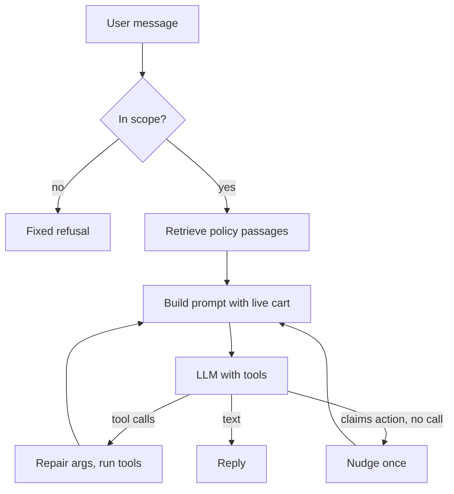

# Building an agent by hand

::: tip In one minute
- The shop assistant in `apps/shop_assistant/agent.py` is about 400 lines of plain Python over Ollama's HTTP API: no framework, so every mechanism is visible.
- Its parts: JSON tool schemas, a loop bounded by `MAX_TOOL_ROUNDS = 3`, argument repair for small-model mistakes, the **live cart rebuilt into the system prompt every round**, a one-time nudge when the model claims an action without a tool call, a hybrid scope guard, and turns that roll back on failure.
- Almost every one of those was added because a test caught a real failure.
- The biggest lesson from code review: regex guards over the user's words kept breaking on new phrasings. Fixes that changed what the **model sees** (the cart, a required argument, an `enum`) held.
:::

## The idea

Frameworks such as [LangGraph](/agents/langgraph) hide the loop. That is convenient, but it also hides the decisions you need to test. Building an agent once by hand shows you what any agent must decide:

- how to describe tools so the model calls them correctly;
- when to stop the loop;
- what to do with bad arguments;
- what the model needs to see on each call;
- what to do when the model lies about what it did;
- what to do when the request is off topic;
- what happens to state when a call fails halfway.

Think of it as writing your own HTTP client once before using `requests`: afterwards, you know what the library is doing for you.



## How it works

### 1. Tool schemas

Tools are described in the JSON format Ollama (and OpenAI-style APIs) accept: a name, a description and a JSON Schema for the arguments. The model never sees your Python function, only this description. So the schema is part of your prompt, and wording matters.

### 2. The bounded loop

The model is called at most `MAX_TOOL_ROUNDS` times per user message. Each round, it either returns text (the loop ends) or asks for tool calls. Each call runs, and its result is appended to the history as a `tool` message so the next round can see it.

### 3. Argument repair

Small models send malformed arguments. `qwen2.5:1.5b` was seen echoing the schema (`{"quantity": {"type": "integer", "value": 2} }`) and copying a cart line into the product field (`{"quantity": 3, "type": "Sauce Labs Backpack"}`). `normalise_arguments` unwraps those shapes, and a JSON string sent instead of an object, before the tool runs. When the product is still missing or unusable, the agent falls back to the product the **user's own message** names, but only if exactly one is named. It never picks a product the user didn't mention, and the user's words never decide the action or the quantity.

### 4. The live cart in every prompt

The model has no idea what is in the cart unless you tell it. Asked "what's in my cart now?", it once invented three items and a total. The fix: `describe_cart` renders the real cart into the system prompt as `CURRENT CART`, and the prompt is rebuilt **every round**, because a tool call in round 1 changes what round 2 must see. (A code review caught the first version building it once per turn: round 2 still saw the old quantity.)

### 5. The "claimed an action" nudge

If the model replies "I've added a bike light to your cart" without any tool call, nothing changed. `claims_cart_action` detects such sentences (ignoring questions and negations). The agent then appends a nudge ("You described a cart change but did not call a tool, so nothing changed...") and loops once more. Only once per turn, so a model that keeps narrating isn't nudged forever. Afterwards the false claim and the nudge are removed from the history (by position, not by matching their text, because an earlier genuine reply can have the very same wording), so later turns never learn from them.

### 6. The hybrid scope guard

Off-topic requests ("write me a haiku") should get a fixed refusal. A regex allow-list of **store nouns** (cart, basket, product names, policy words) lets clear store messages through with no model call. Only messages with none of those words go to a small classifier prompt, and anything but a clear `OUT_OF_SCOPE` verdict is allowed (it **fails open**). Why this order? Measured on `qwen2.5:1.5b`, the classifier alone refused "put a bike light in my basket". Refusing a real customer is worse than answering one odd question.

### 7. Atomic turns

If Ollama times out mid-turn, a client will retry. Without care, the retry sees the user's message twice and re-applies tool calls that already ran. `handle` takes a checkpoint of the history length and the cart, and restores both on any exception.

## How to test it

Every mechanism above has a scripted-model unit test (see [testing AI agents](/agents/testing-agents)): each malformed argument shape seen from the model, the cart in every prompt, the cart refreshed after each tool round, one nudge then a real tool call, the nudge removed from history, the scope allow-list skipping the model, a classifier verdict that fails open, rollback after a mid-turn failure, and the round bound. Live tests then check the real model over HTTP.

The review lesson is worth stating as a rule: **fix what the model sees, not what the user said.** The first fix for the conversation defects parsed the user's words with regexes ("remove *one*", "what's in my *cart*"). Code review showed each new phrasing broke it: "is shipping free if my cart total is over $50?" got a cart summary, and "remove one backpack and two bike lights" removed all the lights. Those guards were replaced by structural fixes: the live cart in the prompt, `quantity` required on removal, and repair based on the argument's *shape*. The later `"Product name"` bug got the same kind of fix: an `enum` in the schema.

## In this repository

All code is in [`apps/shop_assistant/agent.py`](https://github.com/iamzakirzr/Playwright-ZR/blob/main/apps/shop_assistant/agent.py), served by [`apps/shop_assistant/main.py`](https://github.com/iamzakirzr/Playwright-ZR/blob/main/apps/shop_assistant/main.py).

The product argument, after the CI failure:

```python
#: The product argument lists the catalogue as an ``enum``. With only a free-text description
#: ("Product name"), qwen2.5:1.5b on some CPUs copied the description itself as the value.
_PRODUCT_ARGUMENT = {"type": "string", "enum": list(PRODUCTS), "description": "The catalogue product the user named"}
```

The loop, with the cart rebuilt every round and the nudge:

```python
for _ in range(MAX_TOOL_ROUNDS):
    # Rebuilt every round: tool calls in this turn change the cart the model must trust.
    system = SYSTEM_PROMPT.format(products=products, cart=describe_cart(self.cart(session_id)), context=context)
    reply = self._chat([{"role": "system", "content": system}, *history])
    tool_requests = reply.get("tool_calls") or []
    if not tool_requests:
        if not calls and not nudged and claims_cart_action(reply.get("content", "")):
            # Guard: the model narrated an action without doing it. Ask once more.
            nudged = True
            claim_at = len(history)
            history.append({"role": "assistant", "content": reply.get("content", "")})
            history.append({"role": "user", "content": NO_TOOL_NUDGE})
            continue
        break
```

Tool errors become tool output, not crashes, so the model can read the error and correct itself next round:

```python
except (UnknownProductError, ValueError) as exc:
    output = {"ok": False, "error": str(exc)}
```

A missing removal quantity is one of those errors on purpose: guessing "all" is what made "remove one backpack" empty the line.

The atomic turn:

```python
history_checkpoint, cart_checkpoint = len(history), dict(cart.items)
try:
    return self._handle(session_id, message)
except Exception:
    del history[history_checkpoint:]
    cart.items = cart_checkpoint
    raise
```

The FastAPI app builds the agent once per process with hybrid retrieval over the store policies (see [RAG](/foundations/rag)) and exposes `POST /chat`, `GET /cart/{session_id}` and `DELETE /session/{session_id}`. The cart endpoint exists for tests, not for the model.

## Measured here

- The first live agent tests found **four** defects: fake action claims, lost context, off-topic answers, descriptions passed as product names. Each fix is in `agent.py` with a regression test (README 3.8).
- Unguarded, the model answered "what's in my cart?" with "1 backpack, 1 bike light, 1 t-shirt" that weren't there (regression test `test_live_cart_is_in_every_system_prompt`).
- The scope classifier alone refused "put a bike light in my basket"; with the allow-list first, and the `scope_guard` v2 prompt, 12/12 messages without store words were routed correctly, including held-out ones.
- On GitHub runners the model sent `{"product": "Product name"}` on every cart call until the `enum` was added.
- After the third review round, all five conversation scenarios were correct live, and 22/22 live agent tests passed (commit message of the review fixes).

## Try it

```bash
pytest tests/ai/agent/test_agent_units.py        # every guard, offline, in seconds
uvicorn apps.shop_assistant.main:app --port 8000  # run the app (needs Ollama)
```

Then, with the app running:

```bash
curl -s localhost:8000/chat -H 'content-type: application/json' \
  -d '{"session_id": "me", "message": "add 2 backpacks"}'
curl -s localhost:8000/cart/me
```

Exercise (from learning path chapter 08): add a `clear_cart` tool. Add its schema to `TOOLS` and a branch in `run_tool`. Write a scripted unit test that routes "empty my basket" to it first, then a live test that fills the cart, clears it, and checks `GET /cart/{session_id}`.

## Check yourself

1. Why is the cart rebuilt into the system prompt on every loop round, not once per turn?

::: details Answer
A tool call in one round changes the cart. If the prompt is built once, the next round sees the old cart and can, for example, remove the wrong quantity. A review found exactly that.
:::

2. Why does the scope guard check store vocabulary with a regex before asking the classifier, and why does it fail open?

::: details Answer
The small classifier refused a real shopping request ("put a bike light in my basket"). Clear store messages skip it, which is also faster. Failing open means an unclear verdict lets a customer through: a wrongly refused customer costs more than one off-topic answer.
:::

3. The first fix for "remove one backpack removed all of them" parsed "one" from the user's text. Why was it replaced?

::: details Answer
Every new phrasing needed a new rule, and some broke unrelated messages. Making `quantity` required in the schema and showing the live cart fixed the cause (what the model sees) instead of patching symptoms.
:::

4. What would go wrong without the rollback in `handle`?

::: details Answer
If the model call failed after a tool ran, a client retry would send the same message again: the history would hold it twice and the tool (for example `add_to_cart`) would be applied twice.
:::
