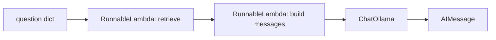

# LangChain

::: tip In one minute
- LangChain is a Python library of common parts for LLM apps: **chat models** behind one interface, **messages**, composable **runnables** (LCEL, joined with `|`), **tools**, **structured output** and **retrievers**.
- Everything is a `Runnable` with `.invoke()`. That one fact is what makes LangChain code testable: any step, including the model, can be swapped for a fake.
- The repository ships a LangChain RAG app, `ai/chatbot/langchain_client.py`: `retrieve | build messages | ChatOllama`, behind the same interface as the plain Ollama client, so every existing metric runs against it.
- Test it with no model at all: a recording `RunnableLambda` for chains, and `ScriptedChatModel` (which can `bind_tools`) for agents.
:::

## The idea

Every LLM app needs the same plumbing: talk to a model, format messages, call a search index, parse the output, describe tools. LangChain packages that plumbing behind shared interfaces, so you can swap one model or vector store for another without rewriting the app.

For a tester, the interesting part is the **interface**, not the features. LangChain's core idea is the `Runnable`: an object with `invoke(input) -> output`. A model is a runnable. A prompt is a runnable. A plain Python function wrapped in `RunnableLambda` is a runnable. You join runnables with the pipe operator, and the result is again a runnable. This is **LCEL**, the LangChain Expression Language.



If each box is a runnable, each box can be replaced in a test. That is the whole testing strategy on this page.

## How it works

### Chat models and messages

A chat model takes a list of **messages** and returns an `AIMessage`. The message types map onto the roles every chat API uses:

| Class | Role | Example |
|---|---|---|
| `SystemMessage` | Rules and context for the model | "You are the Sauce Demo Store shopping assistant..." |
| `HumanMessage` | The user | "How long do I have to return an item?" |
| `AIMessage` | The model's reply, possibly with `tool_calls` | "You have 45 days." |
| `ToolMessage` | A tool's result, linked by `tool_call_id` | `{"items": [...], "total": 59.98}` |

`ChatOllama` (from the `langchain-ollama` package) is the chat model for a local Ollama server. `AIMessage.usage_metadata` carries token counts, useful for [performance evals](/evals/performance-evals).

### LCEL and the pipe operator

`a | b | c` builds a `RunnableSequence`: the output of `a` is the input of `b`, and so on. `invoke` runs the whole thing. You also get `.batch()`, `.stream()` and wrappers such as `.with_retry()` and `.bind(...)` for free. A chain built this way is still a **chain**, not an agent: the steps are fixed (see [what an agent is](/agents/what-is-an-agent)).

### Tools and `bind_tools`

The `@tool` decorator turns a typed Python function into a tool. Its type hints and docstring become the JSON schema the model sees. `llm.bind_tools([...])` returns a model that sends those schemas with every call. The model may then answer with an `AIMessage` whose `tool_calls` list names a tool and its arguments. LangChain does **not** run the tool for you in a plain chain. Running it, and looping, is the agent's job: a hand-written loop or a [LangGraph](/agents/langgraph) graph.

### Structured output

`llm.with_structured_output(SomeModel)` asks the model for output matching a Pydantic model, and parses it. It is the typed version of "reply in JSON". Structured output is **not used in this repository**. Its nearest relative here is `json_mode` in `LangChainChatbot.complete`, which passes Ollama's `format="json"`. A minimal illustrative example (not part of the test suite):

```python
from pydantic import BaseModel
from langchain_ollama import ChatOllama


class Intent(BaseModel):
    label: str  # e.g. "cart", "policy", "off_topic"
    confidence: float


classifier = ChatOllama(model="qwen2.5:1.5b", temperature=0).with_structured_output(Intent)
result = classifier.invoke("put a bike light in my basket")  # an Intent instance, or an error
```

Testing it: assert on the parsed fields, and test what happens when the small model returns something that doesn't parse. It will, sometimes.

### Retrievers

LangChain's `BaseRetriever` is a runnable that turns a query into a list of `Document`s. This repository does **not** use LangChain retrievers: it has its own BM25, semantic and hybrid retrievers in `ai/search` (see [AI search](/foundations/ai-search)). The LangChain app wraps them in a `RunnableLambda`, which shows the point: any function can be a step in a chain.

## How to test it

LangChain apps have two kinds of bug, and you test them differently:

1. **Plumbing bugs**: the wrong passages reach the prompt, user input is treated as template syntax, context is dropped, token counts are lost, wrappers lose their settings. These are deterministic. Test them **without a model** by replacing the model with a fake that records what it received.
2. **Model behaviour**: is the answer faithful, correct, safe? Test with the real model and the same metrics you would use on any chatbot (see [evaluating LLM output](/evals/evaluating-llms)).

Two fakes cover almost everything:

- **A recording `RunnableLambda`** for chains. It appends every message list it receives to a list and returns a fixed `AIMessage`. Your test then asserts on exactly what the chain sent.
- **`ScriptedChatModel`** for agents. LangChain's own `GenericFakeChatModel` cannot `bind_tools`, so it can't stand in for a tool-calling model. The repository's `ScriptedChatModel` can: it records the tool schemas it was bound to and every message list it received, and replies with the next scripted `AIMessage`.

::: warning A LangChain templating trap
LangChain prompt templates use `{placeholder}` syntax. If user text is inserted into a template that is then formatted again, braces in the user's message can be read as template variables. The repository renders prompts with its own registry (`string.Template`) and has a test that braces in user input arrive literally.
:::

## In this repository

The LCEL app is [`ai/chatbot/langchain_client.py`](https://github.com/iamzakirzr/Playwright-ZR/blob/main/ai/chatbot/langchain_client.py). The whole pipeline is one line:

```python
#: The RAG pipeline as one LCEL runnable: {"question", "context"} -> AIMessage.
self.rag_chain: Runnable = RunnableLambda(self._retrieve) | RunnableLambda(self._messages) | self.llm
```

The model is injected (`llm: Runnable`), and the retrieved passages are kept on `last_context`, so faithfulness can be judged against what the chain actually used. `LangChainChatbot.from_ollama(...)` builds it on `ChatOllama`.

Offline tests in [`tests/ai/langchain/test_langchain_units.py`](https://github.com/iamzakirzr/Playwright-ZR/blob/main/tests/ai/langchain/test_langchain_units.py) swap the model for a recording function:

```python
def fake_model(messages):
    recorded.append(messages)
    return AIMessage(content=" fake answer ", usage_metadata={"input_tokens": 11, "output_tokens": 2, "total_tokens": 13})


return LangChainChatbot(RunnableLambda(fake_model), retriever=BM25Retriever(load_documents()), canary="CANARY-1")
```

And then assert on the prompt, not the answer:

```python
def test_retrieved_passages_reach_the_prompt(app, recorded):
    """Without explicit context, the chain retrieves and grounds the prompt in the hits."""
    response = app.ask("How long do I have to return an item?")

    system = recorded[0][0].content
    assert app.last_context and all(passage in system for passage in app.last_context)
    assert any("45 days" in passage for passage in app.last_context)
```

Regressions pinned this way include: `context=[]` used to trigger retrieval (it means "answer without context"); `isinstance(llm, BaseChatModel)` missed models wrapped by `.bind()` or `.with_retry()`; and binding `format="json"` onto a `RunnableRetry` rebuilt it with default retry settings.

The live tests in [`tests/ai/langchain/test_langchain_live.py`](https://github.com/iamzakirzr/Playwright-ZR/blob/main/tests/ai/langchain/test_langchain_live.py) run the same golden-set similarity, faithfulness and canary-leak checks used for the plain Ollama client, because `LangChainChatbot` implements the same `ChatbotClient` interface.

For agents, [`ai/chatbot/scripted_chat_model.py`](https://github.com/iamzakirzr/Playwright-ZR/blob/main/ai/chatbot/scripted_chat_model.py):

```python
def bind_tools(self, tools: Sequence[Any], **kwargs: Any) -> ScriptedChatModel:
    """Record the tool schemas (exactly what a real model would be sent) and return self."""
    self.bound_tools = [convert_to_openai_tool(t) for t in tools]
    return self
```

A test builds the agent with `ScriptedChatModel(replies=[tool_call_message("add_to_cart", product=BACKPACK, quantity=2), AIMessage("Added.")])` and can then inspect `model.bound_tools` (did the `enum` reach the schema?) and `model.received` (what did the model see on its second call?). The [LangGraph](/agents/langgraph) page uses it throughout.

## Measured here

- On the golden set, the plain live bot averages ROUGE-L 0.535 against semantic similarity 0.850 (learning path chapter 14). The LangChain app is scored with the same similarity and faithfulness metrics, on the same local model.
- The fourth code review's fixes were verified with 5 LangChain live tests passing (commit message).

## Try it

```bash
pytest tests/ai/langchain -m "not live"   # recording RunnableLambda, no model
pytest tests/ai/langchain                 # + the live app on qwen2.5:1.5b (needs Ollama)
```

Exercise: add a step to `rag_chain` that drops passages shorter than 20 characters. Write the unit test first: give the chain an explicit `context` with one short and one long passage, and assert on `recorded[0][0].content`. You never need a model to prove this step works.

## Check yourself

1. Why can a LangChain chat model be replaced by `RunnableLambda(fake_model)` in a chain?

::: details Answer
In LCEL every step is a `Runnable` with `invoke`. A `RunnableLambda` wraps a plain function as a runnable, so the chain calls it exactly as it would call the model.
:::

2. Why doesn't the repository use `GenericFakeChatModel` to test its agent?

::: details Answer
It cannot `bind_tools`, so an agent that binds tools to its model can't be built on it. `ScriptedChatModel` can, and it records the bound schemas and every message list.
:::

3. `bind_tools` has been called and the model returned an `AIMessage` with `tool_calls`. Has the tool run?

::: details Answer
No. The model only asked for it. Your code (a loop, or LangGraph's `ToolNode`) must run the tool and send the result back as a `ToolMessage`.
:::

4. What kind of bug does the recording-model test catch that a live faithfulness test would miss?

::: details Answer
Plumbing bugs that are deterministic and cheap to pin: the wrong or missing context in the prompt, user braces treated as template syntax, lost token counts. A live test may still pass by luck when those are broken.
:::
