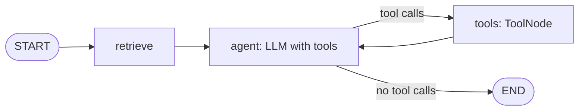

# LangGraph

::: tip In one minute
- LangGraph builds an agent as a **graph**: a shared **state**, **nodes** (functions that update it) and **edges** (which node runs next). A conditional edge lets the model's reply choose the path.
- The repository's LangGraph agent is `retrieve -> agent -> (tools -> agent)* -> END`: `ToolNode` runs tools, `tools_condition` routes, a checkpointer (`InMemorySaver`) gives each `thread_id` its memory.
- Invalid tool arguments are **fed back** to the model as an error message, not repaired by hand. In LangGraph 1.2 a schema violation raises `ToolInvocationError`, not `ValueError`.
- Loops are bounded by `recursion_limit`: 2n − 1 steps for n model calls, plus one when the graph starts with a retrieve node.
- Measured: as a tool, policy search was called in **0 of 6** policy questions by `qwen2.5:1.5b`. As a graph node, it always runs. Put decisions a small model can't be trusted with into edges.
:::

## The idea

The [hand-written agent](/agents/building-agents) is a `for` loop with `if` statements. LangGraph turns that loop into a drawing you can inspect: boxes for steps, arrows for "what next". The loop is still there, but it is now data, which means a test can check its shape.



The analogy is a flowchart on the wall of a call centre. Every call starts at the top. Some boxes are always visited (look up the policy). At some boxes the operator decides which arrow to follow (call a tool, or answer). The chart itself never changes; only the path through it does.

## How it works

### State

The state is a typed dictionary every node reads and writes. `MessagesState` is the prebuilt one: a `messages` list where returned messages are **appended**, not replaced. The shop agent extends it with one field, the policy passages retrieved for this turn.

### Nodes

A node is a function `state -> partial update`. The shop agent has three:

- `retrieve`: finds policy passages for the last user message and returns `{"policy_context": [...]}`.
- `agent`: builds the system prompt (rules, **live cart**, policy context), calls the model, and returns its `AIMessage`.
- `tools`: LangGraph's prebuilt `ToolNode`. It runs every tool call in the last `AIMessage` and returns one `ToolMessage` per call.

### Edges and conditional edges

`add_edge("tools", "agent")` means "after tools, always go back to the agent". `add_conditional_edges("agent", tools_condition, ...)` means "after the agent, ask `tools_condition`": if the last message has tool calls, go to `tools`, otherwise go to `END`. That conditional edge **is** the ReAct loop from [what an agent is](/agents/what-is-an-agent).

### Tools and error feedback

Tools are `@tool` functions whose type hints become the schema. `product: Literal[<catalogue names>]` becomes an `enum`, and `Field(ge=1)` becomes `minimum: 1`. Tools also take a `RunnableConfig` argument, which LangChain injects and **hides from the model**; the tools read the `thread_id` from it to find the right cart.

`ToolNode` validates each call against the schema before running it. With `handle_tool_errors=(ToolInvocationError, ValueError)`, a schema violation or a domain error ("not in the cart") comes back to the model as an error `ToolMessage`, and the model can retry. Any other exception (a broken retriever) propagates and fails loudly. `handle_tool_errors=True` would turn real bugs into polite replies.

::: warning Version detail that broke the first build
In LangGraph 1.2, a schema violation raises `ToolInvocationError`, **not** a `ValueError`. The first version of this agent listed only `ValueError` and crashed on the model's first bad argument.
:::

### Memory: the checkpointer

The graph is compiled with `checkpointer=InMemorySaver()`. Each run is given a config with `thread_id`. After every step, the checkpointer saves the state for that thread. The next `invoke` with the same `thread_id` continues from it, so multi-turn memory needs no hand-kept history list. A different `thread_id` is a separate conversation.

### The loop bound: `recursion_limit`

`recursion_limit` is the maximum number of graph **steps** (node runs) in one `invoke`. Hitting it raises `GraphRecursionError`. To allow n model calls, count the steps: `agent, tools, agent, tools, ..., agent` is n agent steps and n − 1 tools steps, **2n − 1** in total. A limit of 2n would also let the tools step after the last model call run: a cart change that no model call would ever report to the user.

When the graph starts with a `retrieve` node, that node is one more step. With the limit still at 2n − 1, the budget would run out one step early, right **after a tools step**: only n − 1 model calls, and the last thing executed would be exactly the unreported cart change the bound is meant to prevent. So the limit is **2n − 1 steps, plus one when the graph starts with a retrieve node**. The first version forgot this; a code review found that the agent got one model call fewer and could still run an unreported `add_to_cart`. The fixed `_config` counts the node:

```python
retrieve_steps = 1 if "retrieve" in self.graph.nodes else 0
limit = 2 * self.max_model_calls - 1 + retrieve_steps
```

The general rule for any graph: count every node that runs before the loop.

After the bound is hit, the agent's `_close_turn` answers the dangling tool calls with "Not executed: step limit reached." and ends with a give-up reply. Without that, the saved history would end in tool calls nobody answered, and chat models reject such a history on the next turn.

### Retrieval: node or tool?

There are two ways to give an agent search. **Agentic RAG** offers `search_policies` as a tool and lets the model decide when to call it. A **retrieval node** runs search for every message, before the model. The repository supports both (`retrieval="tool"` or `retrieval="node"`), and measured them. With the tool, `qwen2.5:1.5b` called it in 0 of 6 policy questions, even when told to ALWAYS call it, and invented policy ("30 days" for a 45-day window). So the node is the default. Choose the tool only for a model you have measured to use it (see [RAG](/foundations/rag)).

## How to test it

The graph gives you more to assert on than a hand-written loop. The unit tests' own docstring lists what an agent test pins down, "in order of how often it catches real bugs":

1. **Trajectory**: which tools were called, with which arguments, in which order.
2. **State**: the cart after the turn, read from the cart itself, never from the reply text.
3. **What the model was shown**: tool schemas, tool results, the live cart in the prompt.
4. **Control flow**: error feedback, memory across turns, the loop bound.

Plus one thing only a graph offers: **the graph's shape**. `agent.graph.get_graph()` returns nodes and edges, so a test can assert that the ReAct loop, and nothing else, is wired. All of this runs offline with `ScriptedChatModel` (see [LangChain](/agents/langchain)); the live tests use the same oracles as [testing AI agents](/agents/testing-agents).

## In this repository

The agent is [`apps/shop_assistant/langgraph_agent.py`](https://github.com/iamzakirzr/Playwright-ZR/blob/main/apps/shop_assistant/langgraph_agent.py); its walkthrough is [learning path chapter 15](https://github.com/iamzakirzr/Playwright-ZR/blob/main/docs/learning-path/15-building-agents-with-langchain.md). The graph:

```python
graph = StateGraph(ShopState)
graph.add_node("agent", self._call_model)
graph.add_node("tools", ToolNode(self.tools, handle_tool_errors=(ToolInvocationError, ValueError)))
if self.retriever is not None and self.retrieval == "node":
    graph.add_node("retrieve", self._retrieve)
    graph.add_edge(START, "retrieve")
    graph.add_edge("retrieve", "agent")
else:
    graph.add_edge(START, "agent")
graph.add_conditional_edges("agent", tools_condition, {"tools": "tools", END: END})
graph.add_edge("tools", "agent")
```

A tool, with the schema in its type hints:

```python
@tool
def add_to_cart(product: ProductName, quantity: Annotated[int, Field(ge=1)], config: RunnableConfig) -> dict:
    """Add a quantity of a catalogue product to the shopping cart."""
    cart = cart_for(config)
    cart.add(product, quantity)
    return cart.as_dict()
```

`chat(thread_id, message)` returns an `AgentTurn` with the reply, the tool trajectory of this turn (`tool_calls`, each with `name`, `arguments`, `output`, `error`) and `model_calls`.

The unit test that replays the CI failure, from [`tests/ai/langgraph/test_langgraph_agent_units.py`](https://github.com/iamzakirzr/Playwright-ZR/blob/main/tests/ai/langgraph/test_langgraph_agent_units.py):

```python
agent, model = agent_with(
    tool_call_message("add_to_cart", product="Product name", quantity=2),
    tool_call_message("add_to_cart", product=BACKPACK, quantity=2),
    AIMessage("Added 2 backpacks."),
)

turn = agent.chat("t1", "Please add 2 backpacks to my cart")

assert [c.error for c in turn.tool_calls] == [True, False]
feedback = model.received[1][-1]
assert feedback.status == "error" and "Product name" in feedback.content and BACKPACK in feedback.content
assert agent.cart("t1").items == {BACKPACK: 2}
```

The model's first call is rejected by the `enum`; the error it sees lists the valid names; its retry succeeds. Other unit tests check the graph shape, that the `enum` and `minimum` reach the bound schema, that the injected `config` is invisible to the model, memory across turns, thread isolation, `reset`, and both loop-bound behaviours: an endless tool loop is cut off with the thread still usable, and the last allowed model call's tool request is **not** executed.

The live tests, [`tests/ai/langgraph/test_langgraph_agent_live.py`](https://github.com/iamzakirzr/Playwright-ZR/blob/main/tests/ai/langgraph/test_langgraph_agent_live.py), run the same four-turn add, ask, remove, check conversation that broke the hand-written agent in CI, `ToolCorrectnessMetric` on the calls that took effect, grounded policy answers ("45" days, "14.99" express shipping), and an off-topic request that must not touch the cart. Every assertion message carries the per-turn trajectory.

## Measured here

- Agentic RAG on `qwen2.5:1.5b`: `search_policies` called in **0 of 6** policy questions, even when told to ALWAYS call it. Invented answers included "30 days" for a 45-day window, "open 24 hours" and "$5" express shipping.
- The offline suite runs in **under a second**; chapter 15 counted 18 tests when it was written, and the loop-bound regression has since added cases with and without the retrieve node. Live: 5 tests on the real model (commit message).

## Try it

```bash
pytest tests/ai/langgraph -m "not live"   # scripted model, offline
pytest tests/ai/langgraph                 # + qwen2.5:1.5b (needs Ollama)
```

Exercises from chapter 15:

1. In the live fixture, construct the agent with `retrieval="tool"` and run `test_policy_answers_come_from_the_retrieved_policy`. Read the trajectory in the failure message.
2. Change `handle_tool_errors` to `True` and run the unit tests. Which test fails, and why is that the failure you want?
3. Read `test_bound_stops_before_a_tool_call_nobody_would_report`, which runs with and without the retrieve node. Work out the step count for each case by hand, then remove `retrieve_steps` from `_config` and see which case fails.

## Check yourself

1. What does `tools_condition` decide, and where does that decision come from?

::: details Answer
Whether to go from `agent` to `tools` or to `END`. It looks at the last `AIMessage`: tool calls mean `tools`. So the model's reply chooses the path.
:::

2. Why is the recursion limit 2n − 1 and not 2n, and why add one for a retrieve node?

::: details Answer
Steps alternate agent, tools, agent, so n model calls take 2n − 1 steps. A limit of 2n would run one more tools step whose result no model call reports. A retrieve node at the start uses one step, so without the extra one the limit would stop after a tools step, with only n − 1 model calls.
:::

3. Why is `handle_tool_errors=(ToolInvocationError, ValueError)` better than `True`?

::: details Answer
Those two are errors the model can fix (a bad argument, removing something not in the cart). Anything else is a bug in your code or a dependency; with `True` it would be sent to the model and hidden behind a polite reply instead of failing the test.
:::

4. Why is retrieval a node by default rather than a tool?

::: details Answer
Because the small model, given the tool, never called it (0 of 6) and invented policy. A node always runs. A decision the model can't be trusted with belongs in an edge of the graph.
:::
