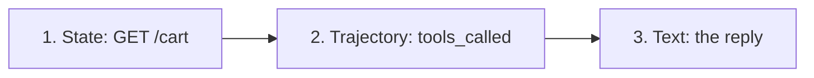

# Testing AI agents

::: tip In one minute
- Rank your oracles: **state** (read the cart through the API) beats **trajectory** (which tools, which arguments) beats **text** (what the agent said).
- Trajectory can be scored without a judge: DeepEval's `ToolCorrectnessMetric` compares called tools and arguments to expected ones, by rule.
- Multi-turn tests drive a whole conversation (`run_conversation` builds a DeepEval `ConversationalTestCase`) and check memory with a rule-based `RetentionProbeMetric`.
- Two layers: **scripted-model unit tests** pin the loop's logic in milliseconds; **live tests** check what a real model actually does.
- Put the per-turn trajectory in every assertion message. Small models behave differently on different machines, and the trajectory is how you find out why.
:::

## The idea

When you test a web form, you don't trust the green "Saved!" banner. You query the database. An agent's reply is that banner, generated by a model that is allowed to be wrong. So an agent test asks three questions, in order of trust:



1. **State.** Did the world change as the user asked? Read it from the system of record, never from the chat.
2. **Trajectory.** Did the agent get there the right way? The [trajectory](/start/glossary#trajectory) is the ordered list of tool calls with their arguments. A correct cart reached by a wrong path (two adds and a remove instead of one add) is a bug waiting to happen.
3. **Text.** Only for what the user must be told: the total, how many are left, a refusal. Check it with rules where you can, and with a [calibrated judge](/evals/judges-and-calibration) only where you must.

The first two are **deterministic**: no LLM judge, no threshold tuning, the same verdict every run. That is why they come first.

## How it works

### Single-turn: state plus trajectory

For "Add 2 backpacks to my cart", the expected trajectory is exactly one call, `add_to_cart` with `{"product": "Sauce Labs Backpack", "quantity": 2}`. DeepEval's `ToolCorrectnessMetric` compares the called tools with the expected tools. With `evaluation_params=[ToolCallParams.INPUT_PARAMETERS]` it also compares arguments, and with `threshold=1.0` anything but an exact match fails. The scoring is a comparison, not a model call.

Then read the cart. If the trajectory is right but the cart is wrong, the bug is in the tool code. If the cart is right but the trajectory is odd, the agent got lucky.

### Multi-turn: conversations

Many bugs appear only across turns: "remove one" after "add two", "one more of the same", "what's in my cart now?". A conversation test sends a scripted list of user messages in one session and then checks:

- **state** after the last turn (net effect: add 2, remove 1, so exactly 1 left);
- **memory**, by checking that a later reply states a fact from earlier turns;
- optionally, **judged** conversation metrics (completeness, role adherence), each gated only on a judge that passed calibration.

DeepEval's `KnowledgeRetentionMetric` is the obvious choice for memory, but in this repository it failed calibration on both local judges (it did not separate a remembering bot from a forgetful one). So memory is checked by a rule: `RetentionProbeMetric` looks for the expected facts, as whole words, in a chosen assistant turn.

### Scripted versus live

| | Scripted-model unit test | Live test |
|---|---|---|
| Model | A test double returning canned replies | The real `qwen2.5:1.5b` in Ollama |
| Speed | Milliseconds, no server | Seconds to minutes per turn on CPU |
| Tests | The loop: routing, argument repair, guards, bounds, rollback | What the model actually does with your prompt and tools |
| Flaky? | No | Can differ across machines, versions and CPUs |

Unit tests answer "if the model does X, does my code do the right thing?". Live tests answer "does the model do X?". You need both. Scripted tests are also where every live failure ends up: once CI shows the model sending some odd argument, you replay that exact argument in a unit test so the fix never regresses.

### Why the trajectory goes in the assertion message

The story that taught this repository the rule: the four-turn conversation test passed locally, 3 out of 3, and failed on GitHub runners with the message `0 == 1` (zero backpacks left, one expected). Same code, same Ollama version. The message said *what* was wrong, not *why*.

The fix was to the test first, not the agent: record every reply with its tool calls and print the per-turn trajectory on failure. The next CI run showed the cause in one go. On the runners, `qwen2.5:1.5b` sent `{"product": "Product name"}` on every cart call, copying the schema's *description* ("Product name") as the value. Nothing was ever added. The fix changed what the model sees: `product` became an `enum` of the catalogue names, so there was no placeholder left to copy (see [building an agent by hand](/agents/building-agents)).

A second case: a CI run ended "add a bike light" plus "add one more of the same item" with 3 bike lights instead of 2, while the identical agent code had passed on an earlier commit. The assertion printed only the cart, so the failing turn couldn't be identified. It now prints both turns' tool calls.

::: warning
A small model at temperature 0 with a fixed seed is repeatable on one machine, not across hardware. If a live agent test fails only in CI, the trajectory in the failure message is your only evidence. Make sure it is there before the failure happens.
:::

## How to test it

A checklist for any tool-calling agent:

| Risk | Assertion |
|---|---|
| Action claimed but not taken | State unchanged means fail, whatever the reply says |
| Wrong tool or arguments | `ToolCorrectnessMetric`, exact arguments, threshold 1.0 |
| Tool used when none should be | Policy question: `tools_called == []` and cart empty |
| Unknown product | Cart empty, and every `add_to_cart` output has `ok` false |
| Wrong arithmetic in the reply | The total in the reply equals the API's total |
| Lost context | Follow-up ("one more of the same") gives the right quantity |
| Session leak | A second session sees neither the cart nor the conversation |
| Off topic | No tools called, and the reply is a refusal |
| Endless loop | Scripted model that always calls a tool is cut off at the bound |

## In this repository

The tests talk to the FastAPI app over real HTTP through a service object, [`api/shop_assistant_client.py`](https://github.com/iamzakirzr/Playwright-ZR/blob/main/api/shop_assistant_client.py), which has a helper built for the state oracle:

```python
def quantity_of(self, session_id: str, product: str) -> int:
    """How many of ``product`` are in the session's cart (0 if none)."""
    return next((i["quantity"] for i in self.cart(session_id)["items"] if i["product"] == product), 0)
```

[`tests/ai/agent/test_agent_live.py`](https://github.com/iamzakirzr/Playwright-ZR/blob/main/tests/ai/agent/test_agent_live.py) checks state, then trajectory:

```python
reply = assistant.chat(session_id, message)

assert assistant.quantity_of(session_id, product) == quantity, reply
test_case = LLMTestCase(
    input=message,
    actual_output=reply["reply"],
    tools_called=as_tool_calls(reply),
    expected_tools=[ToolCall(name="add_to_cart", input_parameters={"product": product, "quantity": quantity})],
)
assert_test(test_case, [tool_correctness(judge_model)])
```

`ToolCorrectnessMetric` insists on a model object in its constructor even though it never calls it here; the fixture's docstring says so, to save the next reader the confusion.

The conversation test, [`tests/ai/agent/test_agent_conversation.py`](https://github.com/iamzakirzr/Playwright-ZR/blob/main/tests/ai/agent/test_agent_conversation.py), uses `run_conversation` from [`ai/evaluators/conversation.py`](https://github.com/iamzakirzr/Playwright-ZR/blob/main/ai/evaluators/conversation.py) and keeps a transcript with tool calls:

```python
USER_TURNS = [
    "Please add 2 backpacks to my cart",
    "How many days do I have to return an item?",
    "Remove one backpack",
    "What's in my cart now?",
]
```

```python
def test_net_cart_state_after_the_conversation(assistant, conversation):
    """Add 2, remove 1: exactly one backpack left."""
    session, _, transcript = conversation

    assert assistant.quantity_of(session, BACKPACK) == 1, "\n" + trajectory(transcript)
```

`trajectory(transcript)` prints one line per turn: the user message, each tool call as `(name, arguments, ok)`, and the start of the reply. The memory check is rule-based:

```python
one = ("1 x", "1 sauce", "one sauce", "one backpack", "1 backpack")
probe = RetentionProbeMetric([one, "backpack"])
```

A tuple lists acceptable spellings of one fact. Matches are whole words, so "1 x" does not pass on "21 x".

Unit tests replace the model. In [`tests/ai/agent/test_agent_units.py`](https://github.com/iamzakirzr/Playwright-ZR/blob/main/tests/ai/agent/test_agent_units.py), `ScriptedShopAgent` overrides `_chat` to pop canned replies and record what was sent:

```python
def test_tool_rounds_are_bounded(self):
    """A model stuck in a tool loop is cut off after MAX_TOOL_ROUNDS model calls."""
    agent = ScriptedShopAgent([tool_reply("view_cart", {})] * (MAX_TOOL_ROUNDS + 5))

    agent.handle("s1", "show my cart again and again")

    assert len(agent.sent) == MAX_TOOL_ROUNDS
```

The LangGraph build of the agent has the same two layers in [`tests/ai/langgraph/`](https://github.com/iamzakirzr/Playwright-ZR/tree/main/tests/ai/langgraph): a `ScriptedChatModel` for offline tests (see [LangChain](/agents/langchain)), and live tests that apply `ToolCorrectnessMetric` only to the calls that took effect. A call the schema rejected, which the model then corrected, is how LangGraph is meant to work, so it is reported but not counted as a wrong action.

## Measured here

- The first live tests found **four** agent defects: fake action claims, lost context, off-topic answers, and descriptions passed as product names (README 3.8).
- The first conversation run found **three** more: "remove one backpack" removed all of them, the model ignored an optional `quantity`, and it invented cart contents (learning path chapter 14).
- On GitHub runners, `qwen2.5:1.5b` sent `{"product": "Product name"}` **on every cart call**; locally the same test passed 3/3.
- Conversation metric calibration: completeness on `llama3.2:3b` scored good 1.0 / bad 0.4. Role adherence on the 3B judge scored good 0.67 / bad 0 locally but 0.0 / 0.0 on GitHub runners, so it gates only on `qwen2.5:7b` (good 1.0 / bad 0.67, threshold 0.8). Knowledge retention scored 0.67 / 0.67 and 1.0 / 1.0: it separates nothing on either judge.
- The scope classifier routed **12/12** messages without store words correctly on `qwen2.5:1.5b`, including held-out phrasings.

## Try it

```bash
pytest tests/ai/agent -m "agent and not live"      # scripted model, seconds
pytest tests/ai/agent/test_agent_live.py            # needs Ollama and qwen2.5:1.5b
pytest tests/ai/agent/test_agent_conversation.py    # the four-turn conversation
pytest tests/ai/langgraph -m "not live"             # the LangGraph build, offline
```

Exercise: in the conversation test, temporarily change the expected quantity to 2 and run it. Read the failure message. Could you tell from it, without a debugger, which turn did what? Now remove `"\n" + trajectory(transcript)` and run again. That difference is the whole argument for this page.

## Check yourself

1. The reply says "I've removed one backpack, you have 1 left", and `tools_called` shows `remove_from_cart` with quantity 1. Is the test done?

::: details Answer
No. Read the cart through the API. The tool may have failed (its output can have `ok: false`), or removed the wrong line. State is the final oracle.
:::

2. Why does this repository use `RetentionProbeMetric` instead of DeepEval's `KnowledgeRetentionMetric`?

::: details Answer
In calibration, `KnowledgeRetentionMetric` gave the good and bad conversations the same score on both local judges (0.67 / 0.67 and 1.0 / 1.0), so it cannot tell a remembering bot from a forgetful one. The rule-based probe can.
:::

3. A live agent test passes locally and fails in CI with `assert 0 == 1`. What should you change first?

::: details Answer
The test's failure message: include the per-turn tool trajectory, so the next CI run shows what the model actually called. In this repository that revealed the `"Product name"` placeholder in one run.
:::

4. What can a scripted-model unit test prove that a live test cannot?

::: details Answer
That the agent's code handles a specific model behaviour correctly (a malformed argument, an endless tool loop, a false claim), every time, in milliseconds. A live test can only show what the model happened to do on that run.
:::
