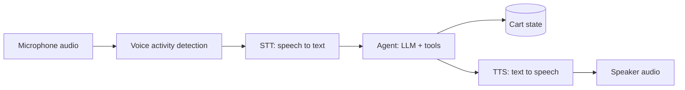

# Voice agents

::: warning Not implemented in this repository
This repository has **no voice agent** and no speech tests. This page teaches the concepts, and every code block below is a clearly labelled, self-contained illustration built on open-source tools (faster-whisper, Piper, jiwer). It wraps the repository's real LangGraph agent, but it is **illustrative, not part of the test suite**.
:::

::: tip In one minute
- A voice agent is a pipeline: **STT** (speech-to-text) turns audio into words, an **agent** decides and acts, **TTS** (text-to-speech) turns the reply back into audio.
- Real systems **stream** every stage and must handle **turn-taking** (when has the user finished?) and **barge-in** (the user interrupts while the bot is talking).
- Latency is a feature: set a budget per stage and end to end, and measure it.
- Test each stage: STT with **WER** (word error rate), TTS with a **round trip** (synthesize, transcribe, compare), plus latency, interruptions, noise and accents.
- Underneath, it is still an agent: the **state** and **trajectory** oracles from [testing AI agents](/agents/testing-agents) stay the most important checks.
:::

## The idea

A voice agent is the shop assistant with a microphone and a speaker bolted on. The customer says "add two backpacks to my cart", and the cart changes. Everything in the middle is the same agent you have already met; the new parts are the ears and the mouth.



The ears and mouth add three problems a text chatbot never has:

1. **Mishearing.** "Add two backpacks" can arrive as "add to backpacks". The agent then acts correctly on the wrong words.
2. **Timing.** In a text chat, a three-second wait is fine. On a phone call, silence feels broken, and the user starts talking again.
3. **Overlap.** People interrupt. The system must notice, stop speaking, and deal with whatever it was in the middle of.

## How it works

### The stages

| Stage | Job | Open-source examples |
|---|---|---|
| VAD | Detect speech versus silence in the audio stream | Silero VAD, WebRTC VAD |
| STT | Turn speech into text | Whisper, faster-whisper |
| Agent | Decide, call tools, write the reply | The shop assistant |
| TTS | Turn the reply into audio | Piper, pyttsx3 |

### Streaming

A naive pipeline waits for each stage to finish. A real one overlaps them: STT emits **partial transcripts** while the user is still talking, the LLM **streams tokens**, and TTS starts speaking the **first sentence** while the rest is still being generated. The user hears the start of the answer before the full answer exists. That is how voice systems get from "several seconds" to "feels like a conversation".

### Turn-taking and endpointing

The system must decide when the user has finished. Usually that is VAD plus a silence threshold ("300 ms of silence ends the turn"). Too short, and the bot cuts people off mid-sentence ("add two... backpacks"). Too long, and every reply feels slow. This is a tuning parameter, and it deserves tests.

### Barge-in

If the user speaks while the bot is talking, the system should stop the audio, cancel the rest of the generated reply, and listen. The hard part for a tester is **state**: if the interruption lands while a tool call is running, did the cart change or not, and does the next turn know? The hand-written agent's atomic turns (see [building an agent by hand](/agents/building-agents)) are the right idea here: a turn either completes or rolls back.

### The latency budget

Split end-to-end latency into stages so a regression points at its cause. The numbers below are an **example budget you would set yourself**, not measurements from this repository (the repository runs its LLM on CPU, where a single agent turn is far slower than this):

| Stage | Measured from, to | Example target |
|---|---|---|
| Endpointing | user stops speaking, turn is closed | 300 ms |
| STT final | turn closed, final transcript | 300 ms |
| Agent first token | transcript in, first reply token | 500 ms |
| TTS first audio | first sentence in, first audio out | 200 ms |
| End to end | user stops speaking, bot starts speaking | about 1.3 s |

Always report percentiles (p50, p95), not averages. See [performance evals](/evals/performance-evals).

## How to test it

### STT accuracy: WER

**Word error rate** compares a transcript to a reference: WER = (substitutions + deletions + insertions) / words in the reference. Lower is better; 0 is perfect.

Reference "add two backpacks to my cart" (6 words), transcript "add to backpacks to my car": two substitutions, WER = 2/6 = 0.33. But notice which words: "two" became "to", so the quantity is gone. WER treats every word the same, while your agent does not. So also measure **task-critical words** (numbers, product names) separately, and in the end, measure the **state** the agent produced from what it heard.

Normalise before scoring (lower-case, strip punctuation, one spelling for numbers), or "Two backpacks." versus "2 backpacks" counts as errors that don't matter.

### TTS intelligibility: the round trip

Listening tests with people are the gold standard for TTS quality, but you can automate a proxy: **synthesize the reply, transcribe it with STT, and compute WER against the original text**. A high round-trip WER means the audio is hard to understand (or your STT is weak: calibrate with known-good audio first, the same way you would [calibrate a judge](/evals/judges-and-calibration)). Watch prices and product names: "$29.99" must come out as something a person understands.

### End to end, with the same agent oracles

Feed recorded or synthesized audio in, and check what happened:

1. **State**: the cart holds two backpacks.
2. **Trajectory**: one `add_to_cart` call with `{"product": "Sauce Labs Backpack", "quantity": 2}`.
3. **Latency** per stage, against the budget.
4. **Text/audio** last: the reply mentions the quantity.

### Robustness

Run the same utterances with background noise at several signal-to-noise ratios, different speakers and accents, different speaking speeds, and phone-quality audio (8 kHz). Track WER and task success per condition, so you can see where it breaks, not just whether it does. Test interruptions with scripted overlapping audio: the bot stops speaking within a set time, and the state is consistent afterwards.

## In this repository

There is no voice code here. What the repository does give you is the part in the middle: an agent with a Python API, `LangGraphShopAgent.chat(thread_id, message)`, that returns the reply and the tool trajectory, and `agent.cart(thread_id)` for the state oracle (see [LangGraph](/agents/langgraph), source in [`apps/shop_assistant/langgraph_agent.py`](https://github.com/iamzakirzr/Playwright-ZR/blob/main/apps/shop_assistant/langgraph_agent.py)). The example below wraps it.

::: info Illustrative, not part of the test suite
Assumes `pip install faster-whisper jiwer`, the `piper` command-line tool with a downloaded voice such as `en_US-lessac-medium.onnx`, and Ollama with `qwen2.5:1.5b`. Library APIs change; check each project's documentation.
:::

```python
"""voice_pipeline.py: illustrative voice wrapper around the repository's LangGraph agent."""
import re
import subprocess
import time

import jiwer
from faster_whisper import WhisperModel
from langchain_ollama import ChatOllama

from ai.search import BM25Retriever, load_documents
from apps.shop_assistant.langgraph_agent import LangGraphShopAgent

stt = WhisperModel("base.en", device="cpu", compute_type="int8")
agent = LangGraphShopAgent(ChatOllama(model="qwen2.5:1.5b", temperature=0), retriever=BM25Retriever(load_documents()))


def transcribe(wav_path: str) -> str:
    segments, _info = stt.transcribe(wav_path)
    return " ".join(segment.text.strip() for segment in segments)


def speak(text: str, wav_path: str, voice: str = "en_US-lessac-medium.onnx") -> None:
    subprocess.run(["piper", "--model", voice, "--output_file", wav_path], input=text.encode(), check=True)


NUMBERS = {"one": "1", "two": "2", "three": "3"}


def normalise(text: str) -> str:
    words = re.sub(r"[^\w\s]", "", text.lower()).split()
    return " ".join(NUMBERS.get(word, word) for word in words)


def word_error_rate(reference: str, hypothesis: str) -> float:
    return jiwer.wer(normalise(reference), normalise(hypothesis))


def voice_turn(thread_id: str, audio_in: str, audio_out: str) -> dict:
    """One spoken turn: STT -> agent -> TTS, timing each stage."""
    t0 = time.perf_counter()
    heard = transcribe(audio_in)
    t1 = time.perf_counter()
    turn = agent.chat(thread_id, heard)
    t2 = time.perf_counter()
    speak(turn.reply, audio_out)
    t3 = time.perf_counter()
    return {
        "heard": heard,
        "turn": turn,
        "latency_ms": {"stt": (t1 - t0) * 1000, "agent": (t2 - t1) * 1000, "tts": (t3 - t2) * 1000},
    }
```

This version is batch, not streaming: each stage waits for the previous one. That is enough for accuracy tests and per-stage timing; streaming and barge-in need a real-time harness.

Three tests on top of it, in the style of the repository's agent tests:

```python
"""test_voice_pipeline.py: illustrative, not part of the test suite."""
from voice_pipeline import agent, normalise, speak, transcribe, voice_turn, word_error_rate

BACKPACK = "Sauce Labs Backpack"


def test_tts_round_trip_is_intelligible(tmp_path):
    """Synthesize a typical reply, transcribe it back, compare."""
    text = "I've added 2 Sauce Labs Backpacks to your cart."
    speak(text, str(tmp_path / "reply.wav"))

    heard = transcribe(str(tmp_path / "reply.wav"))

    assert word_error_rate(text, heard) <= 0.10, heard


def test_spoken_add_changes_the_cart(tmp_path):
    """State first, then trajectory, then latency. The transcript is in every message."""
    speak("Please add two backpacks to my cart.", str(tmp_path / "user.wav"))  # a synthetic caller

    result = voice_turn("voice-1", str(tmp_path / "user.wav"), str(tmp_path / "bot.wav"))
    turn = result["turn"]

    context = f"heard={result['heard']!r} tools={[(c.name, c.arguments) for c in turn.tool_calls]}"
    assert agent.cart("voice-1").items == {BACKPACK: 2}, context
    assert [c.name for c in turn.tool_calls if not c.error] == ["add_to_cart"], context
    assert result["latency_ms"]["stt"] < 2000, result["latency_ms"]
    agent.reset("voice-1")


def test_quantity_survives_transcription(tmp_path):
    """WER can be low while the one word that matters is wrong."""
    speak("Remove one backpack.", str(tmp_path / "user.wav"))

    heard = transcribe(str(tmp_path / "user.wav"))

    assert "1" in normalise(heard).split(), heard
```

Notes on the example, as a tester would read it:

- A **synthetic caller** (TTS generating the user's audio) is cheap and repeatable, but it is clean studio speech. Keep a set of real recordings, with consented speakers, noise and accents, for the numbers you report.
- The thresholds (0.10 WER, 2000 ms) are placeholders. Measure a baseline on your hardware first, then set budgets, as the repository does for its own latency and token budgets.
- The state assertion is the same one the repository's live agent tests use: read the cart, never trust the reply.

## Try it

There is nothing voice-related to run in this repository. To try the idea:

```bash
pip install faster-whisper jiwer
pytest tests/ai/langgraph -m "not live"   # the agent this example wraps, offline
```

Exercise: record yourself saying five cart commands ("add two backpacks", "remove one backpack", "what's in my cart?"...). Write the reference transcripts. Compute WER with `jiwer` for `base.en` and one larger Whisper model, and count how many transcripts would have produced the wrong cart. Is the model with the lower WER always the one with fewer wrong carts?

## Check yourself

1. A transcript has WER 0.17 on "add two backpacks to my cart". Is that good enough?

::: details Answer
It depends on which word was wrong. One error in six words is 0.17; if the wrong word is "two", the cart will be wrong. Measure task-critical words and the resulting state, not only WER.
:::

2. How can you test TTS intelligibility without human listeners?

::: details Answer
A round trip: synthesize the text, transcribe it with an STT model you have calibrated on known-good audio, and compute WER against the original text.
:::

3. The user interrupts while the agent is running `remove_from_cart`. What should the test check?

::: details Answer
That the bot stops speaking within the budget, and that the state is consistent: the removal either happened and the next turn knows it, or it rolled back. Read the cart, as with any agent.
:::

4. Why split end-to-end latency into per-stage numbers?

::: details Answer
So a regression points at its cause (endpointing, STT, the agent or TTS), and so each stage can be given its own budget. Report percentiles, not averages.
:::
