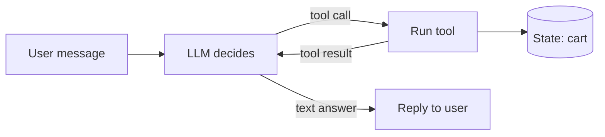

# What an agent is

::: tip In one minute
- An **agent** is an LLM plus **tools** it may call, run in a **loop**, with **memory** of the conversation and access to some **state** (a cart, a database, a file system).
- The loop is simple: the model reads the situation, either answers or asks for a tool call; the program runs the tool and shows the result to the model; repeat until it answers.
- A chatbot only talks. A chain runs fixed steps you wrote. An agent decides its own next step, which is what makes it useful and what makes it hard to test.
- Agents fail in ways chatbots can't: wrong tool, wrong arguments, claiming an action that never happened, forgetting context, looping, and acting outside their job.
- The repository's running example is the Sauce Demo shop assistant, which adds, removes and shows cart items by calling tools.
:::

## The idea

A plain [LLM](/start/glossary#llm) is a text predictor (see [how LLMs work](/foundations/how-llms-work)). Given a conversation, it writes the next message. On its own it cannot *do* anything: it cannot read your cart, charge a card or open a browser. It can only produce text.

An agent is what you get when you let that text trigger actions. You describe some functions to the model ("`add_to_cart(product, quantity)`: add a product to the shopping cart"). Instead of answering in prose, the model can now reply with a structured request: "call `add_to_cart` with `product = Sauce Labs Backpack`, `quantity = 2`". Your program runs the function, and hands the result back to the model. The model reads the result and decides what to do next.

A useful analogy is a new shop assistant with a headset. The manager (the model) never touches the till. They tell the assistant (your code) what to do, the assistant does it and reports back, and the manager decides the next step. The manager can be wrong, can mishear, or can say "done!" without ever giving the instruction. Everything that follows on this site is about catching those mistakes.

Five parts make an agent:

| Part | What it is | In the shop assistant |
|---|---|---|
| LLM | The model that decides | `qwen2.5:1.5b` running locally in Ollama |
| Tools | Functions with a schema the model can request | `add_to_cart`, `remove_from_cart`, `view_cart` |
| Loop | Code that runs requested tools and calls the model again | `for _ in range(MAX_TOOL_ROUNDS)` |
| Memory | The conversation so far, sent back every turn | per-session message history |
| State | The real world the tools change | the session's cart |

### The loop

The most common pattern is called **ReAct** (reason + act): the model thinks about the request, acts by calling a tool, observes the result, and repeats. Modern models do the "reasoning" part implicitly; what matters for a tester is the act, observe, repeat cycle.



The arrow from the tool to the state is the one that matters. Text can be wrong and harmless; a tool call changes something real.

### Chatbot, chain, agent

| | Chatbot | Chain | Agent |
|---|---|---|---|
| Who picks the steps | Nobody: one model call | You, in code | The model, at run time |
| Can change state | No | Only in steps you wrote | Yes, through tools |
| Number of model calls | One per message | Fixed | Varies per message |
| Main test oracle | The text | Each step's output | The state and the tool calls |

A **chain** (see [prompt chaining](/foundations/prompt-chaining)) is a pipeline: classify, then retrieve, then answer. The order never changes, so you can test each link on its own. The repository's LangChain app, `retrieve -> build messages -> chat model`, is a chain (see [LangChain](/agents/langchain)). An **agent** chooses. For "add 2 backpacks" it calls one tool; for "swap the backpack for a jacket" it might call two; for "how long is the return window?" it should call none. You cannot know the path in advance, so you test the path it took.

## How it works

One user turn of the shop assistant, step by step:

1. The user sends "Please add 2 backpacks to my cart".
2. The program builds the messages: a system prompt (rules, the product list, the **live cart**, any retrieved policy passages), the conversation history, and the new message. It also sends the tool schemas.
3. The model replies with a tool call instead of text: `add_to_cart` with `{"product": "Sauce Labs Backpack", "quantity": 2}`.
4. The program checks and runs the tool. The cart now holds two backpacks. The result (`{"ok": true, "cart": ...}`) is appended to the history as a `tool` message.
5. The program calls the model again. It sees its own tool call and the result, and writes "I've added 2 Sauce Labs Backpacks to your cart."
6. No more tool calls, so the loop stops and the reply goes back to the user.

In pseudo-code, every agent framework does roughly this:

```python
history.append(user_message)
for _ in range(MAX_ROUNDS):  # bound the loop
    reply = llm(system_prompt, history, tools)
    if not reply.tool_calls:
        break  # the model answered in text
    for call in reply.tool_calls:
        result = run_tool(call.name, call.arguments)  # the only place state changes
        history.append(tool_message(result))
return reply.text
```

**Memory** is nothing magic: it is the list of previous messages, sent again on every call. The model has no memory of its own between calls. If the program drops a message, the model has "forgotten" it. **State** is different from memory: the cart lives in your program, not in the conversation. The model only knows about the cart what you tell it, which is why the repository puts the live cart into the system prompt on every call (see [building an agent by hand](/agents/building-agents)).

## How to test it

Start from how agents actually fail. Each failure below was seen in this repository with a real model:

| Failure | What it looks like | Seen here |
|---|---|---|
| Wrong tool | A policy question triggers `add_to_cart` | Guarded by a test that a policy question calls no tools |
| Wrong arguments | `{"product": "Product name"}`: the schema's description copied as the value | On GitHub runners, every cart call for a whole test |
| Claims an action it didn't take | "I've added a bike light to your cart" with no tool call | One of the four defects the first live tests found |
| Forgets context | "Add one more of the same" adds the wrong thing | "Lost context" defect; a CI run ended with 3 bike lights instead of 2 |
| Invents state | Asked "what's in my cart?", lists items that aren't there | It listed "1 backpack, 1 bike light, 1 t-shirt" |
| Loops | Keeps calling `view_cart` forever | Bounded by a round limit, with a unit test |
| Acts out of scope | Writes a poem, answers general knowledge | "Off-topic compliance" defect; now a scope guard |

The lesson in that table: **the reply text is the least reliable thing an agent produces**. An agent that says "Added!" may have added nothing, the wrong product, or three of them. So agent tests rank their oracles:

1. **State**: read the cart through the API. Did the world change the way the user asked?
2. **Trajectory**: which tools were called, in which order, with which arguments.
3. **Text**: only last, and only for what the user must be told (the total, the remaining quantity).

That order, and how to implement it, is the subject of [testing AI agents](/agents/testing-agents).

## In this repository

The agent lives in [`apps/shop_assistant/`](https://github.com/iamzakirzr/Playwright-ZR/tree/main/apps/shop_assistant). It exists twice, on purpose:

- [`agent.py`](https://github.com/iamzakirzr/Playwright-ZR/blob/main/apps/shop_assistant/agent.py): a loop written by hand over Ollama's HTTP API, served by the FastAPI app in [`main.py`](https://github.com/iamzakirzr/Playwright-ZR/blob/main/apps/shop_assistant/main.py).
- [`langgraph_agent.py`](https://github.com/iamzakirzr/Playwright-ZR/blob/main/apps/shop_assistant/langgraph_agent.py): the same assistant built with LangChain tools and a LangGraph graph (see [LangGraph](/agents/langgraph)).

The module docstring of `agent.py` draws the loop in one picture:

```text
retrieve policy passages ─▶ LLM (with tools) ─┬─ tool calls? ─▶ run tools ─▶ LLM again (max N rounds)
                                               └─ text ─────────▶ reply
```

And the loop bound is a single constant:

```python
MAX_TOOL_ROUNDS = 3
```

Each tool call the agent makes is returned to the client as a record with its name, arguments and output, which is exactly what a trajectory test needs:

```python
@dataclass
class ToolCall:
    """One executed tool call, as reported to the client (and to DeepEval's ToolCorrectnessMetric)."""

    name: str
    arguments: dict[str, Any]
    output: dict[str, Any]
```

The HTTP API exposes `POST /chat` (reply, `tools_called`, `sources`) and, separately, `GET /cart/{session_id}`. That second endpoint is the point: tests read the cart from it rather than believing the chat reply.

## Measured here

- The first live agent tests found **four real defects**: fake action claims, lost context, off-topic answers, and product descriptions passed as product names (README section 3.8).
- The first multi-turn conversation run found three more: "remove one backpack" removed all of them, the 1.5B model ignored an optional `quantity` argument, and it invented cart contents instead of calling `view_cart` (learning path chapter 14).
- With policy search offered as a tool the model could choose, `qwen2.5:1.5b` called it in **0 of 6** policy questions and invented answers ("30 days" for a 45-day window). Letting a small model decide is itself a failure mode (see [LangGraph](/agents/langgraph)).

## Try it

```bash
pytest tests/ai/agent -m "agent and not live"   # the loop with a scripted model, offline
pytest tests/ai/agent -m "agent and live"       # the real model over HTTP (needs Ollama)
```

Exercise: open [`tests/ai/agent/test_agent_units.py`](https://github.com/iamzakirzr/Playwright-ZR/blob/main/tests/ai/agent/test_agent_units.py) and find `test_tool_rounds_are_bounded`. Before reading its body, write down what you think it scripts the model to do, and what it asserts. Then compare.

## Check yourself

1. Why is "the model replied 'I've added it to your cart'" not evidence that anything was added?

::: details Answer
The reply is just generated text. Only a tool call changes the cart, and the model can write the sentence without making the call. Check the cart (state) and the tool calls (trajectory).
:::

2. What is the difference between memory and state in the shop assistant?

::: details Answer
Memory is the message history the program sends back to the model on every call. State is the cart, held by the program and changed only by tools. The model sees the state only through tool results and the live cart in its system prompt.
:::

3. Is the LangChain RAG app (`retrieve -> build messages -> chat model`) an agent?

::: details Answer
No. It is a chain: the steps and their order are fixed in code, and the model never chooses a tool. That makes it easier to test link by link.
:::

4. Why does every agent loop need a bound such as `MAX_TOOL_ROUNDS`?

::: details Answer
The model decides when to stop. A model that keeps requesting tools would otherwise run forever, costing time and money and possibly changing state again and again.
:::
