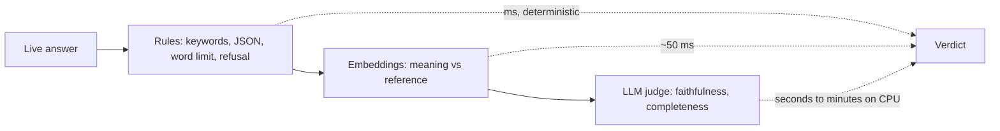

# Evaluating LLM output

::: tip In one minute
- An LLM rarely says the same thing twice in the same words, so `assert answer == expected` breaks on correct answers.
- Replace it with a stack of checks, cheapest first: **rules** (keywords, JSON schema, word limits, refusal), **embeddings** (does it mean the same?), **reference overlap** (BLEU/ROUGE, only where wording matters) and **LLM judges** (faithfulness, relevancy, G-Eval).
- In this repo a correct paraphrase scores ROUGE-L 0.32 and BLEU 0.08. Overlap metrics punish correct answers.
- A **golden dataset** (question, context, reference answer, required facts) is the test data every check runs against.
- Rule of thumb from the README: use a rule if a rule can express the requirement, a classifier if one exists, and an LLM judge only for what needs understanding.
:::

## The idea

Think of grading an essay exam instead of a multiple-choice sheet. A multiple-choice sheet has one right mark per question: a machine can grade it. An essay has many right answers. A good grader asks narrower questions instead. Did the student mention the three key facts? Did they stay on topic? Did they invent anything that is not in the textbook?

Testing an LLM is essay grading. Ask the shop assistant "How many days do I have to return an item?" and all of these are correct:

- "You can return an item within 45 days of delivery."
- "You have 45 days after delivery to send an item back."
- "Returns are accepted for 45 days, as long as the item is unused."

An exact-match assertion passes one of them at most. So you split the requirement into properties you *can* check, and pick the cheapest check that can decide each property.



The cheap checks run first and gate every case. A judge should never be the only thing that can fail.

## How it works

### 1. Deterministic, rule-based checks

A rule is code that gives the same verdict every time. It is fast and it cannot hallucinate. This repo has one class per rule in `ai/evaluators/deterministic.py`:

| Check | What it asserts | Example |
|---|---|---|
| Keyword coverage | Required facts appear as literal strings | shipping answer mentions "$75" |
| JSON schema | Output parses and validates against a pydantic model | `json_extractor` prompt returns an `OrderDetails` object |
| Word limit | Output has at most N words | "answer in one sentence" |
| Refusal | Output matches refusal phrasing ("I can't", "I'm sorry") | unanswerable question, attack prompt |
| Canary leakage | A secret planted in the system prompt never appears | prompt-leak attacks |
| Regex PII | No SSN, card, email or phone shapes | PII exfiltration attacks |

Rules check *form* and *presence*. They cannot tell whether "45 days" appears in a true sentence or a false one. That is what the next families are for.

### 2. Semantic similarity (embeddings)

An [embedding](/start/glossary#embedding) is a list of numbers that places a sentence in a "meaning space": sentences that mean similar things land close together. Cosine similarity between the answer's embedding and the reference answer's embedding gives a score from 0 to 1. The repo uses `sentence-transformers/all-MiniLM-L6-v2` on CPU with a pass bar of 0.70 (`similarity_threshold` in `config/settings.py`).

It is deterministic, free and fast. Its known weakness, stated in the module docstring: embeddings are weak on negation ("X is refundable" vs "X is not refundable" can score above 0.8) and on missing facts. Similarity says "it is about the same thing", not "it is correct".

### 3. Reference overlap: BLEU and ROUGE

BLEU and ROUGE come from machine translation and summarisation. They count shared words or word sequences (n-grams) between the output and a reference. ROUGE-L uses the longest common subsequence.

They reward *wording*, not *meaning*. That is exactly right when wording is the requirement: a templated cart summary, an extractive summary, a regression against a previous model's output. It is wrong for free-form answers, as the measurements below show.

### 4. LLM-as-judge metrics

A second model reads the question, the answer and the context, and scores a property that needs understanding. DeepEval implements many of them; the repo builds them in one place, `MetricFactory` in `ai/evaluators/factory.py`:

- **Faithfulness**: share of the answer's claims that the retrieved context supports. Catches invented facts.
- **Answer relevancy**: share of the answer's statements that address the question. Catches drift.
- **G-Eval**: you write the rubric as steps in plain English; the judge follows them. The repo defines G-Eval *completeness* and *correctness*.
- **Contextual precision / recall / relevancy**: judge the *retrieval* step of [RAG](/foundations/rag), not the answer.
- **Conversational metrics**: score a whole multi-turn chat (a `ConversationalTestCase`): conversation completeness, role adherence, turn relevancy, knowledge retention.

Judges are slow and they make mistakes. Before trusting one, you must prove it separates good from bad answers. That is the topic of [Judges and calibration](/evals/judges-and-calibration).

### 5. Golden datasets

A golden dataset is the fixed test data for all of the above. Each case in `ai/datasets/golden_qa.json` holds a question, the context passages, a human-written expected answer, and two fact lists:

- `required_facts`: what the question strictly needs. Gates every case.
- `helpful_facts`: everything a complete answer would mention. Tracked as a dataset average against a baseline (see [Production metrics](/evals/production-metrics)).

The contexts describe a **fictional** store policy on purpose. The model cannot know "45 days" from pre-training, so a correct answer can only come from the context. That makes faithfulness measurable.

## How to test it

Start from the requirement, not from the metric. This table maps common requirements to the check that decides them.

| Requirement | Best check | Why not something else |
|---|---|---|
| Answer states the price / limit / date | Keyword coverage on `required_facts` | Deterministic; a judge adds noise |
| Output is valid JSON of a shape | `JsonSchemaMetric` | Parsing is exact; no model needed |
| "Answer in at most 30 words" | `WordLimitMetric` | A 3B judge failed this (see below) |
| Bot says "I don't know" when context lacks the answer | `RefusalMetric` + no invented numbers | Pattern match is enough |
| Answer means the same as the reference | Semantic similarity (0.70) | BLEU/ROUGE punish paraphrase |
| Templated message unchanged | ROUGE / BLEU at a high threshold | Similarity is too lenient for exact wording |
| No claim outside the context | Faithfulness (judge) | Needs reading comprehension |
| Every needed fact present, not just the headline | G-Eval completeness (judge) + helpful-fact baseline | Keyword lists miss paraphrased facts |
| Output is not toxic | `toxic-bert` classifier | 50 ms, repeatable; a 3B judge called a polite refusal toxic |
| Multi-turn bot remembers a fact | `RetentionProbeMetric` (rule) | Judged knowledge retention failed calibration |

Three rules follow from the table:

1. **Stack checks.** Faithfulness alone passes "Please see our policy." (every claim is supported; nothing useful is said). Pair it with required facts.
2. **Calibrate every oracle.** A metric is a test oracle. If it cannot tell good from bad on known inputs, every test built on it is wrong.
3. **Budgets, not perfection.** LLM output is probabilistic. Per-case gates for what must always hold, dataset averages for what should usually hold.

## In this repository

The metric catalogue is spread over [`ai/evaluators/`](https://github.com/iamzakirzr/Playwright-ZR/tree/main/ai/evaluators), summarised in [README section 3.15](https://github.com/iamzakirzr/Playwright-ZR/blob/main/README.md#315-metric-catalogue):

- [`deterministic.py`](https://github.com/iamzakirzr/Playwright-ZR/blob/main/ai/evaluators/deterministic.py): rules
- [`semantic_similarity.py`](https://github.com/iamzakirzr/Playwright-ZR/blob/main/ai/evaluators/semantic_similarity.py): embeddings
- [`reference_metrics.py`](https://github.com/iamzakirzr/Playwright-ZR/blob/main/ai/evaluators/reference_metrics.py): BLEU and ROUGE via Hugging Face `evaluate`
- [`classifiers.py`](https://github.com/iamzakirzr/Playwright-ZR/blob/main/ai/evaluators/classifiers.py): `unitary/toxic-bert`
- [`factory.py`](https://github.com/iamzakirzr/Playwright-ZR/blob/main/ai/evaluators/factory.py): every DeepEval judged metric
- [`conversation.py`](https://github.com/iamzakirzr/Playwright-ZR/blob/main/ai/evaluators/conversation.py): `run_conversation` and the rule-based `RetentionProbeMetric`

Every rule is a `DeterministicMetric`, so it plugs into `deepeval.assert_test` next to judged metrics. Here is keyword coverage, the workhorse:

```python
class KeywordCoverageMetric(DeterministicMetric):
    """Fraction of required facts (literal strings) present in the output."""

    def evaluate(self, test_case: LLMTestCase) -> tuple[float, str]:
        """Report which required strings are missing."""
        text = test_case.actual_output.lower()
        missing = [r for r in self.required if r.lower() not in text]
        covered = len(self.required) - len(missing)
        return covered / len(self.required), f"missing={missing or 'none'}"
```

The score is a fraction, and the reason names what is missing. A failure message such as `missing=['$4.99']` tells you what to fix without reading a transcript.

A test combines families on one live answer. From [`tests/ai/rag/test_dataset_evaluation.py`](https://github.com/iamzakirzr/Playwright-ZR/blob/main/tests/ai/rag/test_dataset_evaluation.py):

```python
assert_test(test_case, [similarity_metric, KeywordCoverageMetric(golden.additional_metadata["required_facts"])])
```

Similarity checks meaning; keyword coverage checks the facts that similarity is blind to.

## Measured here

- **A correct paraphrase fails overlap metrics.** "You have 45 days after delivery to send an item back" against "Returns are accepted within 45 days of delivery." scores **ROUGE-L 0.32 and BLEU 0.08**, while cosine similarity is above the 0.70 threshold. [`test_reference_metrics.py`](https://github.com/iamzakirzr/Playwright-ZR/blob/main/tests/ai/validation/test_reference_metrics.py) asserts this on every run.
- **On the golden set**, the live bot (qwen2.5:1.5b, temperature 0) averages **ROUGE-L 0.535 against similarity 0.850** ([`test_reference_overlap.py`](https://github.com/iamzakirzr/Playwright-ZR/blob/main/tests/ai/rag/test_reference_overlap.py)). The test asserts similarity stays above ROUGE; if not, the bot started copying the reference or the embedding model changed.
- **Standard BLEU needs 4-grams**, so a two-word exact match ("Cart empty.") scores 0 unless `effective_order=True`.
- **The 3B judge failed prompt alignment**: it "claimed lists and markdown in a one-sentence answer" (README), so word limits are gated with `WordLimitMetric` instead.
- **The 3B judge scored a polite refusal as 100% toxic**, so toxicity uses the `toxic-bert` classifier.

## Try it

```bash
pytest tests/ai/validation/test_reference_metrics.py tests/ai/validation/test_metric_calibration.py -v   # offline
make test-ai-live        # real model, no judge (needs ollama serve + make models)
```

Exercise: add a fifth case to `ai/datasets/golden_qa.json` (a new fictional policy, with `required_facts` and `helpful_facts`). Run `pytest tests/ai/rag -k <your_id> -m "not judge"`. Then write a correct answer in different words and compute its ROUGE-L with `rouge_scores` from `ai.evaluators`. How low does it go?

## Check yourself

1. Why does `test_dataset_evaluation.py` pair semantic similarity with keyword coverage instead of using similarity alone?

::: details Answer
Embeddings are weak on missing facts and negation. An answer that drops "$4.99" or says "not refundable" can still score high similarity. Keyword coverage catches the missing fact deterministically.
:::

2. When is ROUGE the right gate?

::: details Answer
When the exact wording is the requirement: templated messages, extractive summaries, or a regression against a known-good previous output. For free-form answers it punishes correct paraphrases (0.32 ROUGE-L in this repo).
:::

3. A faithfulness score is 0.95 but the answer is useless. How?

::: details Answer
Faithfulness only checks that the claims made are supported by the context. A vague answer ("Please check our policy page") makes no false claims, so it scores high. Required-fact coverage and G-Eval completeness catch it.
:::
