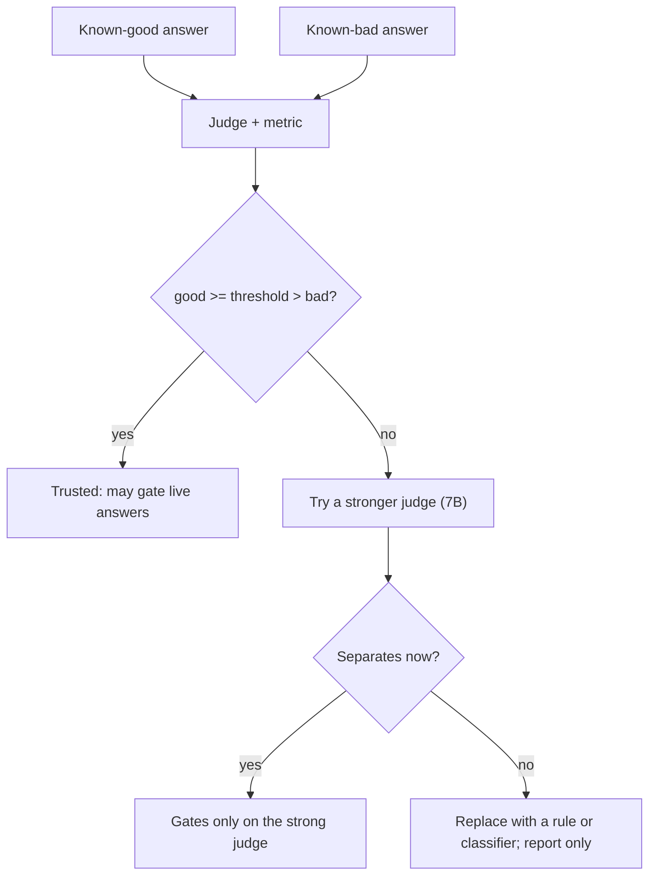

# Judges and calibration

::: tip In one minute
- An **LLM judge** is a second model that scores the first model's answer for a property that needs understanding (faithfulness, relevancy, role adherence).
- A judge is a test oracle, and oracles can be wrong. **Calibration** runs the judge on a hand-written good answer and a hand-written bad answer first. It may gate only if it scores them on the right sides of the threshold.
- In this repo the default `llama3.2:3b` judge passed calibration for faithfulness, G-Eval completeness and conversation completeness, and failed it for eight other metrics. Those run on a `qwen2.5:7b` judge or are replaced by rules.
- Calibrate on the machine that gates: role adherence passed locally on the 3B judge and scored 0.0 / 0.0 in CI.
- Read the score, not the reason. Judges write reasons that contradict their own verdicts.
:::

## The idea

Before you trust a new thermometer, you put it in ice water and in boiling water. If it reads 0 and 100, you use it. If it reads 40 in both, you throw it away, however confident its display looks.

An LLM judge is a thermometer for answer quality. Calibration is the ice-and-boiling-water check. You already know the right verdict for two inputs because you wrote them by hand: a reference answer that is correct, and an answer that contradicts the context. A judge that cannot separate those two cannot be trusted on live output, where you do not know the right verdict.



The rule is written in the README: **a judged metric is only trusted with a judge that passes calibration for it.**

## How it works

### What a judge does

Most DeepEval metrics break the job into small prompts to the judge model. Faithfulness, for example:

1. Ask the judge to extract every claim from the answer.
2. For each claim, ask whether the retrieval context supports it, contradicts it, or says nothing.
3. Score = supported claims / total claims.
4. Ask the judge to write a one-line reason.

G-Eval is different: you write the rubric as evaluation steps in English, and the judge scores against them. The repo's completeness rubric, from `ai/evaluators/factory.py`:

```python
evaluation_steps=[
    "List the facts in 'retrieval context' that are needed to fully answer 'input'.",
    "Check which of those facts appear in 'actual output'.",
    "Heavily penalise every needed fact that is missing, especially prices, limits and exceptions.",
    "Do not penalise brevity when all needed facts are present.",
],
```

### Why judges fail

- **Small models are noisy.** A 3B model misreads, confuses speakers, and struggles to emit the structured JSON the metric parses. The Ragas docstring in `ai/evaluators/judge.py` says 3B models fail with `OUTPUT_PARSING_FAILURE`.
- **Self-preference bias.** Models tend to rate their own family's output higher. The bot is `qwen2.5:1.5b`, so the default judge is `llama3.2:3b`, a different family (comment in `config/settings.py`).
- **Hardware changes the output.** A small model at temperature 0 is repeatable on one machine, not across CPUs or model-server versions.
- **Reasons are generated text too.** The reason can disagree with the score.

### Tiers in this repo

The calibration results decide which judge each metric uses:

| Tier | Judge | Metrics |
|---|---|---|
| Default | `llama3.2:3b` | Faithfulness, G-Eval completeness (threshold 0.7), conversation completeness |
| Strong (opt-in, marker `strong_judge`) | `qwen2.5:7b` | Answer relevancy, G-Eval correctness, hallucination, contextual precision/recall/relevancy, prompt alignment, role adherence, turn relevancy, judged safety |
| Not a gate | none | Knowledge retention (failed on both judges; the rule-based `RetentionProbeMetric` replaces it) |

Strong-judge tests skip if the 7B model is not pulled. CI does not run them: the workflow comment says a 7B judge needs about 2 minutes per call on CPU.

## How to test it

For every judged metric you add:

1. **Write the pair.** A known-good input (usually the golden reference answer) and a known-bad one that fails in exactly the way the metric should catch (a contradiction for faithfulness, a missing fact for completeness, an off-topic turn for turn relevancy).
2. **Assert separation, not just a pass.** `good >= threshold > bad`. A judge that passes everything is worse than no test.
3. **Run the calibration where the gate runs.** If CI gates, calibrate in CI.
4. **Keep the calibration tests in the suite.** They run before the live tests, so a judge upgrade or a model-server change that breaks the judge fails loudly.
5. **Record the scores** next to the threshold (the repo writes them in docstrings and `settings.py` comments), so the next person knows why 0.7 and not 0.5.
6. **Report per-claim verdicts** when a judge rejects something, not only its summary.

## In this repository

The faithfulness calibration, from [`tests/ai/rag/test_faithfulness.py`](https://github.com/iamzakirzr/Playwright-ZR/blob/main/tests/ai/rag/test_faithfulness.py):

```python
class TestJudgeCalibration:
    """Prove the judge discriminates before trusting it on live output."""

    def test_hallucinated_answer_is_caught(self, faithfulness_metric):
        """An answer that contradicts the context must be judged unfaithful."""
        faithfulness_metric.measure(
            LLMTestCase(
                input=RETURNS["question"],
                actual_output="You can return items within 90 days, and no receipt or packaging is needed.",
                retrieval_context=RETURNS["context"],
            )
        )
        assert not faithfulness_metric.is_successful(), (
            f"Judge failed to flag a contradiction (score={faithfulness_metric.score}): {faithfulness_metric.reason}"
        )
```

The context says 45 days and original packaging. The bad answer says 90 days and no packaging. If the judge lets that through, the live faithfulness tests below it mean nothing.

The conversational metrics use a good and a bad three-turn conversation in [`tests/ai/conversation/conftest.py`](https://github.com/iamzakirzr/Playwright-ZR/blob/main/tests/ai/conversation/conftest.py). The bad one answers a return question with a poem and forgets the order number the user gave. The separation check in [`test_conversation_calibration.py`](https://github.com/iamzakirzr/Playwright-ZR/blob/main/tests/ai/conversation/test_conversation_calibration.py):

```python
def test_turn_relevancy_needs_the_strong_judge(strong_metrics, good_conversation, bad_conversation):
    """The 7B judge notices the off-topic poem that the 3B judge scored as relevant."""
    good, bad = scores(lambda: strong_metrics.turn_relevancy(threshold=0.7), good_conversation, bad_conversation)

    assert good >= 0.7 > bad, (good, bad)
```

The factory records the outcome next to the code, in [`ai/evaluators/factory.py`](https://github.com/iamzakirzr/Playwright-ZR/blob/main/ai/evaluators/factory.py):

```python
# Calibrated on a good and a bad 3-turn conversation (tests/ai/conversation):
#   completeness   3B: good 1.0 / bad 0.4    ok on the default judge
#   role_adherence 3B: good 0.67 / bad 0.0 locally, 0.0 / 0.0 in CI; it quotes user turns as the
#                  bot's, so it fails. 7B: good 1.0 / bad 0.67, strong judge (threshold 0.8)
#   turn_relevancy 3B: good 1.0 / bad 1.0    fails; 7B: good 1.0 / bad 0.33, needs the strong judge
```

Synthetic goldens are also gated by a judge. [`ai/synthesis/goldens.py`](https://github.com/iamzakirzr/Playwright-ZR/blob/main/ai/synthesis/goldens.py) does not trust the judge's summary when it rejects one:

```python
if metric.score < self.faithfulness_threshold:
    # The judge's own summary can contradict its verdicts ("0.00 because there are no
    # contradictions"), so report the per-claim verdicts it actually gave.
    judged = [f"{claim!r}: {verdict.verdict}" for claim, verdict in zip(metric.claims, metric.verdicts, strict=False)]
```

## Measured here

Default judge `llama3.2:3b`, RAG metrics (README section 3.1 and [`test_production_metrics.py`](https://github.com/iamzakirzr/Playwright-ZR/blob/main/tests/ai/rag/test_production_metrics.py)):

| Metric | 3B calibration result | Decision |
|---|---|---|
| Faithfulness | faithful 1.0, contradicting 0.0 | default judge |
| G-Eval completeness | complete 0.8 to 0.9, incomplete 0.4 to 0.6 | default judge, threshold 0.7 |
| Contextual recall | **0.33 on a perfect retrieval** (all three shipping passages in the top 3); passed locally, failed in CI on identical input | 7B; retrieval gated by IR metrics |
| Answer relevancy | scored a perfectly on-topic answer 0.25 | 7B |
| G-Eval correctness | flat 0.6 for right and wrong answers | 7B |
| Hallucination | **inverted**: correct answer 1.0, wrong answer 0.0 | 7B |
| Prompt alignment | claimed lists and markdown in a one-sentence answer | 7B; word limit is a rule |
| DeepEval toxicity | polite refusal scored 1.0 (toxic) | `toxic-bert` classifier |

Conversational metrics ([`test_conversation_calibration.py`](https://github.com/iamzakirzr/Playwright-ZR/blob/main/tests/ai/conversation/test_conversation_calibration.py) docstring):

| Metric | llama3.2:3b | qwen2.5:7b |
|---|---|---|
| Conversation completeness | good 1.0 / bad 0.4 | not needed |
| Role adherence | 0.67 / 0 locally, **0.0 / 0.0 on GitHub runners** | good 1.0 / bad 0.67 (threshold 0.8) |
| Turn relevancy | good 1.0 / bad 1.0 | good 1.0 / bad 0.33 |
| Knowledge retention | good 0.67 / bad 0.67 | good 1.0 / bad 1.0 |

Two stories from the commit history:

- **Role adherence on the 3B judge** looked fine locally. On GitHub runners it scored both conversations 0.0, and its reasons quoted the *user's* line "what was my order number again?" as the chatbot going out of character. It confused the speakers, so the local pass was luck. It now gates only on the 7B judge.
- **The golden gate** rejected both synthetic goldens: one correctly (the generator invented "refund or exchange", which the source never says), one strictly (an added "only"). The rejection message now lists per-claim verdicts "because the judge's summary contradicted its own verdict".

## Try it

```bash
make test-ai-judged      # calibration + judged metrics on the 3B judge (slow on CPU)
ollama pull qwen2.5:7b && make test-ai-strong   # the strong tier
```

Exercise: in `tests/ai/rag/test_faithfulness.py`, write a *subtly* wrong answer ("within 45 business days" or "45 days of purchase"). Does the 3B judge catch it? If not, you have found the edge of what this judge can gate.

## Check yourself

1. Why is `assert good >= threshold > bad` stronger than asserting the good answer passes?

::: details Answer
A judge that passes everything also passes the good answer. Only the separation proves the judge can discriminate. Contextual recall and turn relevancy on the 3B judge would have passed a "good passes" test.
:::

2. Role adherence passed calibration on a laptop. Why was that not enough?

::: details Answer
Small models behave differently across hardware. In CI, which is where the gate runs, the same judge scored both conversations 0.0 and confused user turns with bot turns. Calibrate on the machine that gates.
:::

3. The judge rejects a golden with "0.00 because there are no contradictions". What do you trust?

::: details Answer
The per-claim verdicts and the score, not the generated reason. The reason is free text from the same small model and can contradict its own verdicts. That is why `GoldenQualityGate` reports each claim's verdict.
:::
