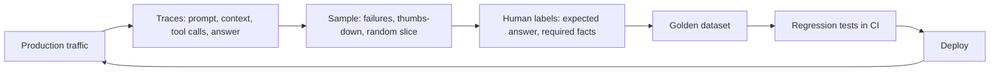

# Observability for AI features

::: tip In one minute
- When an AI feature misbehaves, the final answer rarely tells you why. You need the **prompt, the retrieved context, every tool call, the answer, the model, the latency and the tokens**: a record of what happened.
- **Logging** stores those records. **Tracing** links them into a tree of spans (one per LLM call, retrieval or tool call) under one request. **Dashboards and alerts** watch the aggregates.
- **This repository** records test-time evidence: every LLM exchange is attached to the Allure report, agents return their tool **trajectory** (`AgentTurn`, `ToolCallRecord`), chains record a `StepTrace` per step, and LangSmith tracing can be switched on with two environment variables.
- **Not implemented here**: OpenTelemetry instrumentation, production dashboards, alerts and traffic sampling. This page teaches them as general practice, clearly labelled.
- The payoff loop: production traces become labelled cases, labelled cases become regression tests.
:::

## The idea

A flight data recorder does not prevent crashes. It makes every crash explainable, and each explanation becomes a new check for the next flight. Observability does the same job for an AI feature.

For a classic web service, a log line with a status code and a stack trace is often enough. For an LLM feature it is not: the "bug" may be a passage the retriever did not find, a tool the agent called with a placeholder argument, or a prompt version nobody reviewed. None of that is in the final answer. You have to record the steps.



Every arrow in that loop turns a real failure into a permanent test.

## How it works

### What to record per request

- **Input**: user message, conversation or session id, prompt template name and version.
- **Context**: retrieved passage ids and scores (for [RAG](/foundations/rag)).
- **Model call**: model name as served, sampling settings (temperature, seed), latency, prompt and completion tokens.
- **Tool calls** (for [agents](/agents/what-is-an-agent)): tool name, arguments, result, error flag, in order. This ordered list is the **trajectory**.
- **Output**: the final answer, plus any guard decision (blocked, redacted, why).
- **Outcome**: user feedback, escalation, task completed or not.

Handle it like any sensitive log: prompts and answers can contain personal data, so apply redaction and retention rules before storing.

### Tracing

A **trace** is the full story of one request. It is a tree of **spans**; each span is one timed operation with attributes. For a RAG agent:

```text
trace: POST /chat (session conv-42)
├── span: retrieve            (k=3, top ids: shipping-1, shipping-2)
├── span: llm.chat            (model qwen2.5:1.5b, 812 prompt tokens, 41 completion tokens)
├── span: tool.add_to_cart    (product "Sauce Labs Backpack", quantity 1)
└── span: llm.chat            (final reply)
```

*(Illustrative trace, not output from this repository.)*

With spans you can answer "which step was slow?" and "which step was wrong?" separately.

### LangSmith

LangSmith is LangChain's hosted tracing and evaluation service. LangChain and LangGraph send traces to it automatically when two environment variables are set, with no code change:

```bash
export LANGSMITH_TRACING=true
export LANGSMITH_API_KEY=<your key>
```

It needs a hosted account, so nothing in this repository depends on it.

### OpenTelemetry GenAI semantic conventions

OpenTelemetry (OTel) is the vendor-neutral standard for traces, metrics and logs. Its **GenAI semantic conventions** define standard span and attribute names for model calls, for example `gen_ai.request.model`, `gen_ai.usage.input_tokens` and `gen_ai.usage.output_tokens`, so any backend can show LLM calls the same way. The conventions were still marked as in development at the time of writing; check the current OTel specification before relying on exact names. **OpenTelemetry is not implemented in this repository.**

### Dashboards and alerts

Aggregate the traces into the [production metrics](/evals/production-metrics): p50/p95 latency, tokens and cost per request, refusal rate, guard block rate, tool error rate, thumbs-down rate. Alert on change, not on single events: "guard blocks doubled in an hour" is actionable; one blocked message is not.

## How to test it

Observability is itself a feature with requirements you can test:

1. **The record is complete.** A test asserts that a request produces the tool calls, arguments and model name you expect. If the record is wrong, every investigation built on it is wrong.
2. **The trajectory is an oracle.** Assert on which tools were called with which arguments, not only on the reply text. In this repo the order of trust is state, then trajectory, then text.
3. **Failures carry their evidence.** A failing assertion message should include the trajectory or transcript, so one CI run is enough to diagnose it.
4. **Sensitive data is redacted** in what you store, the same way the guard redacts it in what you show.
5. **The loop closes.** Every production incident ends with a new golden case or regression test.

## In this repository

What is implemented is **test-time observability**: the evidence you need to understand a failing AI test.

**Every LLM exchange in the Allure report.** [`reporting/allure_helpers.py`](https://github.com/iamzakirzr/Playwright-ZR/blob/main/reporting/allure_helpers.py):

```python
def attach_llm_exchange(
    question: str, answer: str, *, model: str = "", context: list[str] | None = None, **telemetry: Any
) -> None:
    """Attach one LLM call (question, context, answer, model, latency, tokens) as a JSON record."""
    attach_json(
        f"LLM: {question[:60]}",
        {"model": model, "question": question, "context": context or [], "answer": answer, **telemetry},
    )
```

The shared `ask` fixture in [`tests/ai/conftest.py`](https://github.com/iamzakirzr/Playwright-ZR/blob/main/tests/ai/conftest.py) calls it on every answer with `latency_ms` and `completion_tokens`, so a failed evaluation shows *what the model said*, not only a score. Tests also call `attach_json` for datasets: per-case ROUGE-L and similarity in `test_reference_overlap.py`, the conversation transcript with tool calls in `test_agent_conversation.py`, and the LangGraph conversation in `test_langgraph_agent_live.py`.

**Agent trajectories.** [`apps/shop_assistant/langgraph_agent.py`](https://github.com/iamzakirzr/Playwright-ZR/blob/main/apps/shop_assistant/langgraph_agent.py) returns one record per user message:

```python
@dataclass
class AgentTurn:
    """The result of one user message.

    Attributes:
        reply: The assistant's final text.
        tool_calls: Every tool call made this turn, in order (the agent's *trajectory*).
        model_calls: How many times the model was called this turn.
    """

    reply: str
    tool_calls: list[ToolCallRecord] = field(default_factory=list)
    model_calls: int = 0
```

`ToolCallRecord` holds `name`, `arguments`, `output` and an `error` flag. The FastAPI shop assistant exposes the same idea over HTTP: `POST /chat` returns `reply`, `tools_called` and `sources` ([`apps/shop_assistant/main.py`](https://github.com/iamzakirzr/Playwright-ZR/blob/main/apps/shop_assistant/main.py)).

**Chain step traces.** [`ai/chains/base.py`](https://github.com/iamzakirzr/Playwright-ZR/blob/main/ai/chains/base.py) records a `StepTrace(step, output, latency_ms)` for each step of the intent, rewrite, retrieve, answer chain, and a failing step raises `ChainError` naming the step. That is a hand-rolled span per step.

**Playwright traces.** The Ollama client sends its HTTP calls through Playwright's `APIRequestContext`, "so chatbot calls are traced exactly like the API suite's HTTP calls", and `pytest.ini` keeps a Playwright trace on failure (`--tracing retain-on-failure`).

**LangSmith** is documented in [learning-path chapter 15](https://github.com/iamzakirzr/Playwright-ZR/blob/main/docs/learning-path/15-building-agents-with-langchain.md) as optional and hosted; tests assert on the graph's own trajectory instead, which works offline.

**Not implemented**: OpenTelemetry spans, production logging pipelines, dashboards, alerts, and sampling of live traffic into the golden set. The golden set is hand-written, plus synthetic goldens from `ai/synthesis/` that must pass a quality gate.

## Measured here

- **A trajectory made a CI-only failure diagnosable in one run.** The conversation test failed in CI (cart ended with 0 backpacks) while local runs were 3/3 correct; the failure message only said `0 == 1`. After the test printed the per-turn trajectory, the next CI run showed the cause: the 1.5B model sent `{"product": "Product name"}`, the schema's description text, on every cart call. The fix made `product` an `enum` of catalogue names (commit history; learning-path chapter 14).
- **Agentic RAG, observed through the trajectory**: when retrieval was a tool, qwen2.5:1.5b called the search tool in **0 of 6** policy questions and invented answers, so retrieval is a graph node by default (README section 3.13b).
- **The judge's reason is not evidence**: the golden gate logs per-claim verdicts because the judge's summary contradicted its own verdict ([Judges and calibration](/evals/judges-and-calibration)).

## Try it

```bash
make test-ai-live     # runs live suites; Allure results go to reports/allure-results
make report-open      # open the report and read the "LLM: ..." attachments
```

Exercise: pick one golden case, break the context on purpose (delete the passage with the answer), run `pytest tests/ai/rag -k <case_id> -m "not judge"`, and diagnose the failure from the Allure attachment alone: question, context, answer, latency, tokens. Then write down which extra field would have made it faster.

## Check yourself

1. The agent's reply says "I added the backpack to your cart." Which record do you trust, and why?

::: details Answer
The state (read the cart back through the API), then the trajectory (was `add_to_cart` actually called, with which arguments). The reply text is generated and can claim an action that never happened; the repo found exactly that defect.
:::

2. What is the difference between a log line and a span?

::: details Answer
A log line is a standalone event. A span is a timed operation with a parent and attributes, linked into a trace for one request, so you can see which step was slow or wrong and how the steps relate.
:::

3. Does this repository send OpenTelemetry GenAI spans?

::: details Answer
No. It records test-time evidence (Allure attachments, `AgentTurn` trajectories, chain `StepTrace`s, Playwright traces) and documents optional LangSmith tracing. OTel GenAI conventions are general practice taught here as a concept.
:::
