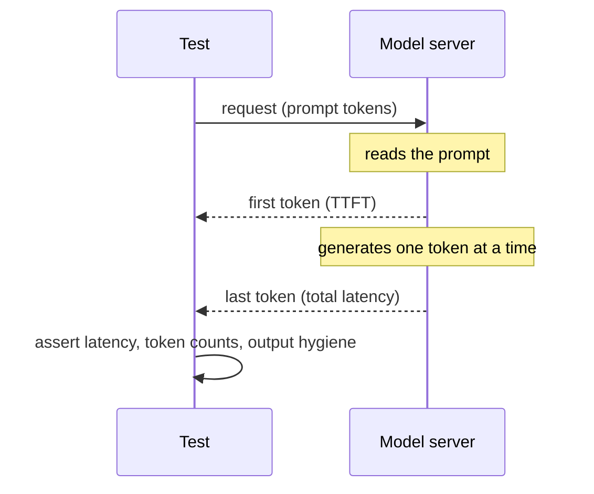

# Performance and reliability evals

::: tip In one minute
- An answer can be correct and still unusable: too slow, too long, too expensive, or different every time you ask.
- Measure **latency** (total, and time to first token when streaming), **tokens** (the unit of cost), **throughput**, and **reproducibility** (same input, same output) and **stability** (different seeds or phrasings, same meaning).
- This repo gates each answer at `max_latency_ms = 60000` and `max_completion_tokens = 150`, asserts identical output at temperature 0 with a fixed seed, and asserts similarity of at least 0.6 across seeds and paraphrases.
- Budgets depend on the hardware. CPU CI runners are slow and produce different small-model output from a laptop, so budgets are generous and the model server version is pinned.
:::

## The idea

A tester already knows non-functional requirements from web apps: a page must load in under two seconds, an API must handle a hundred requests per second. LLM features have the same kind of contract, with two twists.

First, **cost and length are linked**. Hosted models charge per [token](/start/glossary#token) (a chunk of a word, roughly three quarters of an English word on average). A longer answer is slower *and* more expensive. So a token budget is a cost control and a latency control at once.

Second, **the output itself is random by design**. An LLM picks each next token by sampling from a probability distribution ([how LLMs work](/foundations/how-llms-work)). Temperature controls how adventurous the sampling is; the seed fixes the random number generator. At temperature 0 with a fixed seed, the same machine gives the same output. At higher temperatures you want the *meaning* to stay the same even when the words change.



## How it works

| Measure | What it is | Why it matters |
|---|---|---|
| Total latency | Time from request to complete answer | What a non-streaming client waits for |
| Time to first token (TTFT) | Time until the first token arrives when streaming | What a chat user *feels*; the answer then appears word by word |
| Prompt tokens | Size of instructions + context + question | Grows with retrieved context; you pay for it on every call |
| Completion tokens | Size of the answer | Drives generation time and output cost |
| Cost per request | prompt tokens x input price + completion tokens x output price | Budget per feature, per user, per month |
| Throughput | Requests (or tokens) per second the server sustains | Capacity planning; load testing |
| Reproducibility | Identical output for identical input, seed, temperature 0 | Makes a failure replayable |
| Stability | Similar meaning across seeds or paraphrased questions | Users do not ask in your exact words |

**Generation time grows with answer length.** The model writes one token at a time, so a 300-token answer takes roughly twice as long as a 150-token one on the same hardware. That is why a completion-token budget is the cheapest latency control you have.

**Hardware dominates.** The same model on a laptop GPU, a laptop CPU and a shared CI runner can differ by an order of magnitude in speed, and small models can even produce different text on different CPUs.

## How to test it

1. **Measure at the client boundary.** Wrap the model call with a timer and record the server's token counts in the response object, so every test can assert on them.
2. **Set budgets from measurements, not wishes.** Run the suite on the machine that gates, record the numbers, and set the budget with headroom. Write the measured value next to the budget.
3. **Gate the hard ceiling per case, track the trend per dataset.** A single 90-second answer is a bug. A mean that creeps up 20% after a prompt change is a regression you want to see.
4. **Do not cap what you are measuring.** If the client sends a `max_tokens` cap, a runaway answer is silently truncated and a length test can never fail.
5. **Test reproducibility at temperature 0 and stability above it.** The first proves failures can be replayed. The second proves the meaning is robust to sampling noise.
6. **Test paraphrases.** Ask the same question three ways; the answers should be similar in meaning.
7. **Pin the stack.** Model name, model server version, and seed. A changed version is a changed system under test.
8. **Load test separately.** Throughput needs concurrent traffic against a production-like server; do not fold it into functional suites.

## In this repository

Every call returns a `ChatResponse` with telemetry, defined in [`ai/chatbot/base.py`](https://github.com/iamzakirzr/Playwright-ZR/blob/main/ai/chatbot/base.py):

```python
@dataclass(frozen=True)
class ChatResponse:
    """One model reply plus the telemetry needed for non-functional checks."""

    text: str
    model: str
    latency_ms: float
    prompt_tokens: int = 0
    completion_tokens: int = 0
    raw: dict = field(default_factory=dict, repr=False)
```

The Ollama adapter in [`ai/chatbot/ollama_client.py`](https://github.com/iamzakirzr/Playwright-ZR/blob/main/ai/chatbot/ollama_client.py) times the HTTP call with `time.perf_counter()` and copies Ollama's `prompt_eval_count` and `eval_count` into the token fields. It sends `"stream": False`, so it measures **total latency only**. Time to first token is not measured in this repository. Its docstring also warns about point 4 above: `max_tokens` "None means no cap. Leave it off when testing output-length budgets, or the cap would hide an overrun."

The budgets live in [`config/settings.py`](https://github.com/iamzakirzr/Playwright-ZR/blob/main/config/settings.py), overridable by environment variables:

```python
# --- AI non-functional budgets ---
max_latency_ms: float = 60_000
max_completion_tokens: int = 150
```

The suite is [`tests/ai/validation/test_genai_validation.py`](https://github.com/iamzakirzr/Playwright-ZR/blob/main/tests/ai/validation/test_genai_validation.py). Reproducibility and stability:

```python
def test_temperature_zero_is_reproducible(chatbot):
    """Two identical calls at temperature 0 with a fixed seed return identical text."""
    case = golden_case("warranty")

    first = chatbot.ask(case["question"], case["context"]).text
    second = chatbot.ask(case["question"], case["context"]).text

    assert first == second


def test_answers_are_stable_across_seeds(chatbot, settings):
    """Sampling noise must not change the meaning: answers under different seeds stay similar."""
    case = golden_case("returns-window")
    answers = [chatbot.with_options(temperature=0.7, seed=seed).ask(case["question"], case["context"]).text for seed in (1, 2, 3)]

    for other in answers[1:]:
        score = cosine_similarity(answers[0], other, settings.embedding_model)
        assert score >= 0.6, f"unstable ({score:.2f}): {answers[0]!r} vs {other!r}"
```

This is the one place where exact equality is the right assertion: it tests the *determinism* of the setup, not the quality of the answer.

Budgets, per golden case:

```python
assert response.latency_ms <= settings.max_latency_ms, f"{response.latency_ms:.0f} ms"
assert 0 < response.completion_tokens <= settings.max_completion_tokens, response.completion_tokens
assert response.prompt_tokens > 0
```

The same file checks **output hygiene** (non-empty, no `script`/`iframe`/`img`/`a` tags, no unrendered template variables, no echoed system prompt, ASCII ratio above 0.95 as a language check), a **toxicity floor** with the `toxic-bert` classifier (threshold 0.2), and **model identity** (the server reports the configured model, catching silent swaps or fallbacks).

Paraphrase stability lives in [`tests/ai/prompts/test_prompt_behaviour.py`](https://github.com/iamzakirzr/Playwright-ZR/blob/main/tests/ai/prompts/test_prompt_behaviour.py): three phrasings of the returns question ("until when can I return stuff I bought" among them) must give pairwise similarity of at least 0.6.

**Cost** is not computed in money here: the models run locally through Ollama, so there is no price per token. Token counts are the cost proxy, and the test docstring calls the budgets "cost control". A related saving is in [`ai/search/rag.py`](https://github.com/iamzakirzr/Playwright-ZR/blob/main/ai/search/rag.py): below a retrieval score floor the pipeline abstains "without calling the LLM, which saves cost and removes one hallucination path." **Throughput and load testing are not implemented in this repository.**

## Measured here

- **Budgets**: 60,000 ms latency and 150 completion tokens per answer (`MAX_LATENCY_MS`, `MAX_COMPLETION_TOKENS` in the README configuration table). The latency budget is generous because inference runs on CPU.
- **CPU is slow**: the AI suites "take 10 to 20 minutes on CPU" (learning-path chapter 12); a 7B judge needs "~2 min per call on CPU", so strong-judge tests do not run in CI; the judged tier "takes tens of minutes on a laptop CPU; a GPU cuts that roughly tenfold" (README known limitations). Judge calls get a 600 s timeout (`judge_timeout_s`), chatbot calls 180 s.
- **Temperature 0 is repeatable on one machine, not across machines**: `test_summarizer_keeps_every_number` failed twice in CI (the summary dropped $4.99 and $14.99) while the same selection passed 100/100 locally on Ollama 0.34.4 and kept all numbers on 10/10 seeds. The install script had pulled a newer Ollama. CI now pins `OLLAMA_VERSION: 0.34.4` and keys the model cache on it.
- **Different CPUs, different behaviour**: on GitHub runners the 1.5B agent model sent `{"product": "Product name"}` on every cart call (copying the schema text), so nothing was added to the cart, while local runs of the same conversation were 3/3 correct on the same Ollama version.

## Try it

```bash
pytest tests/ai/validation/test_genai_validation.py -v            # needs ollama serve + make models
MAX_COMPLETION_TOKENS=20 pytest tests/ai/validation -k budgets   # watch the budget fail
```

Exercise: add a p95 latency check. Run all golden cases five times, collect `response.latency_ms`, compute the 95th percentile with `statistics.quantiles(latencies, n=20)[-1]`, and assert it against a new budget. Record the value you measured in a comment above the budget.

## Check yourself

1. Why does `OllamaChatbot` leave `max_tokens` unset in the budget tests?

::: details Answer
A cap truncates the answer at the limit, so `completion_tokens` could never exceed the budget and the test could never fail. The overrun would be hidden instead of reported.
:::

2. Two identical calls give different text in CI but identical text locally. Is the reproducibility test flaky?

::: details Answer
Not necessarily. Temperature 0 and a fixed seed make output repeatable on one machine and one model-server version. Check the Ollama version and hardware first; the repo pins the version for exactly this reason.
:::

3. Why is the stability test's threshold (0.6) lower than the golden similarity threshold (0.70)?

::: details Answer
It runs at temperature 0.7, where the wording is expected to vary more. It checks that the meaning survives sampling noise, not that the answer matches a reference.
:::
