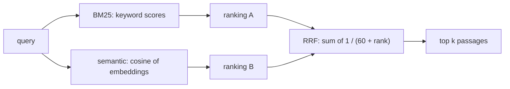

# AI search and its testing

::: tip In one minute
- **Keyword search (BM25)** scores documents by shared words. It is exact and explainable, and misses paraphrases.
- **Semantic search** compares [embeddings](/start/glossary#embedding), so it finds meaning without shared words, and can drift on exact terms and negation.
- **Hybrid search** fuses both rankings. This repo uses Reciprocal Rank Fusion (RRF), the common production default.
- Test search like a ranking system, not like a chatbot: a **labelled query set** plus IR metrics (Recall@k, MRR, nDCG@k gate here; Precision@k and hit rate are implemented too).
- Also test **robustness** (typos, casing, synonyms, paraphrases) and the **negative space**: off-topic queries must return nothing, so the bot abstains instead of guessing.
:::

## The idea

Before a RAG bot can answer "is express delivery expensive?", something has to find the passage that says "Express shipping costs $14.99". That something is search, and it is the step most often at fault when an AI answer is wrong. If the right passage is not retrieved, no prompt can save the answer.

Search is also the easiest part of an AI system to test well. It is deterministic, it needs no LLM, and the information-retrieval field has decades of standard metrics. A tester can hold it to numeric quality bars in seconds.



## How it works

### Keyword search: BM25

BM25 is the classic lexical ranking formula. For each query word that appears in a document it adds a score that grows with:

- how often the word appears in the document (with diminishing returns, controlled by `k1`),
- how rare the word is across the collection (inverse document frequency, so "shipping" counts more than "store"),
- and a correction for document length (controlled by `b`).

Strengths: exact terms like SKUs, product names and codes; fully explainable. Weakness: "how long do I have to send something back" shares no useful words with "accepts returns within 45 days of delivery".

### Semantic search: embeddings

An embedding model turns the query and every document into vectors. Documents are ranked by cosine similarity to the query. Paraphrases and synonyms land close together, so "send something back" finds the returns passage. Weaknesses: exact identifiers can be blurred, negation is weak, and every document gets *some* similarity, so without a threshold even nonsense queries return "results".

### Hybrid search: Reciprocal Rank Fusion

BM25 scores and cosine scores are on different scales, so you can't just add them. RRF ignores the scores and fuses the **ranks**: each retriever contributes `1 / (rrf_k + rank)` for each document, and the sums are re-ranked. With `rrf_k = 60` (the value from the original RRF paper), a document ranked first by either retriever gets a strong boost. A document is found if either method ranks it high.

### The relevance floor

A search returns the top k, always, unless you set a minimum score. For semantic search the repo uses a floor (`semantic_min_score`, default 0.35): below it, nothing is returned, and the RAG pipeline answers "I don't know based on the provided information." without calling the LLM. That saves a model call and removes one [hallucination](/start/glossary#hallucination) path.

## How to test it

### Labelled queries (qrels)

Write down queries and, for each, the document ids a human judged relevant. This is the oracle. Then compute, for each query, over the ranked list:

| Metric | Question it answers | Implemented | Gated |
|---|---|---|---|
| Precision@k | What fraction of the top k is relevant? | yes | unit-tested only |
| Recall@k | What fraction of the relevant documents made the top k? | yes | yes, at least 0.80 |
| Hit rate@k | Did at least one relevant document make the top k? | yes | computed, not gated |
| MRR | How high is the *first* relevant hit? (1 / rank, averaged) | yes | yes, at least 0.75 |
| nDCG@k | Are relevant documents ranked *higher*? (log-discounted) | yes | yes, at least 0.75 |

k is 3 by default (`RETRIEVAL_K`), because that is how many passages the bot receives. Recall@3 matters most for RAG: a relevant passage at rank 4 does not exist as far as the model is concerned.

::: info Test the metrics too
Metric code has bugs like any code. Known inputs with known answers (a perfect ranking scores 1.0; one relevant document at rank 3 gives MRR 1/3 and nDCG 0.5) catch them.
:::

### Compare strategies

Run the same query set against every retriever. The hybrid one exists to be better, so assert it: hybrid nDCG must not fall more than 0.05 below the best single strategy.

### Robustness probes

Real users misspell, shout, reorder and paraphrase. Keep a list of perturbed queries, each with the one document it must still find in the top k: typos ("retrn windw for itmes"), casing ("RETURN WINDOW"), word order, synonyms ("bike lamp"), paraphrases.

### Negative space

Off-domain queries ("recipe for sourdough bread") must return nothing above the floor. And the floor must not be so high that a genuine query ("express shipping price") is dropped too. Test both sides of the threshold.

### Properties

Ranks are 1..k in order, scores never increase, no duplicates, and the same query twice gives the same ranking.

## In this repository

All retrievers extend one abstract class in [`ai/search/base.py`](https://github.com/iamzakirzr/Playwright-ZR/blob/main/ai/search/base.py) (a Strategy pattern), so the same tests run against each. `search` applies the floor:

```python
scores = self._score(query)
order = sorted(range(len(scores)), key=lambda i: scores[i], reverse=True)
results = []
for i in order[:k]:
    if min_score is not None and scores[i] < min_score:
        break
    results.append(SearchResult(self.documents[i], scores[i], rank=len(results) + 1))
return results
```

[`ai/search/retrievers.py`](https://github.com/iamzakirzr/Playwright-ZR/blob/main/ai/search/retrievers.py) holds `BM25Retriever`, `SemanticRetriever` (all-MiniLM-L6-v2 embeddings, normalised, so a dot product equals cosine) and `HybridRetriever`, whose fusion is:

```python
fused = [0.0] * len(self.documents)
for retriever in self.retrievers:
    scores = retriever._score(query)
    order = sorted(range(len(scores)), key=lambda i: scores[i], reverse=True)
    for rank, i in enumerate(order, start=1):
        fused[i] += 1.0 / (self.rrf_k + rank)
return fused
```

Because RRF scores come from ranks, every document gets a positive score. The relevance floor is therefore applied to the semantic retriever, whose scores mean something on their own.

The metrics are pure functions in [`ai/search/metrics.py`](https://github.com/iamzakirzr/Playwright-ZR/blob/main/ai/search/metrics.py). nDCG with binary relevance:

```python
dcg = sum(1.0 / math.log2(rank + 1) for rank, d in enumerate(retrieved[:k], start=1) if d in relevant)
ideal = sum(1.0 / math.log2(rank + 1) for rank in range(1, min(len(relevant), k) + 1))
return dcg / ideal if ideal else 0.0
```

The data is [`ai/search/corpus.json`](https://github.com/iamzakirzr/Playwright-ZR/blob/main/ai/search/corpus.json): 15 atomic policy passages (including near-duplicate distractors "so ranking quality matters"), 8 labelled `queries`, 5 `robustness` probes and 3 `out_of_domain` queries. One labelled query:

```json
{"query": "is delivery free", "relevant": ["shipping-2", "shipping-1"]}
```

The tests are in [`tests/ai/search/`](https://github.com/iamzakirzr/Playwright-ZR/tree/main/tests/ai/search): `test_retrieval_quality.py` (metric math, quality bars per strategy, hybrid versus components, ranking properties, determinism), `test_search_robustness.py` (probes, paraphrase, floor), and `test_rag_search_e2e.py` (search plus the live model; see [RAG](/foundations/rag)).

## Measured here

The suite pins two behaviours worth knowing:

- **BM25 misses a paraphrase that embeddings find.** For "how long do I have to send something back", the semantic retriever returns `returns-1` in the top 3, and BM25 with a tiny score floor returns nothing. The test docstring warns about a trap: without a floor, BM25 still *returns* documents. They all score 0 and come back in insertion order, "which looks like a hit but isn't".
- **The floor abstains without calling the model.** With floor 0.35, "recipe for sourdough bread" returns no passages, and a spy chatbot records zero calls.

The repository records the quality bars (Recall@3 at least 0.80, MRR and nDCG@3 at least 0.75) but not the actual scores each strategy reaches. Run the suite to see them.

## Try it

```bash
# Offline: BM25 and embeddings only, no LLM
pytest tests/ai/search/test_retrieval_quality.py tests/ai/search/test_search_robustness.py -v
pytest -m search          # the whole search marker, including the live end-to-end tests
```

Exercise: add a robustness probe to `corpus.json`, for example `{"query": "refnd timing", "relevant": "returns-3", "kind": "typos"}`, and run the robustness test. Does hybrid still find it? Then try BM25 alone in a Python shell and explain the difference:

```python
from ai.search import load_documents
from ai.search.retrievers import BM25Retriever

bm25 = BM25Retriever(load_documents())
print(bm25.search("refnd timing", k=3, min_score=1e-9))
```

## Check yourself

1. Recall@3 is 1.0 but MRR is 0.5. What does that tell you?
::: details Answer
Every relevant document is somewhere in the top 3, but on average the first relevant one is at rank 2, not rank 1. Ranking order can improve.
:::

2. Why fuse ranks (RRF) instead of adding BM25 and cosine scores?
::: details Answer
The scores are on unrelated scales (BM25 is unbounded, cosine is roughly 0 to 1), so adding them lets one method dominate. Ranks are comparable without calibration.
:::

3. Why test off-domain queries at all? Nobody asks a store bot about sourdough.
::: details Answer
They do, and without a floor search still returns its "best" passages. The model then gets irrelevant context and may invent an answer. An empty result lets the pipeline abstain safely.
:::

4. Why is Recall@k usually the most important search metric for RAG?
::: details Answer
The model only sees the top k passages. A relevant passage just below the cut-off is invisible to it, so the answer can't use it.
:::
