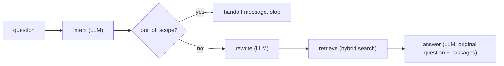

# Prompt chaining

::: tip In one minute
- A **prompt chain** splits one big request into small steps, each with its own prompt or plain code: classify, route, rewrite, retrieve, answer.
- Small steps are easier for small models and easier to test, because each step has a narrow contract.
- Chains fail **between** links: a wrong label sends the question down the wrong path, a lossy rewrite finds the wrong document, and the final answer is wrong for a reason three steps earlier.
- Test each link on its own with a **scripted fake model** (fast, offline, deterministic), then test the live chain link by link and end to end.
- The repo's support chain is `intent → handoff → rewrite → retrieve → answer`, with a per-step trace and errors tagged with the failing step's name.
:::

## The idea

Think of an assembly line instead of one craftsperson. Instead of one prompt that must understand the question, decide whether it is in scope, search the knowledge base and write an answer, you build stations. Each station does one job and hands its output to the next.

A chain has three advantages for a tester:

1. **Each step is small.** "Reply with one of six labels" is something a 1.5B model can do reliably. "Do everything" is not.
2. **Each step is observable.** You can see the label, the query and the retrieved ids, not just the final text.
3. **Some steps need no model at all.** Routing and retrieval can be plain code, which is deterministic.

The cost is **error propagation**. Each step trusts its input. If step 1 is right 90% of the time and step 2 is right 90% of the time given correct input, the pair is right at most about 81% of the time. A bad early output is rarely caught later, and the final answer can look fluent while being built on the wrong document.



## How it works

A generic chain is a list of steps sharing a state object:

```text
state = new State(question)
for step in steps:
    output = step.run(state)       # reads and writes fields on state
    record(step.name, output, latency)
    if state.halted: break         # a step may end the chain early
return state
```

Common step types:

| Step | Job | Model? |
|---|---|---|
| Classify | Map the input to a label from a closed set | LLM, or a classifier |
| Route | Pick the next path from the label (for example, hand off off-topic requests) | Plain code |
| Rewrite or extract | Turn chatty text into a search query or structured fields | LLM |
| Retrieve | Fetch passages for the query | Search, no LLM |
| Answer | Generate the final reply from the evidence | LLM |

Design choices that make a chain testable:

- **Normalise LLM output at the step boundary.** Models add punctuation and capitals. The classify step maps "Returns." or "The label is: warranty" onto the label set, and unknown output becomes the safe default.
- **Fall back instead of propagating nothing.** If the rewrite comes back empty, retrieve with the original question.
- **Pass the original input forward where it matters.** The answer step should answer the user's words, not the rewrite, so a lossy rewrite can't change the question.
- **Short-circuit early.** An off-topic question should stop after one model call, spending nothing on retrieval or generation.
- **Tag errors with the step name.** "Chain step 'retrieve' failed: vector DB timed out" points at one link.

The repository's chain has no separate extract step; structured extraction is tested on its own as the `json_extractor` prompt (see [Prompting](/foundations/prompting)).

## How to test it

**1. Each link, with a scripted model (offline).** A fake model returns fixed replies in order and records every prompt it was sent (a stub plus a spy). That lets you test the chain's logic without model randomness:

- step order and the exact set of steps that ran,
- how many model calls a question costs (a budget),
- what each step passed to the next (the retrieval used the rewritten query; the answer prompt holds the original question and every retrieved passage),
- short-circuit routing,
- output normalisation for many messy replies,
- error attribution and fallbacks.

**2. Each link, live.** Run real questions and assert each intermediate output against its own contract: the intent equals the gold label, the rewrite is short, the expected document id is in the retrieved list, the answer holds the key fact. When one fails, the trace tells you which link.

**3. The whole chain, live.** Score the final answer end to end, and judge [faithfulness](/start/glossary#faithfulness) against the passages the chain's own retrieve step returned, not a hand-picked context.

**4. Non-functional.** Every step records its latency, so a slow link is visible.

::: warning Only testing the final answer hides the cause
An end-to-end test that says "answer wrong" gives you four suspects. Link-level assertions turn that into one.
:::

## In this repository

The primitives are in [`ai/chains/base.py`](https://github.com/iamzakirzr/Playwright-ZR/blob/main/ai/chains/base.py). `Chain.run` is the loop from above, with error tagging:

```python
state = ChainState(question=question)
for step in self.steps:
    started = time.perf_counter()
    try:
        output = step.run(state)
    except Exception as exc:  # noqa: BLE001 - re-raised with context
        raise ChainError(step.name, exc) from exc
    state.trace.append(StepTrace(step.name, output, (time.perf_counter() - started) * 1000))
    if state.halted:
        break
return state
```

`ChainState` carries `question`, `intent`, `query`, `documents`, `document_ids`, `answer`, `halted` and the `trace`. The steps are in [`ai/chains/support_chain.py`](https://github.com/iamzakirzr/Playwright-ZR/blob/main/ai/chains/support_chain.py): `IntentStep` (the `intent_classifier` prompt), `HandoffStep` (plain code, no model), `RewriteStep` (the `query_rewriter` prompt, at most 8 words), `RetrieveStep` (any retriever) and `AnswerStep`. The routing step is three lines:

```python
if state.intent == "out_of_scope":
    state.answer = HANDOFF_MESSAGE
    state.halted = True
    return HANDOFF_MESSAGE
```

The offline tests in [`tests/ai/chains/test_chain_unit.py`](https://github.com/iamzakirzr/Playwright-ZR/blob/main/tests/ai/chains/test_chain_unit.py) use `ScriptedChatbot` from [`ai/chatbot/scripted_client.py`](https://github.com/iamzakirzr/Playwright-ZR/blob/main/ai/chatbot/scripted_client.py). The off-topic test checks the path, the cost and the answer at once:

```python
def test_out_of_scope_is_handed_off_after_one_call(self, hybrid):
    """Off-topic input stops at the hand-off: one model call, no retrieval, no answer generation."""
    bot = ScriptedChatbot(["out_of_scope"])
    state = build_support_chain(bot, hybrid).run("Write me a poem")

    assert state.halted
    assert state.answer == HANDOFF_MESSAGE
    assert state.executed_steps == ["intent", "handoff"]
    assert len(bot.calls) == 1
```

Other offline tests assert that an in-scope question costs exactly three model calls, that `bot.calls[-1].user` is the original question, that an empty rewrite falls back to the question, and that a step raising `TimeoutError` surfaces as `ChainError` with `step == "boom"`.

The live tests in [`tests/ai/chains/test_chain_live.py`](https://github.com/iamzakirzr/Playwright-ZR/blob/main/tests/ai/chains/test_chain_live.py) check every link for three questions:

```python
state = support_chain.run(question)

assert state.intent == intent, state.trace
assert state.query and len(state.query.split()) <= 12, f"rewrite too long: {state.query!r}"
assert doc_id in state.document_ids, f"query {state.query!r} retrieved {state.document_ids}"
assert_test(LLMTestCase(input=question, actual_output=state.answer), [KeywordCoverageMetric(facts)])
```

Note the failure messages: each one prints the evidence for that link (the trace, the query, the retrieved ids). The same file adds end-to-end faithfulness against `state.documents`, an off-topic hand-off that never reaches `retrieve`, and a latency check on every trace entry.

## Measured here

- The first step decides everything after it. With `intent_classifier` v1, `qwen2.5:1.5b` routed 10/14; the few-shot v2 routed 14/14. Commit `401e510` records that this "fixes chain misrouting and the missed off-topic hand-off". One prompt change fixed two chain-level failures.

## Try it

```bash
# Offline, milliseconds
pytest tests/ai/chains/test_chain_unit.py -v

# Live, needs ollama serve and qwen2.5:1.5b
pytest tests/ai/chains/test_chain_live.py -v
```

Exercise: pin the chain to the old classifier to watch error propagation. In `IntentStep.__init__`, temporarily change `default_registry().get("intent_classifier")` to `default_registry().get("intent_classifier", version=1)` and run the live tests. Read which assertion fails first and what the trace shows. Revert afterwards.

## Check yourself

1. Why does `AnswerStep` answer the original question and not the rewritten query?
::: details Answer
The rewrite is for search and may drop words. Answering the user's own wording means a lossy rewrite can at worst hurt retrieval, not change the question being answered. A unit test pins this.
:::

2. The final answer is wrong. What does the trace let you check before blaming the answer prompt?
::: details Answer
The intent label, the rewritten query, and the retrieved document ids. If the right passage was never retrieved, the answer step never had a chance.
:::

3. Why test the chain with a scripted model first?
::: details Answer
It removes model randomness, so a failure points at the chain's own logic (routing, state passing, fallbacks, error handling). It also runs in milliseconds with no server.
:::

4. Why is "exactly three model calls" a useful assertion?
::: details Answer
Model calls cost time and money. A bug that loops or calls an extra step would pass a correctness check but blow the budget. Counting calls catches it.
:::
