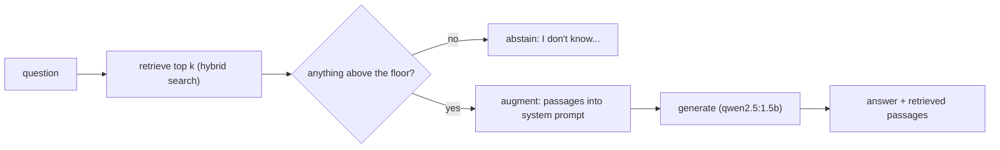

# Retrieval-augmented generation (RAG)

::: tip In one minute
- [RAG](/start/glossary#rag) answers a question in three steps: **retrieve** relevant passages, **augment** the prompt with them, **generate** an answer from them.
- It fails in four typical ways: the right passage is not retrieved, the model ignores the context, the model adds claims the context doesn't support (hallucination), or the source data is stale.
- Test each failure separately: IR metrics for retrieval, **faithfulness** for grounding, **abstention** and **counterfactual** probes for "context beats prior knowledge", fact coverage for completeness.
- A judged metric gates only on a judge that passed calibration for it. Here, faithfulness and completeness gate on `llama3.2:3b`; relevancy, correctness, hallucination and the contextual metrics need `qwen2.5:7b`.
- In an agent, make retrieval a fixed graph step unless the model is strong enough to decide to search. `qwen2.5:1.5b` called the search tool 0 of 6 times and invented "30 days".
:::

## The idea

An LLM only knows what was in its training data, and it cannot tell you where a fact came from. RAG is an open-book exam: before the model answers, the application looks up the relevant pages and puts them in front of it with the instruction "answer from these".

That gives three benefits: answers about private or recent data (your store's return policy), fewer invented facts, and a way to check the answer, because you know exactly which text it was supposed to use. That last point is what makes RAG testable.

The repository makes it even more testable by using a **fictional** store policy (45-day returns, $4.99 standard shipping under $75, $14.99 express). A model cannot know those facts from pre-training, so a correct answer can only have come from the context.



## How it works

1. **Retrieve.** Search the knowledge base for the question and keep the top k passages (k = 3 here). See [AI search](/foundations/ai-search) for BM25, embeddings and hybrid fusion.
2. **Augment.** Render a prompt that holds the rules and the passages. The repo's `grounded_qa` v2 system prompt begins: "Answer ONLY from the CONTEXT below. Include every relevant fact from it, such as prices, limits and exceptions. If the context does not contain the answer, reply exactly: "I don't know based on the provided information."". The passages are inserted as a bullet list.
3. **Generate.** The model writes the answer. The application returns it *with* the passages it was given, so a test can judge the answer against the real evidence.

### How RAG fails

| Failure | What it looks like | Where the bug is |
|---|---|---|
| Retrieval miss | Fluent answer, wrong or "I don't know", although the knowledge base has the fact | Search: query, index, k, floor |
| Context ignored | Model answers from pre-training ("water boils at 100 °C") despite context saying otherwise | Prompt, model size |
| Hallucination | Answer adds a number or rule the passages don't contain | Model, prompt; no abstention path |
| Incomplete | States the main fact, drops the fee or the exception | Model, prompt |
| Stale data | Answer faithfully repeats an outdated policy | Content pipeline, not the model |

Stale data is worth a warning: every faithfulness metric will pass, because the answer matches its context perfectly. Only freshness checks on the knowledge base catch it. **That is not implemented in this repository**; in a real system you would assert, for example, that every indexed document carries a last-reviewed date within a set window.

## How to test it

Separate the pieces, then test the seam between them.

**Retrieval, without an LLM.** Labelled queries and Recall@k, MRR, nDCG@k. This is deterministic and gates every run.

**Grounding guardrails, without a judge.** Two cheap probes:

- *Unanswerable*: give a context that lacks the answer ("How many loyalty points do I earn per dollar?" with only returns and shipping passages). The bot must abstain, and must not produce a number.
- *Counterfactual*: give a context that contradicts world knowledge ("in the pressurised chamber used for Lab 7, water boils at 121 degrees Celsius"). The answer must contain "121" and not "100". A model answering from pre-training fails, even though 100 °C is "true" in general. This is the sharpest faithfulness probe.

**Required facts, without a judge.** Each golden case lists `required_facts` (what the question strictly needs, gating) and `helpful_facts` (what a complete answer would mention, tracked against a dataset baseline).

**Judged metrics (DeepEval), each on a calibrated judge.** An LLM judge reads the answer and context and scores it. Before trusting one, run it on a known-good and a known-bad hand-written answer. A judge that passes both is worse than no test.

| Metric | Asks | Judge it gates on here |
|---|---|---|
| Faithfulness | Is every claim in the answer supported by the retrieved context? | `llama3.2:3b` (calibrated: faithful 1.0, contradicting 0.0) |
| G-Eval completeness | Does the answer cover what the reference covers? | `llama3.2:3b` (complete 0.8 to 0.9, incomplete 0.4 to 0.6, threshold 0.7) |
| Answer relevancy | Does the answer address the question? | `qwen2.5:7b` only |
| Contextual precision / recall / relevancy | Were the retrieved passages the right ones, ranked well? | `qwen2.5:7b` only; retrieval is gated by IR metrics |
| Hallucination, G-Eval correctness | Does the answer contradict the context or the reference? | `qwen2.5:7b` only |
| Ragas Faithfulness | Second, independent faithfulness implementation | opt-in, 7B or larger |

**End to end.** Run the real pipeline and judge faithfulness against `retrieval_context` = the passages search actually returned, not a curated context. Also assert the pipeline abstains without calling the model when nothing clears the floor.

See [Evaluating LLMs](/evals/evaluating-llms) and [Judges and calibration](/evals/judges-and-calibration) for the metric details.

## In this repository

The pipeline is [`ai/search/rag.py`](https://github.com/iamzakirzr/Playwright-ZR/blob/main/ai/search/rag.py). Its `answer` method is the whole loop:

```python
def answer(self, question: str) -> RagAnswer:
    """Retrieve passages for ``question`` and generate a grounded answer."""
    results = self.retriever.search(question, k=self.k, min_score=self.min_score)
    if not results:
        return RagAnswer(question, None, [])
    response = self.chatbot.ask(question, [r.document.text for r in results])
    return RagAnswer(question, response, results)
```

`RagAnswer` keeps the evidence: `.contexts` (passage texts, in rank order, ready for DeepEval's `retrieval_context`) and `.document_ids`. With no results, `.text` is the standard abstention.

The grounding probes are in [`tests/ai/rag/test_grounding_guardrails.py`](https://github.com/iamzakirzr/Playwright-ZR/blob/main/tests/ai/rag/test_grounding_guardrails.py), with their cases in [`ai/datasets/golden_qa.json`](https://github.com/iamzakirzr/Playwright-ZR/blob/main/ai/datasets/golden_qa.json):

```python
@pytest.mark.parametrize("case", COUNTERFACTUAL, ids=[c["id"] for c in COUNTERFACTUAL])
def test_bot_prefers_context_over_prior_knowledge(ask, case):
    """When the context contradicts common knowledge, the context wins."""
    answer = ask(case["question"], case["context"]).text

    assert case["must_contain"] in answer, f"Ignored the context: {answer!r}"
    assert not re.search(rf"\b{case['must_not_contain']}\b", answer), f"Leaked prior knowledge: {answer!r}"
```

The rest of [`tests/ai/rag/`](https://github.com/iamzakirzr/Playwright-ZR/tree/main/tests/ai/rag): `test_faithfulness.py` (judge calibration first, then live answers), `test_production_metrics.py` (the three tiers: deterministic required facts, 3B completeness, 7B relevancy and contextual metrics), `test_semantic_similarity.py`, `test_ragas_crosscheck.py`. The seam between search and generation is tested in [`tests/ai/search/test_rag_search_e2e.py`](https://github.com/iamzakirzr/Playwright-ZR/blob/main/tests/ai/search/test_rag_search_e2e.py).

### RAG inside an agent: node or tool?

An agent can get its passages two ways. **Retrieval as a node**: the application always searches before the model runs, and puts the passages in the prompt. **Retrieval as a tool** ("agentic RAG"): the model gets a `search_policies` tool and decides when to call it. The second is more flexible and relies on the model making that decision.

[`apps/shop_assistant/langgraph_agent.py`](https://github.com/iamzakirzr/Playwright-ZR/blob/main/apps/shop_assistant/langgraph_agent.py) supports both, and wires the node like this:

```python
if self.retriever is not None and self.retrieval == "node":
    graph.add_node("retrieve", self._retrieve)
    graph.add_edge(START, "retrieve")
    graph.add_edge("retrieve", "agent")
else:
    graph.add_edge(START, "agent")
```

Node mode is the default because of a measurement (below). The docstring's lesson: "When the model can't be trusted with a decision, make it an edge in the graph." See [LangGraph](/agents/langgraph).

## Measured here

- **Agentic RAG failed on the small model.** In tool mode, `qwen2.5:1.5b` called the search tool in **0 of 6** policy questions, "even when told to ALWAYS call it", and invented policy instead: **"30 days"** for a 45-day return window. With retrieval as a node, the live test asserts the answers contain "45" and "14.99".
- **3B judge calibration** (README section 3.1): faithfulness passed (faithful 1.0, contradicting 0.0). Contextual recall scored **0.33 on a perfect retrieval** (all three shipping passages in the top 3), passing locally and failing in CI on identical inputs. Answer relevancy scored a perfectly on-topic answer **0.25**. Hallucination was **inverted** (correct answer 1.0, wrong answer 0.0). Correctness gave a flat 0.6 to right and wrong answers. All of those moved to the 7B judge.
- **Incomplete answers are a known model limit.** Asked "Is shipping free?", `qwen2.5:1.5b` says free from $75 and never mentions the $4.99 fee. Four prompt variants and `qwen2.5:3b` failed to fix it, so helpful facts are tracked against baselines (`MIN_MEAN_HELPFUL_COVERAGE` 0.60, `MIN_MEAN_COMPLETENESS` 0.55) rather than gating each case.

## Try it

```bash
ollama serve &
ollama pull qwen2.5:1.5b && ollama pull llama3.2:3b

pytest tests/ai/rag/test_grounding_guardrails.py -v      # live model, no judge
pytest tests/ai/search/test_rag_search_e2e.py -v         # search + model + faithfulness
make test-ai-judged                                       # 3B-judged metrics (slow on CPU)
```

Exercise: add your own counterfactual case to the `counterfactual` list in `ai/datasets/golden_qa.json`, for example a context saying "Sauce Demo Store's head office is on the Moon" and a question about where the head office is, with `must_contain` "Moon". Does the 1.5B model follow the context? Then try the same case with `grounded_qa` v1 by pinning it and compare.

## Check yourself

1. The answer is wrong but faithfulness scores 1.0. Name two possible causes.
::: details Answer
A retrieval miss (the answer faithfully repeats the wrong passage), or stale data in the knowledge base. Faithfulness only checks answer against context, not context against truth.
:::

2. Why does the repo use a fictional store policy?
::: details Answer
So the model cannot answer from pre-training. A correct answer must come from the context, which makes faithfulness and grounding measurable.
:::

3. Why is the counterfactual probe sharper than a normal faithfulness check?
::: details Answer
It separates "answered from the context" from "happened to know the answer". A model using prior knowledge says 100 °C, which is true in general but wrong for the given context.
:::

4. When would you choose retrieval as a tool over retrieval as a node?
::: details Answer
When the model is strong enough to decide reliably when to search (measure it first), and always searching is wasteful, for example in an agent that mostly does non-policy actions. With `qwen2.5:1.5b` the measurement said no.
:::
