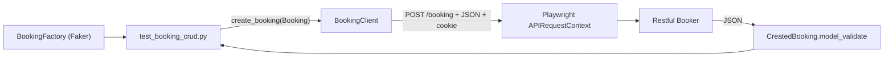

# API testing with service objects

::: tip In one minute
- A **service object** (client) is the page object idea for HTTP: one class per API, one method per endpoint. Tests never build URLs or headers.
- **pydantic schemas** turn every response into a typed object. A renamed, missing or retyped field fails loudly, even when the status is 200. That is contract testing for free.
- **Auth is a fixture**: a token is created once per session and attached by `authenticate()`.
- **Negative tests** pin down how the API really signals failure. Restful Booker reports bad credentials with HTTP 200 and a `reason` in the body.
- **Test data comes from factories** (Faker, seeded and replayable), and every created booking is deleted afterwards.
:::

## The idea

An API test that says `request.post("https://.../booking", data={...})` mixes three things: where the
API lives, what the request looks like, and what the test is checking. When the URL or the auth scheme
changes, every test changes. The service-object pattern moves the first two into a client, so the test
keeps only the third.

The second idea is **contract validation**. `assert response.status == 200` says nothing about the body.
If the API renames `firstname` to `first_name`, a status check stays green and some consumer breaks in
production. Parsing the body into a strict schema catches that on the first run.



## How it works

1. **One request context per session.** The `api_request` fixture creates a Playwright
   `APIRequestContext` with `base_url` from `config/settings.py`. Using Playwright for HTTP means the UI
   and API layers share one tool, one configuration and the same fixtures.
2. **A base client** ([`api/base_client.py`](https://github.com/iamzakirzr/Playwright-ZR/blob/main/api/base_client.py))
   wraps `get`, `post`, `put`, `patch` and `delete`, and keeps default JSON headers.
3. **Endpoint clients** add intent-level methods: `AuthClient.create_token()`,
   `BookingClient.create_booking()`, `get_booking()`, `update_booking()`, `partial_update()`,
   `delete_booking()`, `list_ids()`. Each is decorated with `@step`, so the Allure report reads as a timeline.
4. **Schemas** ([`api/schemas/booking.py`](https://github.com/iamzakirzr/Playwright-ZR/blob/main/api/schemas/booking.py))
   build request bodies and validate responses. `Booking` uses `extra="forbid"`, so an unexpected
   field fails too.
5. **Factories** ([`data/factories.py`](https://github.com/iamzakirzr/Playwright-ZR/blob/main/data/factories.py))
   give each test fresh, realistic data. `BookingFactory.build(totalprice=0)` pins only the field the test cares about.

## How to test it

A useful checklist for any REST resource, and where this repository covers it:

| Check | Why | Test |
|---|---|---|
| Create matches contract | the API stores exactly what it was sent | `test_create_booking_matches_contract` |
| Round trip | GET returns what POST created | `test_get_booking_round_trip` |
| Full vs partial update | PUT replaces; PATCH changes one field and keeps the rest | `test_full_update`, `test_partial_update` |
| Delete then read | a deleted booking is 404, not 500 | `test_delete_booking` |
| Filters | query parameters find the created record | `test_filter_by_name_returns_created_booking` |
| Boundaries | zero price, no deposit, no extra needs | `test_boundary_bookings_round_trip` |
| Unknown id | 404, not 500 | `test_get_unknown_booking_returns_404` |
| Auth | valid, invalid, missing token | `tests/api/test_auth.py` |

**Negative tests document reality.** `test_invalid_credentials_are_rejected` asserts that Restful
Booker returns **HTTP 200** with `{"reason": "Bad credentials"}`. That is not good API design, but it is
how the API behaves, and a test that expected 401 would be wrong. The client handles it too:
`AuthClient.create_token()` raises when the body has no `token`, because the status alone is not enough.

**Clean up what you create.** Tests that create bookings delete them in `finally` or in fixture
teardown, so reruns stay independent and a shared public API does not fill up with test data.

**Replay the data of a failed run.** The seed is printed in the pytest header
(`test data seed: FAKER_SEED=...`). Every test is reseeded from that seed plus its own test id, so
`FAKER_SEED=<n> pytest <that test>` reproduces its data exactly, whatever ran before it.

The same pattern extends to the AI app: [`api/shop_assistant_client.py`](https://github.com/iamzakirzr/Playwright-ZR/blob/main/api/shop_assistant_client.py)
is the service object for the shop assistant, and the agent tests use it to read the cart and check what
the agent really did. See [Testing agents](/agents/testing-agents).

## In this repository

The schema, from [`api/schemas/booking.py`](https://github.com/iamzakirzr/Playwright-ZR/blob/main/api/schemas/booking.py):

```python
class Booking(BaseModel):
    """A booking as sent to and returned by the API. Extra fields are forbidden (strict contract)."""

    model_config = ConfigDict(populate_by_name=True, extra="forbid")

    firstname: str
    lastname: str
    totalprice: int
    depositpaid: bool
    bookingdates: BookingDates
    additionalneeds: str | None = None
```

`CreatedBooking` wraps it with `bookingid: int = Field(gt=0)`, so even the id is checked.

A fixture with setup and teardown, and two tests, from
[`tests/api/test_booking_crud.py`](https://github.com/iamzakirzr/Playwright-ZR/blob/main/tests/api/test_booking_crud.py):

```python
@pytest.fixture
def created_booking(authed_booking_client, new_booking):
    """Create a booking for the test and delete it afterwards (setup + teardown)."""
    response = authed_booking_client.create_booking(new_booking)
    assert response.ok, response.text()
    created = CreatedBooking.model_validate(response.json())
    yield created
    authed_booking_client.delete_booking(created.bookingid)


def test_partial_update(authed_booking_client, created_booking):
    """PATCH changes only the given field and keeps the rest."""
    new_lastname = BookingFactory.build().lastname + "-patched"
    response = authed_booking_client.partial_update(created_booking.bookingid, {"lastname": new_lastname})

    assert response.status == 200
    body = Booking.model_validate(response.json())
    assert body.lastname == new_lastname
    assert body.firstname == created_booking.booking.firstname
```

The factory, from [`data/factories.py`](https://github.com/iamzakirzr/Playwright-ZR/blob/main/data/factories.py):

```python
class BookingFactory(Factory[Booking]):
    """Valid Restful Booker bookings: check-in 1-60 days ahead, 1-14 night stay."""

    model = Booking

    @classmethod
    def defaults(cls) -> dict[str, Any]:
        """Random guest, price and a future stay."""
        checkin = date.today() + timedelta(days=fake.random_int(1, 60))
        return {
            "firstname": fake.first_name(),
            "lastname": fake.last_name(),
            "totalprice": fake.random_int(50, 2000),
            "depositpaid": fake.boolean(),
            "bookingdates": BookingDates(checkin=checkin, checkout=checkin + timedelta(days=fake.random_int(1, 14))),
            "additionalneeds": fake.random_element(["Breakfast", "Late checkout", "Parking", None]),
        }
```

Auth flows through fixtures in the root `conftest.py`: `auth_token` is created once per session,
`authed_booking_client` is `BookingClient(api_request).authenticate(auth_token)`, which sends the token
as a `Cookie: token=...` header, the way Restful Booker expects it.

## Try it

```bash
make test-api
pytest tests/api -k partial -v
FAKER_SEED=1234 pytest tests/api        # same seed, same generated data
```

Exercise (from chapter 3): add a test that PATCHes only `firstname` and asserts that **every** other
field is unchanged. Compare whole models, not one field: build the expected booking with
`created_booking.booking.model_copy(update={"firstname": ...})` and assert equality with the validated response.

## Check yourself

1. What does `Booking.model_validate(response.json())` catch that `response.status == 200` does not?

::: details Answer
Contract drift: a missing, renamed or wrongly typed field, and, with `extra="forbid"`, an unexpected
new field, while the status is still 200.
:::

2. Restful Booker returns 200 for bad credentials. Should the test assert 401?

::: details Answer
No. Tests describe real behaviour: assert 200 plus `{"reason": "Bad credentials"}`. If you think the
behaviour is a bug, report it, and change the test when the API changes.
:::

3. Why use `BookingFactory.build(totalprice=0)` instead of a hard-coded booking?

::: details Answer
Every other field is fresh realistic data, which finds bugs a fixed value hides and avoids collisions
in parallel runs. The one value the test is about is pinned and obvious to the reader.
:::
