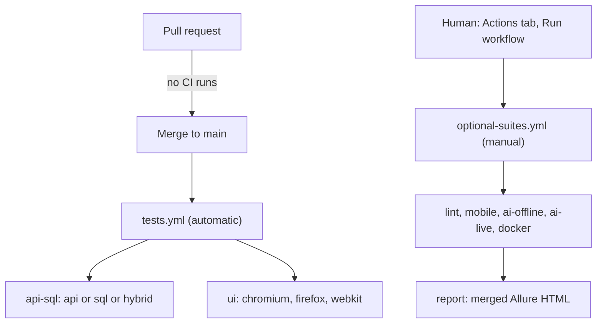

# CI/CD

::: tip In one minute
- **Automatic**: `.github/workflows/tests.yml` runs only the deterministic functional suites (**UI, API, SQL**, plus hybrid and BDD) and only on **push to `main`**, which is what a merged pull request produces.
- **Manual**: `.github/workflows/optional-suites.yml` holds **lint, mobile, AI, Docker and the Allure report**, and runs only when someone starts it from the Actions tab.
- **The trade-off**: pull requests get **no CI signal**. The pre-commit hook and `make lint` plus `make test` locally are the gate before merge.
- **AI suites are manual** because they need an Ollama server, take 10 to 20 minutes on CPU, and small models behave differently across machines.
- Jenkins and Azure DevOps **templates** in `ci-templates/` mirror the same policy; a Dockerfile and `docker-compose.yml` run the whole stack in containers.
:::

## The idea

A pipeline is a promise: "if this is green, the change is safe enough". Running everything on every change
sounds safest, but it is slow, and for LLM tests it is **noisy**: a small model on a different machine can
give a different answer at temperature 0. A red build that is red for no reason trains people to ignore red
builds.

So this repository splits its suites by how **deterministic** and how **expensive** they are, and runs
only the deterministic, cheap ones automatically.



## How it works

### Automatic: tests.yml

[`.github/workflows/tests.yml`](https://github.com/iamzakirzr/Playwright-ZR/blob/main/.github/workflows/tests.yml)
has a single trigger:

```yaml
on:
  push:
    branches: [main]
```

No `pull_request`, no `schedule`, no `workflow_dispatch`. Two jobs:

| Job | Selects | Matrix |
|---|---|---|
| `api-sql` | `api or sql or hybrid`, parallel with `-n auto` | none |
| `ui` | `(ui or bdd) and not ai and not live` | chromium, firefox, webkit |

The UI job runs on three engines because rendering differs per engine. The API job runs once because an HTTP
call does not care which browser is installed. `fail-fast: false` lets every browser finish, so one engine's
failure does not hide the others. Every job uploads `reports/` (JUnit XML and Allure results) and, for UI,
`test-results/` (traces, screenshots, videos) as artifacts, even when tests fail.

### Manual: optional-suites.yml

[`.github/workflows/optional-suites.yml`](https://github.com/iamzakirzr/Playwright-ZR/blob/main/.github/workflows/optional-suites.yml)
triggers only on `workflow_dispatch`, with a `suite` input: `all`, `lint`, `mobile`, `ai-offline`, `ai-live`
or `docker`.

| Job | What it runs |
|---|---|
| `lint` | `ruff check` and `ruff format --check` |
| `mobile-web` | `mobile_web` on Chromium and WebKit (Firefox cannot emulate `isMobile`) |
| `mobile-native` | an Android emulator (API 33) with Appium 2 and Chrome |
| `ai-offline` | `ai and not live and not judge and not strong_judge` |
| `ai-live` | two tiers: `live and not judge`, and `judge and not strong_judge`, with Ollama pinned |
| `docker` | builds the image and validates `docker-compose.yml` |
| `report` | merges every job's Allure results into one HTML report (an artifact) |
| `publish-report` | deploys it to GitHub Pages, opt-in with the variable `DEPLOY_ALLURE_PAGES=true` |

The strong-judge tests (`-m strong_judge`) are not selected even here: a 7B judge takes about two minutes
per call on a CPU runner. Run them locally or on a GPU runner.

Shared install steps (Python, CPU-only torch, requirements, the requested Playwright browsers) live in one
composite action, [`.github/actions/setup/action.yml`](https://github.com/iamzakirzr/Playwright-ZR/blob/main/.github/actions/setup/action.yml),
so each job reads as checkout, setup, pytest, upload.

### Locally: pre-commit, make, Docker

- [`.pre-commit-config.yaml`](https://github.com/iamzakirzr/Playwright-ZR/blob/main/.pre-commit-config.yaml)
  runs ruff (lint with `--fix`, and format) plus whitespace, YAML, JSON and large-file checks on every commit.
  `make setup` installs the hook. It uses the same ruff version as the lint job, so a clean commit means a green lint job.
- `make lint` and `make test` (functional plus offline AI) are the pre-merge gate.
- The [`Dockerfile`](https://github.com/iamzakirzr/Playwright-ZR/blob/main/Dockerfile) builds a test runner
  (Python 3.11, CPU-only torch, Chromium) whose default command runs everything that needs no model server.
  [`docker-compose.yml`](https://github.com/iamzakirzr/Playwright-ZR/blob/main/docker-compose.yml) adds an
  Ollama service and a one-shot model pull; `SUITE="live and not judge" docker compose up ...` picks another tier.

### Other CI servers

[`ci-templates/Jenkinsfile`](https://github.com/iamzakirzr/Playwright-ZR/blob/main/ci-templates/Jenkinsfile) and
[`ci-templates/azure-pipelines.yml`](https://github.com/iamzakirzr/Playwright-ZR/blob/main/ci-templates/azure-pipelines.yml)
follow the same policy: functional stages on merge to `main`, everything else on a manual run. In Jenkins, the
first `SUITE` choice, `functional`, is the default for automatic builds. In Azure, `pr: none` disables pull-request
builds and the AI and lint stages have `condition: eq(variables['Build.Reason'], 'Manual')`. They are
**templates**, not executed by this repository: adapt agents, pools and the Ollama connection before using them.

## How to test it

How do you judge a CI policy? Ask what it catches, when, and at what cost.

**The trade-off, stated plainly.** Merge-only means post-merge detection. A pull request gets no CI signal,
so a broken change is found after it is on `main`. The repository accepts that cost and says so in
[chapter 12](https://github.com/iamzakirzr/Playwright-ZR/blob/main/docs/learning-path/12-ci-cd.md). To go back to
gating pull requests, add `pull_request:` under `on:` in `tests.yml`. For a team, that is usually the right
choice for the functional suites; the AI suites are a different question.

**Why the AI suites are manual.**

- They need an **Ollama server** and several gigabytes of models on the runner.
- They are **slow on CPU**: 10 to 20 minutes for the live tiers, and judged metrics take much longer.
- **Small models differ across machines.** Temperature 0 and a fixed seed make runs repeatable on one
  machine, not across hardware or Ollama versions. An automatic job that fails for that reason is noise.

That does not mean "never run them". Run them before merging a change to `ai/` or `apps/`, and read them as
evaluations with thresholds, not as pass/fail unit tests. See [Evaluating LLMs](/evals/evaluating-llms) and
[Performance evals](/evals/performance-evals).

**Evidence on failure.** When a UI job fails, download its artifact and run `playwright show-trace` on the
trace zip: it replays the run with DOM snapshots, network and console. The `ai-live` job also uploads
`ollama.log`, and `attach_llm_exchange` in
[`reporting/allure_helpers.py`](https://github.com/iamzakirzr/Playwright-ZR/blob/main/reporting/allure_helpers.py)
records every prompt and answer, so a failed evaluation shows what the model said, not only a score.

## In this repository

The UI job, from `tests.yml`:

```yaml
  ui:
    name: UI + BDD (${{ matrix.browser }})
    runs-on: ubuntu-latest
    timeout-minutes: 20
    strategy:
      fail-fast: false
      matrix:
        browser: [chromium, firefox, webkit]
    steps:
      - uses: actions/checkout@v4
      - uses: ./.github/actions/setup
        with:
          browsers: ${{ matrix.browser }}
      - name: Run UI and BDD suites
        run: pytest -m "(ui or bdd) and not ai and not live" --browser ${{ matrix.browser }} -n auto --junitxml=reports/junit.xml
```

The marker expression does the selecting. Because markers come from folders (see
[the framework tour](/framework/overview)), a new test in `tests/ui/` joins this job with no CI change.

The Ollama pin in the `ai-live` job, with the reason recorded next to it:

```yaml
      # Pinned: a new Ollama build can change a small model's temperature-0 output, and every
      # threshold here was measured on this version (an unpinned install dropped prices from
      # the summarizer test in CI while 0.34.4 kept them on 10/10 seeds).
      OLLAMA_VERSION: 0.34.4
```

## Measured here

Facts recorded in the repository that shaped this policy:

- An unpinned Ollama install dropped prices from the summarizer test in CI, while Ollama 0.34.4 kept them
  on 10 of 10 seeds (comment in `optional-suites.yml`).
- The 3B judge's contextual metrics passed locally and failed in CI on identical input (README, section 3.1);
  they moved to the 7B judge tier.
- The 3B judge confused speakers in CI for role adherence and turn relevancy (README, section 3.12).
- A 7B judge takes about two minutes per call on a CPU runner, so `strong_judge` is not run in CI.
- The live AI suites take 10 to 20 minutes on CPU (learning path chapter 12).

## Try it

```bash
make lint                              # what the lint job runs
make test                              # everything that needs no model server
pre-commit run --all-files             # the hook, on every file
docker compose up --abort-on-container-exit --exit-code-from tests
```

Exercise: in a fork, add `pull_request:` under `on:` in `tests.yml`, open a pull request that breaks one
UI test, and watch the three browser jobs report. Then write down, for your team, which suites you would put
on pull requests, which on merge, and which on a nightly or manual run, and why.

## Check yourself

1. With this policy, what catches a broken change before it reaches `main`?

::: details Answer
Nothing in CI. The pre-commit hook (ruff) and running `make lint` and `make test` locally before opening
the pull request. That is the stated cost of the merge-only policy.
:::

2. Why do the UI tests run on three browsers but the API tests only once?

::: details Answer
Rendering and browser behaviour differ per engine; an HTTP call does not. Repeating API tests per browser
costs minutes and finds nothing.
:::

3. Give two reasons the AI suites are not automatic.

::: details Answer
They need an Ollama server and models on the runner, they are slow on CPU (10 to 20 minutes, much more for
judged tiers), and small models can answer differently on different machines or Ollama versions, which makes
automatic runs noisy.
:::

4. Why is the Ollama version pinned in the `ai-live` job?

::: details Answer
Every threshold was measured on 0.34.4. A newer build changed a small model's temperature-0 output in CI
(prices dropped from the summarizer), so an unpinned version turns an infrastructure change into a test failure.
:::
