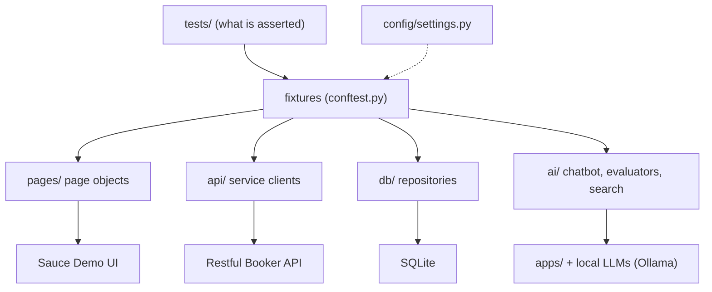

# A tour of the framework

::: tip In one minute
- The repository is a layered Python test framework: **tests** say what to check; **page objects, service clients and repositories** say how.
- It covers UI (Playwright), API, SQL, cross-layer ("hybrid"), BDD, visual, self-healing, mobile, an MCP server and AI testing, all runnable locally without paid keys.
- Three rules: tests say *what*, objects say *how*; configuration comes from one place (`config/settings.py`); every AI threshold is calibrated.
- Markers come from the folder a test lives in, so `pytest -m api` or `make test-api` selects a layer with no decorators.
- The `docs/learning-path/` chapters are a course through the code; this site explains the ideas behind them.
:::

## The idea

A test suite grows in two directions: more tests, and more kinds of tests. Without structure, both
turn into copy-paste. This framework uses one idea everywhere: **put the "how" in an object and keep
the test about the "what".** A page object knows the login form's selectors. A service client knows
the booking API's URLs. A repository knows the SQL. The test reads like a user story.



Tests never build these objects themselves. They ask for them by name as pytest fixtures, and the
fixtures in `conftest.py` construct them from the settings. That is dependency injection, and it is
why swapping a browser, a base URL or a model is a configuration change, not a code change.

## How it works

### The folder map

| Folder | What lives there |
|---|---|
| [`pages/`](https://github.com/iamzakirzr/Playwright-ZR/tree/main/pages) | Page objects (`BasePage`, `LoginPage`, `InventoryPage`...), components (`header.py`), self-healing locators (`healing/`), `StaticSite` for serving local pages (`support/`) |
| [`api/`](https://github.com/iamzakirzr/Playwright-ZR/tree/main/api) | Service clients (`BaseClient`, `AuthClient`, `BookingClient`) and pydantic schemas (`schemas/`) |
| [`db/`](https://github.com/iamzakirzr/Playwright-ZR/tree/main/db) | SQLite connection, `seed.sql`, repositories |
| [`data/`](https://github.com/iamzakirzr/Playwright-ZR/tree/main/data) | Faker factories with a replayable seed |
| [`tests/`](https://github.com/iamzakirzr/Playwright-ZR/tree/main/tests) | `ui/`, `api/`, `sql/`, `hybrid/`, `bdd/`, `unit/`, `mobile/`, `ai/` |
| [`ai/`](https://github.com/iamzakirzr/Playwright-ZR/tree/main/ai) | Chatbot clients, prompts, chains, search and RAG, evaluators, red-team attacks, synthetic data |
| [`apps/`](https://github.com/iamzakirzr/Playwright-ZR/tree/main/apps) | Apps under test: `shop_assistant` (an agent), `store_mcp` (an MCP server), `playground` (a local site) |
| [`config/`](https://github.com/iamzakirzr/Playwright-ZR/tree/main/config) | `settings.py`: every URL, credential, model and threshold |
| [`reporting/`](https://github.com/iamzakirzr/Playwright-ZR/tree/main/reporting) | Allure helpers (`@step`, attachments) |
| [`visual/`](https://github.com/iamzakirzr/Playwright-ZR/tree/main/visual) | Screenshot comparator and an optional vision judge |
| [`mobile/`](https://github.com/iamzakirzr/Playwright-ZR/tree/main/mobile) | Appium driver factory and screen objects |
| [`docs/`](https://github.com/iamzakirzr/Playwright-ZR/tree/main/docs) | The learning path and the course-coverage map |
| `site/` | This website |

Test targets: [Sauce Demo](https://www.saucedemo.com) for the UI, [Restful Booker](https://restful-booker.herokuapp.com)
for the API, a seeded in-memory SQLite database for SQL, and open-source models served by
[Ollama](https://ollama.com) for AI.

### The three rules

The learning path's [README](https://github.com/iamzakirzr/Playwright-ZR/blob/main/docs/learning-path/README.md)
states three rules the whole framework follows:

1. **Tests say *what*, objects say *how*.** A test never contains a selector, a URL or SQL.
2. **Configuration comes from one place.** Every URL, credential, model name and threshold is a field in
   [`config/settings.py`](https://github.com/iamzakirzr/Playwright-ZR/blob/main/config/settings.py),
   overridable by an environment variable of the same name or a `.env` file.
3. **Every AI threshold is calibrated.** Before a metric judges the bot, a test proves the metric
   itself can tell a good answer from a bad one. See [Judges and calibration](/evals/judges-and-calibration).

### Markers by folder

Nobody decorates tests with `@pytest.mark.api`. The root `conftest.py` adds markers while pytest
collects tests: one per folder name, plus `live`, `judge` and `strong_judge` depending on which
fixtures the test uses. Two folders get renamed markers (`web` becomes `mobile_web`, `native` becomes
`mobile_native`). `pytest.ini` runs with `--strict-markers`, so every marker must be registered there.

### Running things

Every `make` target is a plain `pytest -m ...` line in the
[`Makefile`](https://github.com/iamzakirzr/Playwright-ZR/blob/main/Makefile); open it and copy the line
if you are on Windows without `make`.

| Command | Runs |
|---|---|
| `make setup` | installs dependencies, Chromium and the pre-commit hook |
| `make test-functional` | UI, API, SQL, hybrid, BDD and unit tests, no AI |
| `make test-ui` / `make test-api` / `make test-sql` | one layer (`BROWSER=firefox make test-ui` for another engine) |
| `make test-ai-offline` | AI tests that need no model server |
| `make test-ai-live` / `make test-ai-judged` | real model behaviour / LLM-judged metrics (need Ollama) |
| `make test-mobile-web` | phone emulation |
| `make lint` | ruff, the same checks as the lint job |
| `make report-open` | the Allure HTML report of the last run (needs Node.js) |

Tests that need a missing server or model **skip** with a message naming what to start or pull. They
never fail for that reason.

## How to test it

How do you know a framework like this is healthy? Some checks the repository applies to itself:

- **The framework has its own tests.** `tests/unit/` checks the data seeding and the visual comparator
  without a browser, network or model (`make test-unit`).
- **Isolation is asserted, not assumed.** `test_changes_are_rolled_back_between_tests` in
  `tests/sql/test_user_repository.py` checks that only the three seeded users exist, whatever ran before.
- **Reproducibility.** The Faker seed is printed in the pytest header; `FAKER_SEED=<n>` replays the
  exact data of a failed run.
- **Evidence on failure.** `pytest.ini` keeps a screenshot, a trace and a video for every failing
  browser test, in `test-results/`.

## In this repository

The marker logic is short enough to read in full. From the root
[`conftest.py`](https://github.com/iamzakirzr/Playwright-ZR/blob/main/conftest.py):

```python
def pytest_collection_modifyitems(config, items):
    """Attach folder-based and dependency-based markers to every collected test."""
    for item in items:
        try:
            parts = Path(item.fspath).relative_to(TESTS_ROOT).parts
        except ValueError:
            continue
        for folder in parts[:-1]:
            item.add_marker(getattr(pytest.mark, FOLDER_MARKER_ALIASES.get(folder, folder)))
        fixtures = set(getattr(item, "fixturenames", ()))
        if fixtures & LIVE_FIXTURES:
            item.add_marker(pytest.mark.live)
        if fixtures & JUDGE_FIXTURES:
            item.add_marker(pytest.mark.judge)
        if fixtures & STRONG_JUDGE_FIXTURES:
            item.add_marker(pytest.mark.strong_judge)
```

So `tests/ai/redteam/test_guard_units.py` gets `ai` and `redteam`. Any test that asks for the
`ollama_models` fixture also gets `live`. You never have to remember to tag a test that needs a model:
using the fixture is the tag.

The same file shows rule 1 in practice. A test asks for `login_page`, and this fixture builds it
from the settings:

```python
@pytest.fixture
def login_page(page, settings) -> LoginPage:
    """Login page object bound to the current browser page."""
    return LoginPage(page, settings.ui_base_url)
```

### The learning path

[`docs/learning-path/`](https://github.com/iamzakirzr/Playwright-ZR/tree/main/docs/learning-path) has 15
chapters, each with files to read, a command, an exercise and a quiz:

| Chapters | Topic | On this site |
|---|---|---|
| 01, 02, 13 | Setup, page objects, Playwright essentials | [UI testing](/framework/ui-testing) |
| 03, 05 | API testing, test data, BDD, reporting | [API testing](/framework/api-testing) |
| 04 | Database and cross-layer tests | [SQL and hybrid](/framework/sql-and-hybrid) |
| 06, 07, 14 | AI evals, search, prompts, chains, synthetic data | [Evaluating LLMs](/evals/evaluating-llms), [AI search](/foundations/ai-search) |
| 08, 15 | Agents, MCP, LangChain and LangGraph | [Testing agents](/agents/testing-agents), [Testing MCP servers](/mcp/testing-mcp-servers) |
| 09 | Red teaming | [Red teaming](/evals/red-teaming) |
| 10, 11 | Mobile, self-healing and visual | [UI testing](/framework/ui-testing) |
| 12 | CI/CD | [CI/CD](/framework/ci-cd) |

## Try it

```bash
python -m venv .venv && source .venv/bin/activate
make setup
make help                 # every target, one line each
make smoke                # the fast critical path
pytest --collect-only -q -m "sql or hybrid"   # see which tests a marker selects
```

Exercise: create `tests/sql/test_products.py` with one test, run `pytest -m sql --collect-only -q`,
and confirm your test is selected although you never wrote a marker. Then move it to a new folder
`tests/sql/catalogue/` and run again: it now needs a `catalogue` marker registered in `pytest.ini`
(because of `--strict-markers`). That is the cost of folder markers, and why the folder names are few and stable.

## Check yourself

1. A test contains `page.locator("#user-name")`. Which rule does it break, and where should the selector live?

::: details Answer
"Tests say what, objects say how." The selector belongs in the page object (`LoginPage` binds
`username_input` in its `__init__`); the test should call `login_page.login_as(...)`.
:::

2. How does a test in `tests/ai/rag/` that uses the `judge` fixture get its markers?

::: details Answer
`pytest_collection_modifyitems` in the root `conftest.py` adds `ai` and `rag` from the folder names,
and `judge` because the test requests a judge fixture. Nothing is written on the test itself.
:::

3. You need to run the UI tests against a staging URL. What do you change?

::: details Answer
Nothing in the code: set the environment variable `UI_BASE_URL` (or put it in `.env`). `config/settings.py`
reads it, and the fixtures pass it to every page object.
:::
