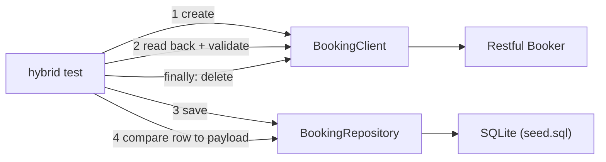

# SQL and hybrid tests

::: tip In one minute
- **Repositories** in `db/repositories/` hold every SQL statement; tests call methods like `find_by_username()`. Every query uses `?` placeholders.
- The database is **SQLite, seeded from `db/seed.sql`**, in memory by default. No server to install.
- **Isolation**: each test runs inside a transaction that the `db` fixture rolls back, so tests never see each other's writes and need no cleanup.
- SQL tests check **constraints, cascades, aggregates and reconciliation** (orphans, price mismatches), not just "a row exists".
- **Hybrid tests** cross layers: create a booking through the API, read it back, store it, and compare every column with the request. They test the **mapping**, where renames and type conversions break.
:::

## The idea

The UI can say "saved" while the database says otherwise. The API can return 201 while a field is
silently truncated. Testing each layer alone misses the seams between them. This part of the framework
does two things: tests the data layer directly, and tests that data survives the trip from one layer to
the next.

The repository pattern is the same idea as page objects and service clients: keep the "how" (SQL) out of
the test, keep the "what" (the rule being checked) in it.



## How it works

### Connection and seed

[`db/connection.py`](https://github.com/iamzakirzr/Playwright-ZR/blob/main/db/connection.py) opens SQLite
with dictionary-like rows, turns on foreign keys (`PRAGMA foreign_keys = ON`, which SQLite leaves off by
default), runs [`db/seed.sql`](https://github.com/iamzakirzr/Playwright-ZR/blob/main/db/seed.sql), and uses
autocommit mode so the test fixture controls transactions explicitly. `db_path` defaults to `:memory:` in
`config/settings.py`.

The seed mirrors the Sauce Demo domain, so UI, API and SQL tests talk about the same things: `users`
(including `standard_user` and `locked_out_user`), `products`, `orders`, `order_items` and `bookings`. The
schema carries the rules: `UNIQUE` usernames and emails, a `CHECK` on email shape and order status, foreign
keys with `ON DELETE CASCADE`, and `CHECK (checkout >= checkin)` for bookings.

### Repositories

[`db/repositories/base_repository.py`](https://github.com/iamzakirzr/Playwright-ZR/blob/main/db/repositories/base_repository.py)
provides `fetch_one`, `fetch_all`, `scalar` and `execute`. Subclasses add intent methods:
`UserRepository.find_by_username()`, `lock()`, `locked_usernames()`; `OrderRepository.order_total()`,
`revenue_by_status()`, `orphan_order_items()`, `price_mismatches()`; `BookingRepository.save()` and `find()`.
Repositories never open or commit transactions; that is the fixture's job.

### Isolation by rollback

The session opens one seeded connection. Each test gets it wrapped in `BEGIN` ... `ROLLBACK`. Whatever the
test inserts, updates or deletes disappears afterwards. It is faster than re-seeding and needs no cleanup
code. Swapping SQLite for Postgres means replacing `db/connection.py`; the repositories depend only on a
DB-API connection.

## How to test it

What SQL tests should check, beyond "the query returns something":

| Kind | Example in the repository |
|---|---|
| Lookup of seeded data | `test_seeded_user_lookup` |
| Constraint rejects bad data | `test_username_must_be_unique`, `test_order_status_is_constrained` (CHECK), `test_order_requires_existing_user` (FOREIGN KEY) |
| Cascade | `test_deleting_user_cascades_to_orders`: orders go, and no orphaned items remain |
| Aggregate equals hand-computed value | `test_order_total_is_sum_of_line_items`, `test_revenue_aggregation_by_status` |
| Reconciliation query returns nothing | `test_no_orphan_order_items`, `test_line_item_prices_match_catalogue` |
| Cross-suite agreement | `test_locked_users_match_ui_fixture`: the DB agrees with the UI settings on which user is locked |
| Isolation itself | `test_changes_are_rolled_back_between_tests`: only the three seeded users exist |

Constraint tests use `pytest.raises(sqlite3.IntegrityError, match="CHECK")`. Matching the message matters:
without it, a test expecting a CHECK failure would also pass on an unrelated UNIQUE failure.

**Hybrid tests: what they catch.** Separate API and SQL tests each pass while the mapping between them is
wrong: a boolean stored as text, a date stored in another format, a field dropped by the persistence code.
The hybrid test compares the stored row with the original request payload, field for field, including the
conversions (`depositpaid` becomes `0` or `1`, dates become ISO strings).

**Data isolation across layers.** The database side is rolled back. The API side is a shared public service,
so the hybrid test deletes its booking in `finally`. Two layers, two cleanup strategies, both needed.

::: info What is and is not implemented
`tests/hybrid/` has one test, API to database. A UI-to-database or API-to-UI hybrid test is **not
implemented in this repository**: Sauce Demo's UI and the SQLite seed are separate systems. The same idea
does appear elsewhere: the shop assistant's agent tests take an action through the chat and then verify it
through the cart API, never through the reply text. See [Testing agents](/agents/testing-agents).
:::

## In this repository

The rollback fixture, from the root [`conftest.py`](https://github.com/iamzakirzr/Playwright-ZR/blob/main/conftest.py):

```python
@pytest.fixture
def db(db_connection):
    """Per-test transaction, rolled back afterwards so tests never see each other's writes."""
    db_connection.execute("BEGIN")
    yield db_connection
    db_connection.execute("ROLLBACK")
```

A repository method, from [`db/repositories/user_repository.py`](https://github.com/iamzakirzr/Playwright-ZR/blob/main/db/repositories/user_repository.py):

```python
def create(self, username: str, email: str, is_locked: bool = False) -> int:
    """Insert a user and return its id. Constraint violations raise ``sqlite3.IntegrityError``."""
    return self.execute(
        "INSERT INTO users (username, email, is_locked) VALUES (?, ?, ?)",
        (username, email, int(is_locked)),
    )
```

A cascade test, from [`tests/sql/test_data_integrity.py`](https://github.com/iamzakirzr/Playwright-ZR/blob/main/tests/sql/test_data_integrity.py):

```python
def test_deleting_user_cascades_to_orders(user_repo, order_repo):
    """Deleting a user removes their orders and leaves no orphaned items."""
    user_id = user_repo.find_by_username("standard_user")["id"]
    assert order_repo.orders_for_user(user_id)

    user_repo.delete(user_id)

    assert order_repo.orders_for_user(user_id) == []
    assert order_repo.orphan_order_items() == []
```

Note the first assertion: it proves the user had orders before the delete. Without it, the test would
pass on an empty table and prove nothing.

The hybrid test, from [`tests/hybrid/test_api_to_db.py`](https://github.com/iamzakirzr/Playwright-ZR/blob/main/tests/hybrid/test_api_to_db.py):

```python
def test_api_booking_persists_consistently(authed_booking_client, booking_client, booking_repo):
    """Create via API, read back, persist to SQL: every column matches the request payload."""
    payload = BookingFactory.build()
    created = CreatedBooking.model_validate(authed_booking_client.create_booking(payload).json())
    try:
        fetched = Booking.model_validate(booking_client.get_booking(created.bookingid).json())
        booking_repo.save(created.bookingid, fetched)

        row = booking_repo.find(created.bookingid)
        assert row == {
            "id": created.bookingid,
            "firstname": payload.firstname,
            "lastname": payload.lastname,
            "totalprice": payload.totalprice,
            "depositpaid": int(payload.depositpaid),
            "checkin": payload.bookingdates.checkin.isoformat(),
            "checkout": payload.bookingdates.checkout.isoformat(),
        }
    finally:
        authed_booking_client.delete_booking(created.bookingid)
```

The expected row is built from `payload` (what was sent), not from `fetched` (what came back). Comparing
the stored row with `fetched` would only prove the save code copies fields; comparing it with the payload
proves the whole trip.

## Try it

```bash
make test-sql                          # SQL and hybrid tests
pytest tests/sql -v
pytest tests/hybrid -v                 # needs network access to Restful Booker
```

Exercise (from chapter 4): add a repository method `orders_for(username)` that joins `users` and `orders`,
and a test that deleting that user cascades to their orders. Then break it on purpose: remove
`ON DELETE CASCADE` from the `orders` table in `db/seed.sql` and watch which tests fail, and how.

## Check yourself

1. Why do repositories use `?` placeholders instead of f-strings?

::: details Answer
The driver escapes the values, which prevents SQL injection and quoting bugs (a name like O'Brien).
Test data from Faker can contain any character.
:::

2. Why roll back instead of deleting the rows each test created?

::: details Answer
Rollback undoes everything, including rows the test did not know it created (triggers, cascades), with no
cleanup code, and it is fast. A test that crashes halfway still leaves nothing behind.
:::

3. What does the hybrid test catch that the API tests and SQL tests alone do not?

::: details Answer
Errors in the mapping between layers: type conversions (booleans, dates), renamed or dropped fields
between the API model and the table. Each layer can pass its own tests while the combination is wrong.
:::
