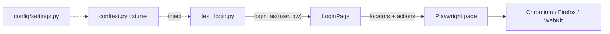

# UI testing with Playwright

::: tip In one minute
- **Page objects** in `pages/` own the locators and actions; tests call methods like `login_as()` and assert on the result.
- Use **user-facing locators** (test ids, roles, names) and **web-first assertions** (`expect(...)`), which wait and retry, so tests need no sleeps.
- **Fixtures** hand tests ready-made page objects; `storage_state` logs in once per session; `StaticSite` serves a local app with **network interception**.
- The same tests run on **Chromium, Firefox and WebKit**, and on emulated phones. Failures keep a **trace, screenshot and video**.
- Two AI-adjacent helpers: **visual comparison** (pixels decide) and **self-healing locators** (an LLM proposes, validation decides).
:::

## The idea

A UI test has two jobs that change at different speeds. **What** the user can do (log in, add to cart,
check out) changes rarely. **How** the page is built (selectors, markup) changes every sprint. A page
object separates them: when a selector changes you edit one line in one class, not forty tests.



## How it works

### Page objects and locators

Every page extends `BasePage` in [`pages/base_page.py`](https://github.com/iamzakirzr/Playwright-ZR/blob/main/pages/base_page.py),
which gives it `open()`, `by_test_id()` and `expect_loaded()`. Locators are created once in
`__init__`. Playwright locators are lazy (they find the element when used, not when created), so this
costs nothing. Sauce Demo marks its elements with `data-test` attributes, which survive restyling
better than CSS classes.

The only assertion allowed inside a page object is `expect_loaded()`, a "this is the right page"
check. Business assertions belong in the test, so the same page object serves positive and negative cases.

### Web-first assertions

`expect(locator).to_be_visible()` and `expect(locator).to_have_text(...)` retry until the condition is
true or a timeout passes. That removes the classic source of flakiness, `time.sleep()`: the test waits
exactly as long as the page needs and no longer.

### Fixtures and saved login state

Tests ask for `login_page`, `inventory_page`, `cart_page` or `logged_in` by name; the root
`conftest.py` builds them. Logging in through the form before every checkout test is slow and makes
every test depend on the login page. The `sauce_auth_state` fixture logs in once per session, saves
cookies and `localStorage` with `context.storage_state(path=...)`, and modules opt in to start signed in.

### Network interception

[`pages/support/static_site.py`](https://github.com/iamzakirzr/Playwright-ZR/blob/main/pages/support/static_site.py)
packages `context.route` as `StaticSite`: it serves the local
[`apps/playground`](https://github.com/iamzakirzr/Playwright-ZR/tree/main/apps/playground) site at
`https://playground.local` with no web server, answers fake API endpoints from Python, and records every
request so tests can assert on what the page sent. Routes go on the **context**, so pop-ups and new tabs
are served too. The essentials suite in
[`tests/ui/essentials`](https://github.com/iamzakirzr/Playwright-ZR/tree/main/tests/ui/essentials) uses
it for mocking, modifying real responses, blocking images, dialogs, iframes, tabs, uploads, downloads and
emulation (locale, timezone, geolocation, offline).

### Cross-browser runs and failure evidence

`--browser firefox` or `--browser webkit` runs the same tests on another engine. `pytest.ini` adds
`--screenshot only-on-failure`, `--tracing retain-on-failure` and `--video retain-on-failure`, so a
failing test leaves evidence in `test-results/`. Open a trace with `playwright show-trace <zip>` to replay
the run with DOM snapshots, network calls and console logs.

## How to test it

What goes wrong in UI suites, and the defence used here:

| Problem | Defence |
|---|---|
| Timing flakiness | web-first `expect`, no fixed sleeps |
| Selector churn | locators in one page object; `data-test` ids and roles |
| Tests coupled to login | `storage_state` reuse |
| Backend states that are hard to create (empty, 500) | mock them with `StaticSite` or `page.route` |
| A mocked handler crashing and the page showing an error state | an autouse fixture fails the test if any fake endpoint raised |
| Engine-specific bugs | the Chromium, Firefox and WebKit matrix |
| "It looks wrong" with green functional tests | visual comparison |
| A refactor renaming every attribute | self-healing locators, as a safety net |
| Mobile layout bugs | device emulation with a desktop control test |

**Visual testing.** [`visual/comparator.py`](https://github.com/iamzakirzr/Playwright-ZR/blob/main/visual/comparator.py)
compares a screenshot with a baseline stored per name, browser **and** OS (fonts render differently).
It counts pixels whose largest per-channel difference exceeds a tolerance (16 of 255), passes if at most
0.1% changed (`max_diff_ratio=0.001`), and writes the actual image and a red-on-grey diff on failure.
Dynamic regions such as timestamps are masked. `UPDATE_SNAPSHOTS=1` accepts intended changes. An optional
vision model ([`visual/vision_judge.py`](https://github.com/iamzakirzr/Playwright-ZR/blob/main/visual/vision_judge.py))
describes the difference; it is **advisory**, pixels decide.

**Self-healing locators.** [`pages/healing/self_healing.py`](https://github.com/iamzakirzr/Playwright-ZR/blob/main/pages/healing/self_healing.py)
resolves an element in order: the page object's selector, then a previously healed selector from a JSON
cache, then selectors an LLM proposes from a trimmed copy of the page HTML. A candidate is accepted only
if it matches **exactly one** element, and every heal is logged so someone fixes the page object. Without
that validation, a model suggesting `button` would "heal" to the wrong button and click it.

**Mobile emulation.** [`tests/mobile/web`](https://github.com/iamzakirzr/Playwright-ZR/tree/main/tests/mobile/web)
runs the same page objects in contexts built from Playwright's device descriptors (Pixel 7, iPhone 13):
viewport, user agent, touch and pixel ratio. A control test checks that the desktop grid has several
columns, so the "one column on a phone" assertion is known to be meaningful.

## In this repository

A page object, from [`pages/login_page.py`](https://github.com/iamzakirzr/Playwright-ZR/blob/main/pages/login_page.py):

```python
class LoginPage(BasePage):
    """Username and password form plus its error banner."""

    path = "/"

    def __init__(self, page, base_url):
        """Bind the login form locators."""
        super().__init__(page, base_url)
        self.username_input = self.by_test_id("username")
        self.password_input = self.by_test_id("password")
        self.login_button = self.by_test_id("login-button")
        self.error_message = self.by_test_id("error")

    def expect_loaded(self):
        """The login button is visible."""
        expect(self.login_button).to_be_visible()
        return self
```

A test that uses it, from [`tests/ui/test_login.py`](https://github.com/iamzakirzr/Playwright-ZR/blob/main/tests/ui/test_login.py).
There is no selector and no URL in it:

```python
def test_locked_out_user_sees_error(login_page, settings):
    """A locked account is refused with a clear message."""
    login_page.open().login_as(settings.ui_locked_user, settings.ui_password)

    expect(login_page.error_message).to_be_visible()
    assert "locked out" in login_page.error_text()
```

Opting a whole module into the saved login, from
[`tests/ui/test_checkout_e2e.py`](https://github.com/iamzakirzr/Playwright-ZR/blob/main/tests/ui/test_checkout_e2e.py):

```python
@pytest.fixture
def browser_context_args(browser_context_args, sauce_auth_state):
    """Every test in this module starts signed in: log in once, reuse the saved session."""
    return {**browser_context_args, "storage_state": sauce_auth_state}
```

Mocking a backend state, from
[`tests/ui/essentials/test_network.py`](https://github.com/iamzakirzr/Playwright-ZR/blob/main/tests/ui/essentials/test_network.py):

```python
def test_server_error_shows_friendly_message(page, site, base_url_playground):
    """A 500 from the API must not leave the page stuck on "Loading…"."""
    site.json("GET", "/api/products", {"error": "boom"}, status=500)

    products = ProductsPage(page, base_url_playground).open()

    expect(products.status).to_have_text("Could not load products")
```

The visual tests are in [`tests/ui/visual/test_visual_regression.py`](https://github.com/iamzakirzr/Playwright-ZR/blob/main/tests/ui/visual/test_visual_regression.py)
on a local product card with a live timestamp, which is there on purpose: one test proves that without
masking, the same page "differs" on every run.

## Measured here

Engine differences recorded in the repository while building these suites (learning path chapter 13,
and comments in the mobile tests and CI workflow):

- An intercepted download started by `<a download>` is cancelled in Chromium, and in WebKit a downloaded
  intercepted response never starts. The playground builds its export as a client-side Blob, which works everywhere.
- `request.all_headers()` hangs inside a route handler, so `StaticSite` rebuilds the cookie header from `context.cookies()`.
- Geolocation was `denied` until the playground origin changed from `http://` to `https://` (a secure context).
- Playwright's Linux WebKit build reports `navigator.maxTouchPoints` as 0 even though touch events work, so
  the mobile test checks touch by behaviour (a tap delivers `touchstart`).
- Firefox cannot emulate `isMobile`, so phone tests run on Chromium and WebKit only.

## Try it

```bash
make test-ui                                   # Chromium
BROWSER=webkit make test-ui                    # Safari's engine
pytest tests/ui/essentials -v                  # network, dialogs, frames, files, emulation
make test-visual                               # screenshot baselines
make test-mobile-web                           # Pixel 7 and iPhone 13 profiles
pytest -m "healing and not live"               # self-healing with a fake healer
playwright show-trace test-results/<test-folder>/trace.zip
```

Exercise (from chapter 2): add a `remove(product_name)` method to `CartPage`, copying the
filter-then-role idea from `InventoryPage.add_to_cart`, and a test that adds two products, removes one,
and checks both the cart list and `header.cart_count()`.

## Check yourself

1. Why is `expect(locator).to_have_text(...)` better than reading the text and using `assert`?

::: details Answer
`expect` retries until the text matches or the timeout passes, so it waits for the page. A plain
`assert` reads the value once and fails if the page was a few milliseconds late.
:::

2. Why are `StaticSite` routes installed on the context rather than the page?

::: details Answer
Pop-ups and new tabs are new pages in the same context. A context route serves them too; a page route
would not.
:::

3. The self-healing locator's LLM suggests three selectors. Which one is used?

::: details Answer
The first that is valid and matches exactly one element. If none does, the locator raises
`LocatorHealingError` instead of guessing. A heal is logged and cached, and the page object should be fixed.
:::

4. Why is the vision LLM only advisory in visual tests?

::: details Answer
Small vision models can describe changes that are not there. A pixel diff is deterministic. The
model helps a human read the diff faster; it does not decide pass or fail.
:::
