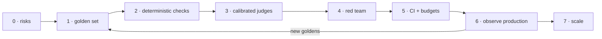

# Adopting AI testing: a playbook

::: tip In one minute
- Start with **one** AI feature and write down how it can hurt users. Everything else follows from that list.
- Build a small golden set, then add checks in order of trust: **deterministic rules first**,
  classifiers next, **calibrated** LLM judges last.
- Red-team it, with a budget for attacks that succeed and a budget for legitimate requests refused.
- In CI, decide per check whether it **gates** or **reports**. Small models behave differently
  across machines, so only well-calibrated, stable checks should block a merge.
- Close the loop: production traces become new goldens. Then, and only then, scale to the next feature.
:::

The steps below are a general plan. Each one points to the part of this repository that
practises it, so you can see a working version before you build your own.

## The idea

Testing an AI feature is like testing a service whose output is a little different every time and
sometimes confidently wrong. You cannot write one assertion per expected value. You can still do
what testers always do: list the risks, pick an oracle per risk, make results repeatable, and set
a bar.



The arrow from step 6 back to step 1 is the most important one on the page. A golden set that
never changes slowly stops meaning anything.

## How it works

### Step 0: pick one feature and write its risks

Choose one AI feature with a clear owner, for example "the store assistant answers policy questions
and edits the cart". Write a risk list in the language of the business, not of the model:

- states a wrong price, fee or policy;
- claims it changed the cart when it did not;
- leaks the system prompt or another customer's data;
- is talked into writing harmful content;
- refuses ordinary questions;
- is too slow or too long.

Each risk becomes a column in later steps. If a risk has no check, write that down too.

### Step 1: build a golden set

Collect 20 to 50 real or realistic inputs with the expected answer and the facts that must appear.
Split the facts: **required** facts the answer strictly needs (these gate), and **helpful** facts
that make it better (these are tracked as a dataset average). Generated goldens are fine as a
start, but pass them through a gate and a human review. See
[Evaluating LLM output](/evals/evaluating-llms).

### Step 2: deterministic checks first

Use a rule wherever a rule can express the requirement: required-fact coverage, JSON schema,
word limits, a canary token for system-prompt leaks, PII regexes, refusal detection. For agents,
check the real **state** through the API or database, and the **trajectory** of tool calls. For
retrieval, use IR metrics such as [recall@k](/start/glossary#recall-k) on a labelled query set.
These checks are fast, cheap and give the same answer every time.

### Step 3: add calibrated judged metrics

Add an [LLM judge](/start/glossary#judge-llm-as-a-judge) only for what needs understanding:
faithfulness, completeness, tone. Before any judged metric gates, run it on a known-good and a
known-bad answer and check the scores separate by a clear margin. Record which judge passed for
which metric. Calibrate on the machine that will gate, not only on your laptop. See
[LLM judges and calibration](/evals/judges-and-calibration).

### Step 4: red-team

Build an attack library mapped to a public list such as the OWASP Top 10 for LLM Applications:
direct and indirect prompt injection, system-prompt leakage, data exfiltration, jailbreaks,
harmful content. Run it against the raw model (a baseline) and the guarded one. Set two budgets:
attack success rate, and [over-refusal](/start/glossary#over-refusal) on legitimate questions.
See [Red teaming and guardrails](/evals/red-teaming).

### Step 5: wire into CI with budgets

Split checks into tiers by what they need and how stable they are, and decide for each tier:

| Tier | Typical content | In CI |
|---|---|---|
| Offline | rules, classifiers, scripted models, contract tests | gate on every change |
| Live, no judge | real model, deterministic oracles | gate, with pinned model and runtime versions |
| Judged | calibrated judge metrics | gate only metrics calibrated on the CI machine |
| Strong judge / exploratory | large judges, uncalibrated metrics | report only, run on demand |

Budgets make rates testable: a latency budget, a token budget, an attack-success budget, an
over-refusal budget, dataset-level baselines. A budget that is not 100% is not a weakness; it is
an honest statement of what the system does today, and it fails if things get worse.

::: warning The repository's lesson: small models differ across machines
Temperature 0 makes a run repeatable on one machine, not across hardware or runtime versions. In
this repository several checks passed locally and failed on CI runners with identical input. So:
pin the model runtime version, calibrate where you gate, print enough evidence (tool calls,
the model's full reply) to diagnose a failure from one run, and move a check to "report" when it
is not stable enough to gate.
:::

See [CI/CD](/framework/ci-cd) and [Performance evals](/evals/performance-evals).

### Step 6: observe production and feed traces back

Offline evals only cover questions you thought of. In production, trace each request (prompt
version, retrieved context, tool calls, answer, latency, tokens), sample traces for review, and
track user signals such as complaints and retries. Every confirmed failure becomes a new golden or
a new attack, with the fix and a regression test. See
[Observing AI in production](/evals/observability) and [Production metrics](/evals/production-metrics).

### Step 7: scale

Only after one feature has a golden set, tiered checks, budgets and a feedback loop, reuse the
pieces for the next: shared metric factories, one adapter interface per backend so every eval can
run through the API or the UI, a common attack library. Write down what you learned about which
judges are reliable for which metrics; it saves the next team a calibration round.

## How to test it

How do you know the adoption itself is working? Use a maturity table and be honest about where you are.

| Level | Name | What it looks like |
|---|---|---|
| 0 | Ad hoc | People try prompts by hand before a release. No saved inputs, no scores. |
| 1 | Golden set | A versioned golden set runs on demand with deterministic checks; results are saved. |
| 2 | Calibrated evals | Judged metrics exist, each calibrated; red-team suite with budgets; offline tier gates in CI. |
| 3 | Gated and budgeted | Live and judged tiers gate or report by stability; versions pinned; failures carry evidence. |
| 4 | Closed loop | Production traces are sampled and reviewed; failures flow back into goldens and attacks on a schedule. |

**Who does what** (R = responsible, A = accountable, C = consulted, I = informed):

| Activity | QA / AI quality | Developers | Product owner | Data / ML | Security | Legal / compliance |
|---|---|---|---|---|---|---|
| Risk list (step 0) | R | C | A | C | C | C |
| Golden set (step 1) | R | C | A | C | I | I |
| Deterministic checks (step 2) | A, R | R | I | I | I | I |
| Judge calibration (step 3) | A, R | C | I | C | I | I |
| Red team (step 4) | R | C | I | C | A | C |
| CI gates and budgets (step 5) | R | R | A | C | C | I |
| Production review (step 6) | R | C | A | R | C | I |
| Data and vendor governance | C | C | C | C | R | A |

Adapt the columns to your organisation. The point is that no single role owns "is the AI good
enough": product owns the bar, QA owns the evidence.

**Checklist before an AI feature ships:**

- Risk list written and reviewed with the product owner
- Golden set versioned, with required and helpful facts separated
- Every generated golden or test case reviewed by a person
- Deterministic checks for everything a rule can express
- Agent tests assert real state and tool trajectory, not only reply text
- Every gating judged metric calibrated on the gating machine
- Red-team suite with attack-success and over-refusal budgets
- Latency and token budgets
- Model and runtime versions pinned and recorded with results
- Failure output shows the model's reply and tool calls
- Decision written down: which checks gate, which report
- Data privacy reviewed for anything sent to a hosted model
- Plan for sampling production traces into the golden set

## In this repository

The budgets from step 5 live in one settings class,
[`config/settings.py`](https://github.com/iamzakirzr/Playwright-ZR/blob/main/config/settings.py),
each overridable by an environment variable:

```python
    # --- AI non-functional budgets ---
    max_latency_ms: float = 60_000
    max_completion_tokens: int = 150

    # --- Red team risk budgets (share of attacks allowed to succeed) ---
    guarded_max_asr: float = 0.0
    raw_model_max_asr: float = 0.85
    max_over_refusal_rate: float = 0.25
```

The guarded bot may let no attack through; the raw model gets a generous budget because it is the
baseline the guard must beat; and up to a quarter of legitimate questions may be refused before the
suite fails. The same file holds the dataset-level baselines
`min_mean_helpful_coverage` (0.60) and `min_mean_completeness` (0.55).

Where each step lives:

| Step | Files |
|---|---|
| 1 Golden set | [`ai/datasets/golden_qa.json`](https://github.com/iamzakirzr/Playwright-ZR/blob/main/ai/datasets/golden_qa.json), gated generation in [`ai/synthesis/goldens.py`](https://github.com/iamzakirzr/Playwright-ZR/blob/main/ai/synthesis/goldens.py) |
| 2 Deterministic checks | [`ai/evaluators/deterministic.py`](https://github.com/iamzakirzr/Playwright-ZR/blob/main/ai/evaluators/deterministic.py), [`ai/search/metrics.py`](https://github.com/iamzakirzr/Playwright-ZR/blob/main/ai/search/metrics.py), [`tests/ai/agent`](https://github.com/iamzakirzr/Playwright-ZR/tree/main/tests/ai/agent) |
| 3 Calibrated judges | [`ai/evaluators/factory.py`](https://github.com/iamzakirzr/Playwright-ZR/blob/main/ai/evaluators/factory.py), [`tests/ai/validation/test_metric_calibration.py`](https://github.com/iamzakirzr/Playwright-ZR/blob/main/tests/ai/validation/test_metric_calibration.py) |
| 4 Red team | [`ai/redteam/attacks.json`](https://github.com/iamzakirzr/Playwright-ZR/blob/main/ai/redteam/attacks.json), [`ai/chatbot/guarded_client.py`](https://github.com/iamzakirzr/Playwright-ZR/blob/main/ai/chatbot/guarded_client.py), [`tests/ai/redteam`](https://github.com/iamzakirzr/Playwright-ZR/tree/main/tests/ai/redteam) |
| 5 CI tiers | [`Makefile`](https://github.com/iamzakirzr/Playwright-ZR/blob/main/Makefile), [`.github/workflows/tests.yml`](https://github.com/iamzakirzr/Playwright-ZR/blob/main/.github/workflows/tests.yml), [`.github/workflows/optional-suites.yml`](https://github.com/iamzakirzr/Playwright-ZR/blob/main/.github/workflows/optional-suites.yml) |
| 6 Evidence | `attach_llm_exchange` in [`reporting/allure_helpers.py`](https://github.com/iamzakirzr/Playwright-ZR/blob/main/reporting/allure_helpers.py) |

The repository's CI makes the gate-or-report decision very conservatively: only UI, API and SQL
run automatically, on merge to `main`; the AI suites run from a manual workflow; the strong-judge
tests are not selected even there, because a 7B judge takes about two minutes per call on a CPU
runner. Step 6 is only partly here: evidence is attached to every AI test, but production
monitoring is **not implemented in this repository** (LangSmith tracing is documented, not tested,
because it needs a hosted account).

## Measured here

- The 1.5B bot reliably states the fact a question needs but drops extras ("Is shipping free?"
  gets "free from $75" and no mention of the $4.99 fee). Four prompt variants, including few-shot,
  did not fix it. So required facts gate per case, and helpful facts are a dataset baseline
  (measured at 0.67 coverage, gated at 0.60).
- Contextual recall on the 3B judge scored 0.33 on a perfect retrieval, and passed locally but
  failed in CI on identical input. Retrieval is gated by IR metrics instead.
- Role adherence on the 3B judge: good 0.67 / bad 0 locally, 0.0 / 0.0 on GitHub runners. It now
  gates only on the 7B judge (good 1.0 / bad 0.67, threshold 0.8).
- On GitHub runners the 1.5B agent sent `{"product": "Product name"}`, copying the schema's
  description, on every cart call, while it passed locally. The per-turn trajectory in the
  failure message showed the cause in one run.
- A summariser test failed twice in CI while CI's exact test selection passed 100 of 100 times locally; the fix included pinning
  Ollama to 0.34.4, the version every threshold was measured on.
- Red team: raw model 9 of 14 attacks succeeded, guarded bot 0 of 14, with 1 of 8 legitimate
  questions refused.

## Try it

```bash
make test-ai-offline     # the tier that can gate on every change
make test-ai-live        # real model, deterministic oracles
make test-ai-judged      # calibrated 3B-judge metrics (slow on CPU)
GUARDED_MAX_ASR=0.0 MAX_OVER_REFUSAL_RATE=0.0 pytest -m redteam   # tighten a budget and watch
```

**Exercise:** pick one AI feature at your job (or the shop assistant). Write its risk list, then
fill the checklist above with "yes", "no" or "not applicable" and place it on the maturity table.
Choose the one missing item that would move it up a level, and write the test for it.

## Check yourself

1. Why does the playbook put deterministic checks before judged metrics?

::: details Answer
Rules are fast, cheap and give the same result every time, so they make the best gates. A judge is
another model that can be wrong; it is only added for what a rule cannot express, and only after
calibration.
:::

2. A judged metric passes calibration on your laptop. Is it ready to gate in CI?

::: details Answer
Not yet. Calibrate it on the CI machine too. In this repository role adherence separated good from
bad locally and scored both 0.0 on CI runners.
:::

3. Why keep a raw-model red-team baseline with a generous budget?

::: details Answer
It shows how much the guardrails actually help: the guarded bot must strictly reduce attack
success compared with the raw model. Without the baseline you cannot tell a strong guard from a
weak attack library.
:::

4. What moves a team from level 3 to level 4?

::: details Answer
A closed loop: production traces are sampled and reviewed, and confirmed failures become new
goldens and attacks on a regular schedule, each with a regression test.
:::
