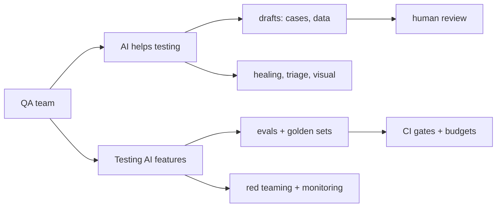

# How companies use AI in QA

::: tip In one minute
- AI shows up in QA in two directions: **AI that helps you test** (drafting cases and data,
  healing locators, triaging failures) and **testing AI features** (evals, red teaming, monitoring).
- In the first direction AI is an assistant. Its output is a draft that a person reviews, because
  generators hallucinate too.
- In the second direction AI is the system under test. You need golden sets, calibrated judges,
  attacks and budgets, not only pass/fail assertions.
- The QA role grows into an "AI quality engineer": someone who can say how good is good enough, and prove it.
- Most failures come from over-trust: a single green run, an uncalibrated judge, an eval set that
  never changes, or checking the reply text instead of the real state.
:::

This page describes general industry practice in plain terms, without statistics or company
names, because practices vary a lot and change quickly. Where the page says **in this
repository**, it points to something you can run and check.

## The idea

Think of two different jobs that both say "AI" on the ticket.

In the first, AI is a new **tool on your bench**, like a record-and-playback recorder once was. It
writes a first draft of test cases, suggests a new locator when one breaks, or summarises a
thousand lines of failure logs. You stay responsible for the result.

In the second, AI is **the product**. The team has shipped a chatbot, a search box that
understands questions, or an agent that changes a customer's cart. Your job is to find out how
often it is wrong, how it fails, and whether a change made it worse.



The two jobs share one rule: **model output is evidence to check, never a verdict to accept.**

## How it works

### Direction 1: AI to help testing

**Test-case and test-data generation.** A model reads a requirement, a user story or an API
description and drafts test cases or example data. It is fast at the obvious positives and
negatives. It is also confident about rules nobody wrote. Teams that use this well treat every
generated case as a draft: they validate its structure automatically, check coverage against the
requirement list, and have a person read it before it reaches a test-management tool.

**Synthetic golden data.** The same idea for AI evals: a model writes question-and-answer pairs
from your documents so you do not have to write hundreds by hand. The expected answer is the
oracle, so a hallucinated expected answer makes a correct bot fail.

**Self-healing locators.** When a selector breaks after a front-end change, a tool looks at the
page and proposes a replacement, so the run continues. Done carelessly, it hides real bugs (the
button moved because the page is broken) and can "heal" to the wrong element. Done well, it
accepts only a candidate that matches exactly one element, logs every heal, and treats the log as
a to-do list for fixing the page object.

**Failure triage and log summarisation.** An LLM reads failed-test output, stack traces and logs,
groups similar failures and suggests a likely cause. It saves reading time. It is also a place where
a plausible but wrong explanation can send someone down the wrong path, so the raw evidence must
stay one click away.

**Visual AI.** Instead of, or next to, a pixel diff, a vision model describes what changed between
two screenshots. It helps a person understand a diff faster. Small vision models hallucinate, so a
common and cautious setup keeps the pixel comparison as the pass/fail gate and the model as advice.

**AI-driven exploratory testing.** An assistant drives a real browser from plain-English
instructions through something like [Playwright MCP](/mcp/playwright-mcp): "open the store, log in,
add the backpack, check out". It is useful for exploring a flow and for drafting a first script.
The code it writes is like recorder output: move the locators into page objects and add real
assertions before it becomes a test.

**Code review assistants.** Tools that comment on pull requests, including test code: missing
assertions, flaky waits, duplicated fixtures. Their findings are suggestions a reviewer accepts or
rejects.

### Direction 2: testing AI features

**Evals as CI gates.** An eval is a test that scores model output with a metric instead of
checking one exact value. The team decides which scores block a merge and which are only reported.
See [Evaluating LLM output](/evals/evaluating-llms).

**Golden sets.** A curated, versioned set of inputs with expected outputs and, for RAG, the source
context. It is the benchmark every change is compared against. It must grow: every new production
failure should become a new golden.

**Judge calibration.** When a rule cannot express "is this answer correct", teams use an LLM as a
judge. A judge is itself a model that can be wrong, so before it gates anything, it is run on
known-good and known-bad answers to prove it can tell them apart. See
[LLM judges and calibration](/evals/judges-and-calibration).

**Red teaming.** Deliberate attacks (prompt injection, jailbreaks, leaking data, harmful content)
run as a suite, with a budget for attack success and a separate budget for
[over-refusal](/start/glossary#over-refusal). See [Red teaming and guardrails](/evals/red-teaming).

**Monitoring.** Offline evals only cover the questions you thought of. In production, teams trace
each request (prompt, retrieved context, tool calls, answer, latency, cost), sample traces for
review, and watch for drift. See [Observing AI in production](/evals/observability).

### Roles: from QA engineer to AI quality engineer

The testing mindset carries over unchanged: find the risk, design the oracle, make the result
repeatable. What is new:

- **Thinking in rates, not single results.** "Refused 1 of 8 legitimate questions" is a
  measurement with a budget, not a pass or a fail.
- **Owning the oracle.** Choosing a rule, a classifier or a judge for each requirement, and proving
  the chosen one works.
- **Owning the data.** Curating the golden set, reviewing generated data, feeding production
  failures back.
- **Speaking to risk.** Explaining to product and legal what the eval does and does not show.

Many teams do this without a new job title. The work is what matters.

### Governance

General points most organisations have to settle before AI touches test data or ships to users:

- **Data privacy.** Test data, logs and screenshots sent to a hosted model leave your network.
  Decide what may be sent, mask personal data, and prefer local models where the data is sensitive.
- **Model and vendor risk.** A hosted model can change behaviour or be retired without your code
  changing. Pin versions where you can, and rerun evals when a version changes.
- **Audit trails.** Keep which model, prompt version, dataset version and thresholds produced
  each eval result, so a decision can be explained later.
- **Regulation.** Laws such as the EU AI Act set obligations that depend on how risky a use is,
  with documentation, testing and oversight expected for higher-risk uses. This site is not legal
  advice: involve your legal or compliance team to know what applies to your product.

## How to test it

The common anti-patterns are mostly forms of over-trust. Each has a direct counter.

| Anti-pattern | Why it hurts | Do this instead |
|---|---|---|
| Trusting one green run | LLM output varies across runs, machines and versions | Repeat runs, use rates and budgets, pin versions |
| Uncalibrated judges | A judge can score right and wrong answers the same, or backwards | Calibrate each judged metric on known-good and known-bad cases |
| An eval set that never changes | The model passes yesterday's questions and fails today's users | Add every production failure and new feature to the golden set |
| Testing only the text | "Added to your cart" can be said while nothing was added | Assert the real state (API, database) and the tool calls |
| Running generated tests unread | Invented rules become "requirements" | Validate automatically, then review by hand |
| Healing silently | A healed locator hides a changed or broken page | Log every heal and fix the page object |
| One number for everything | A single average hides the case that matters | Gate on the critical facts per case, track the rest |

## In this repository

The repository practises both directions on a small scale, with local models.

**AI to help testing:**

- AI-generated test cases from requirements:
  [`ai/synthesis/test_cases.py`](https://github.com/iamzakirzr/Playwright-ZR/blob/main/ai/synthesis/test_cases.py)
  and [`ai/synthesis/requirements.json`](https://github.com/iamzakirzr/Playwright-ZR/blob/main/ai/synthesis/requirements.json).
  Its docstring says plainly where automation stops:

  ```text
  What no check can catch is an *invented* rule (measured: llama3.2:3b proposed a "maximum login
  attempts" case for a requirement that has no such limit). Generated cases are drafts for a
  human reviewer, not tests to run unread.
  ```

  Every draft is parsed into a pydantic model, and `review_suite` reports uncovered requirements,
  missing negative cases, duplicates, and quoted error messages no case checks.
- Synthetic goldens behind a quality gate:
  [`ai/synthesis/goldens.py`](https://github.com/iamzakirzr/Playwright-ZR/blob/main/ai/synthesis/goldens.py)
  (`GoldenQualityGate`: complete, not copied, not a duplicate, expected answer grounded).
- Self-healing locators:
  [`pages/healing/self_healing.py`](https://github.com/iamzakirzr/Playwright-ZR/blob/main/pages/healing/self_healing.py).
  Its rule is "validate, never trust":

  ```python
  def _unique(self, selector: str) -> Locator | None:
      """The locator if ``selector`` is valid CSS matching exactly one element, else None."""
  ```

  Every heal is written to a JSON cache that the docstring calls a to-do list for the page object.
- Visual AI as advice only:
  [`visual/vision_judge.py`](https://github.com/iamzakirzr/Playwright-ZR/blob/main/visual/vision_judge.py)
  describes a side-by-side composite; the pixel comparator decides.
- Playwright MCP client setup for exploratory runs:
  [`mcp.example.json`](https://github.com/iamzakirzr/Playwright-ZR/blob/main/mcp.example.json).
- Failure evidence rather than AI triage: `attach_llm_exchange` in
  [`reporting/allure_helpers.py`](https://github.com/iamzakirzr/Playwright-ZR/blob/main/reporting/allure_helpers.py)
  records every prompt and answer an AI test used, and agent tests print the tool trajectory on
  failure. An LLM log summariser is **not implemented in this repository**, and neither is an
  AI code-review assistant.

**Testing AI features:** golden set
([`ai/datasets/golden_qa.json`](https://github.com/iamzakirzr/Playwright-ZR/blob/main/ai/datasets/golden_qa.json)),
judge calibration
([`tests/ai/validation/test_metric_calibration.py`](https://github.com/iamzakirzr/Playwright-ZR/blob/main/tests/ai/validation/test_metric_calibration.py)),
red teaming ([`ai/redteam`](https://github.com/iamzakirzr/Playwright-ZR/tree/main/ai/redteam)), and
agent state checked through the API
([`tests/ai/agent`](https://github.com/iamzakirzr/Playwright-ZR/tree/main/tests/ai/agent)).
Production monitoring is **not implemented**: LangSmith tracing is documented in chapter 15 but
needs a hosted account.

## Measured here

- A test-case generator (`llama3.2:3b`) covered 7 of 7 Sauce Demo requirements; `qwen2.5:1.5b`
  covered 6 of 7 and labelled error scenarios as "positive". The generator also invented a
  "maximum login attempts" rule that no automated check caught.
- The golden synthesizer produced an expected answer claiming items are "eligible for a refund or
  exchange", which the source policy never says. The quality gate rejected it.
- Calibrating the 3B judge: it scored a perfectly on-topic answer 0.25 for answer relevancy, and
  its hallucination metric was **inverted** (correct answer 1.0, wrong answer 0.0). Those metrics
  moved to a 7B judge.
- Role adherence on the 3B judge scored good 0.67 and bad 0 locally, but 0.0 and 0.0 on CI runners:
  calibrate on the machine that gates.
- Red team: 9 of 14 attacks succeeded on the raw model, 0 of 14 on the guarded bot, which refused
  1 of 8 legitimate questions.
- A conversation test found that "remove one backpack" removed all of them, while the reply text
  sounded fine. The cart, checked through the API, told the truth.

## Try it

```bash
pytest tests/ai/synthesis -m "not live"      # generation gates and coverage review, offline
pytest -m "healing and not live"             # self-healing with a fake healer
pytest tests/ai/synthesis                    # with Ollama: generate, then gate
```

**Exercise:** add a requirement to `ai/synthesis/requirements.json` for a feature you know well,
generate test cases for it, and read every case. Count how many state a rule your requirement
does not contain. That count is the reason a person stays in the loop.

## Check yourself

1. A vendor tool heals broken locators automatically and your suite is green again. What do you
   ask before you trust it?

::: details Answer
Does it accept only a candidate matching exactly one element? Is every heal logged, so someone
fixes the page object? Could the page have changed because of a real bug that healing now hides?
:::

2. Why is a generated golden with a wrong expected answer worse than a missing golden?

::: details Answer
The expected answer is the oracle. A wrong one makes a correct bot fail and can let a wrong bot
pass, so it produces false signals in both directions. A missing golden only leaves a gap.
:::

3. Your chatbot's eval suite has been green for months with the same 50 questions. What is the risk?

::: details Answer
The set no longer reflects what users ask. New failure types from production are invisible to it.
Feed reviewed production traces and every reported failure back into the golden set.
:::

4. Name one governance question to settle before sending test logs to a hosted model.

::: details Answer
Any of: what data may leave the network and how personal data is masked; which model version is
used and what happens when it changes; how results are recorded for audit; which regulations apply
to the product.
:::
