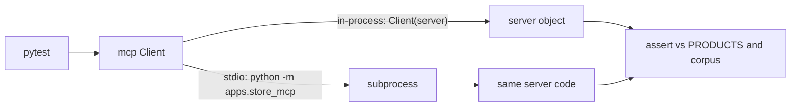

# Testing MCP servers

::: tip In one minute
- An MCP server is an API whose caller is a model. Test it like an API: **contract first**.
- Assert the **exact tool list**, the **input schemas** (required arguments, defaults) and that every tool has a useful description.
- Check **results against a source of truth** (the catalogue, the corpus), not against hand-typed values.
- Bad input must come back as a **tool error** the model can read, and the server must survive it.
- Run the same client code over **two transports**: in-process for speed, and a real **stdio subprocess** to prove the server starts the way a host launches it.
:::

## The idea

When an agent uses your MCP server, it plans from three things only: the tool names, their
descriptions and their JSON Schemas. Then it trusts what comes back. So a server can break an agent
in ways a normal unit test would not notice:

- a tool is renamed, and the agent's plan points at nothing;
- an argument becomes required, and every call fails;
- a result changes shape, and the agent reads the wrong field;
- an error is raised as a crash, and the agent gets nothing useful to recover from;
- a tool "helpfully" guesses, and the agent gets a confident wrong answer.

These are contract problems. The oracle is the contract you published, plus the real data behind it.
(For how the protocol works, read [How MCP works](/mcp/how-mcp-works) first.)



## How it works

A test is a real MCP client. It connects, lists tools or calls one, and inspects the typed result.
The Python SDK's `Client` accepts either a server object (the whole session runs in memory) or
`StdioServerParameters` (it launches a subprocess and talks JSON-RPC over its pipes). The same
helper works for both, which is the point: one set of assertions, two ways in.

What to assert, layer by layer:

| Layer | Question | Example assertion |
|---|---|---|
| Discovery | Are exactly the right tools exposed? | tool names equal an expected set |
| Schema | Are required arguments and defaults right? | `required == ["product"]`, `k` defaults to 3 |
| Descriptions | Can a model choose well? | every description is non-trivial |
| Results | Is the answer true? | structured output equals the catalogue |
| Errors | Is bad input a readable tool error? | `is_error` is true and the message names the input |
| Robustness | Does the server survive errors? | the next call still succeeds |
| Look-alikes | Does a near-miss get rejected? | an unsold product that *sounds* sold is an error |
| Idempotency and side effects | Is a read tool really read-only? | same call twice gives the same result, state unchanged |
| Transport | Does it start as a host starts it? | stdio subprocess lists tools and answers a call |

## How to test it

**Discovery is a security test too.** Asserting the tool set with `==` (not "contains") catches a
tool that should not be exposed, for example a debug tool left in. That is least privilege, checked
on every run.

**Use the source of truth as the oracle.** Compare `list_products` with the `PRODUCTS` dictionary
the store itself uses. If a price changes, the test follows; if the server drops or invents a
product, the test fails.

**Separate protocol failures from tool failures.** A missing required argument should be rejected by
schema validation. A valid call with a bad value (a product that is not sold, `k=0`) should be a tool
error with a message. Neither should kill the server.

**Test inputs that look like valid ones.** The dangerous input is not `"nonsense"`, which any
matcher rejects. It is `"Sauce Labs Water Bottle"`: it shares the brand prefix with every real product
and sounds plausible.

::: warning Lesson from this repository: fuzzy matching is a contract risk
`get_price` accepts loose names such as "backpack", using `resolve_product` from
[`apps/shop_assistant/catalog.py`](https://github.com/iamzakirzr/Playwright-ZR/blob/main/apps/shop_assistant/catalog.py).
Its last fallback was a fuzzy match over full catalogue names (`difflib.get_close_matches` with
`cutoff=0.5`). Every name starts with "Sauce Labs", and that shared prefix alone scored as a match: the
fallback resolved `"Sauce Labs Water Bottle"` to the **Sauce Labs Onesie** (and, when we tried it,
`"Sauce Labs Red Hat"` to the Bike Light). The tool returned a real price for a product the store does
not sell. The only error test used `"gaming laptop"`, which shares nothing with the catalogue, so it passed.

The fix compares only the distinctive part of each name ("onesie", "bike light") with a stricter
cutoff of 0.75, so typos such as "backpak" still resolve but unsold look-alikes are rejected, and the
error test now includes look-alike names as regression cases.

The general rule: any tool that "helps" by guessing turns a wrong input into a confident wrong
answer, and the model has no way to tell. Test unknown inputs that look like known ones.
:::

**Idempotency and side effects.** All three store tools are read-only. For read tools, check that the
same call twice returns the same result, and that the underlying state did not change. For write tools
(the shop assistant's `add_to_cart`, for example), check the state change through an independent
channel, as the agent tests do through the cart API. The store server's tests do not yet include an
explicit repeat-call test; `test_server_survives_errors` is the closest. A labelled example of one you
could add:

```python
# Example, not in the repository yet
def test_list_products_is_repeatable_and_read_only():
    before = dict(PRODUCTS)
    first, second = call("list_products"), call("list_products")
    assert first.structured_content == second.structured_content
    assert PRODUCTS == before
```

**What these tests do not cover.** They prove the server keeps its contract. They do not prove a
model will call it correctly. Tool choice and argument quality are agent tests: see
[Testing agents](/agents/testing-agents).

## In this repository

The server is [`apps/store_mcp/server.py`](https://github.com/iamzakirzr/Playwright-ZR/blob/main/apps/store_mcp/server.py)
with three tools: `list_products`, `get_price` and `search_policies`. The tests are
[`tests/ai/mcp/test_store_mcp_server.py`](https://github.com/iamzakirzr/Playwright-ZR/blob/main/tests/ai/mcp/test_store_mcp_server.py).
Two small async helpers take any target, a server object or stdio parameters:

```python
async def _list_tools(target):
    """Connect to ``target`` and return its tool list."""
    async with Client(target) as client:
        return (await client.list_tools()).tools


async def _call(target, name: str, arguments: dict):
    """Connect to ``target`` and call one tool."""
    async with Client(target) as client:
        return await client.call_tool(name, arguments)
```

`run_sync` from [`ai/asyncio_bridge.py`](https://github.com/iamzakirzr/Playwright-ZR/blob/main/ai/asyncio_bridge.py)
runs them from ordinary synchronous pytest tests. The discovery and schema checks:

```python
def test_exposes_exactly_the_expected_tools(self):
    """No tool is missing and nothing unexpected is exposed (least privilege)."""
    assert {t.name for t in run_sync(_list_tools(server))} == EXPECTED_TOOLS


def test_input_schemas_declare_required_parameters(self):
    """``get_price`` must require ``product``; ``search_policies`` must require ``query``."""
    schemas = {t.name: t.input_schema for t in run_sync(_list_tools(server))}
    assert schemas["get_price"]["required"] == ["product"]
    assert "query" in schemas["search_policies"]["required"]
    assert schemas["search_policies"]["properties"]["k"]["default"] == 3
```

The error class checks that failures are readable and survivable:

```python
@pytest.mark.parametrize("product", ["gaming laptop", "Sauce Labs Water Bottle", "Sauce Labs Bike Helmet"])
def test_unknown_product_is_a_tool_error(self, product):
    """A product that isn't sold returns an error mentioning it, even when it *looks* like a
    catalogue name. Regression: "Sauce Labs Water Bottle" returned the Onesie's price."""
    result = call("get_price", product=product)
    assert result.is_error
    assert product in result.content[0].text
```

The first value is far from anything sold; the other two share the brand prefix and one shares a word
("Bike") with a real product. Those are the inputs that exercise the risky fallback.

Other tests in the file: `list_products` must equal `PRODUCTS`; loose names ("backpack",
"bike lights") resolve to the catalogue entry; a shipping query ranks passage `shipping-3` first;
`k` of 0 or 11 is rejected; a call without `product` is rejected; after an error the next call
still works.

Finally the transport test launches the server exactly as a desktop host would:

```python
def test_stdio_transport_end_to_end():
    """Launch the server as a real subprocess over stdio (as MCP clients do) and call a tool."""
    params = StdioServerParameters(command=sys.executable, args=["-m", "apps.store_mcp"])

    tools = run_sync(_list_tools(params))
    result = run_sync(_call(params, "get_price", {"product": "onesie"}))

    assert {t.name for t in tools} == EXPECTED_TOOLS
    assert result.structured_content == {"name": "Sauce Labs Onesie", "price": 7.99}
```

Why both transports? In-process tests are fast and cover every edge case. The stdio test catches
what in-process cannot: import errors at startup, a wrong `__main__` entry point, or a `print()`
writing into the protocol stream (chapter 8 of the learning path lists these).

The server's design makes it testable. Tools return pydantic models, so results arrive as
`structured_content` that tests compare as plain dictionaries. Expected failures raise `ToolError`,
so they reach the client as `is_error` results instead of crashes.

## Try it

```bash
pytest -m mcp -v
pytest tests/ai/mcp -k stdio -v          # just the subprocess test
```

Exercise: reproduce the lesson. In `apps/shop_assistant/catalog.py`, temporarily put back the old
fallback (`difflib.get_close_matches(wanted, [p.lower() for p in PRODUCTS], n=1, cutoff=0.5)`) and run
`pytest -m mcp`: the look-alike cases fail. Restore the file. Then add the other half of the contract, a
positive control so the matcher cannot over-reject: a parametrised test that `"Sauce Labs Onesie"`,
`"onesie"` and the typo `"backpak"` still resolve to the right catalogue entries.

## Check yourself

1. Why assert the tool set with `==` rather than checking that the expected tools are present?

::: details Answer
`==` also fails when an unexpected tool appears. An extra tool is extra power the model can use,
so exposing exactly the intended tools is a least-privilege check.
:::

2. The error test with `"gaming laptop"` passed while `"Sauce Labs Water Bottle"` returned the Onesie's price. What does that teach about choosing negative inputs?

::: details Answer
Pick negatives close to the valid space: same prefix, same shape, plausible words. Inputs far from
anything valid only test the easy path of a matcher. The risky fallbacks (fuzzy match, guessing) only
fire on near misses.
:::

3. What does the stdio test catch that the in-process tests do not?

::: details Answer
Startup and packaging problems: the module cannot be launched with `python -m apps.store_mcp`, an
import fails in a fresh process, or something writes to standard output and corrupts the JSON-RPC stream.
:::

4. How would you test that a read-only tool has no side effects?

::: details Answer
Snapshot the state the tool reads (here `PRODUCTS`, or a database or cart), call the tool, possibly
twice, and assert the results are equal and the state is unchanged. For write tools, verify the
intended change through an independent channel, not through the tool's own reply.
:::
