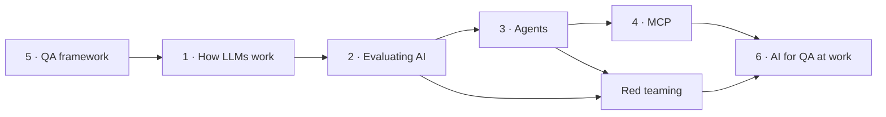

# Learning roadmap

::: tip In one minute
- Six weeks, about five to eight hours a week, from "I test web apps" to "I can test and build an AI agent".
- Each week pairs site pages (the ideas) with chapters from the repository's
  [learning path](https://github.com/iamzakirzr/Playwright-ZR/tree/main/docs/learning-path) (the hands-on work).
- Each week ends with one milestone exercise that changes real code and runs a real test.
- Three tracks pick different weeks: **UI/API/SQL tester**, **AI tester** and **AI agent builder**.
- Weeks 1 and 2 need no model server. From week 2 onwards, [Ollama](/start/glossary#ollama) makes the live tests run instead of skip.
:::

## The map

The site has six tracks. The arrows show what each track leans on. The QA framework comes first
because every AI test in the repository reuses its page objects, service clients and fixtures.



The repository's own course suggests the same order for its AI chapters: after chapters 01 to 05,
do **06 → 07 → 14 → 08 → 15 → 09**. The weeks below follow that order.

## Pick your track

| Track | You want to | Weeks | Skip or skim |
|---|---|---|---|
| **UI/API/SQL tester** | get solid at the non-AI framework, and understand enough AI to test a chatbot screen | 1 (deep), 2, 6 | the building half of week 5 |
| **AI tester** | test LLM features: answers, retrieval, agents, safety, CI gates | 1 (fast) to 6 | chapter 10 (mobile), the building half of week 5 |
| **AI agent builder** | build agents with LangChain and LangGraph and ship them with tests | 1 (fast) to 6, with extra time on week 5 | chapter 10, most of chapter 11 |

"Fast" means: read the pages, run the command, skip the exercise if you already know the topic.

## Week 1: the QA framework

**Goal:** run every non-AI suite and understand how tests, page objects, service clients and
repositories fit together.

| Site pages | Repository chapters |
|---|---|
| [Tour of the repository](/framework/overview) | [01 Setup and your first test](https://github.com/iamzakirzr/Playwright-ZR/blob/main/docs/learning-path/01-setup-and-first-test.md) |
| [UI testing with Playwright](/framework/ui-testing) | [02 Page Object Model](https://github.com/iamzakirzr/Playwright-ZR/blob/main/docs/learning-path/02-page-object-model.md), [13 Playwright essentials](https://github.com/iamzakirzr/Playwright-ZR/blob/main/docs/learning-path/13-playwright-essentials.md) |
| [API testing](/framework/api-testing) | [03 API testing with service objects](https://github.com/iamzakirzr/Playwright-ZR/blob/main/docs/learning-path/03-api-testing.md) |
| [SQL and cross-layer tests](/framework/sql-and-hybrid) | [04 Database and cross-layer tests](https://github.com/iamzakirzr/Playwright-ZR/blob/main/docs/learning-path/04-database-and-hybrid.md), [05 Test data, BDD and reporting](https://github.com/iamzakirzr/Playwright-ZR/blob/main/docs/learning-path/05-data-bdd-reporting.md) |

```bash
make setup
make test-functional   # UI + API + SQL + hybrid + BDD, no AI
```

**Milestone:** add a `remove(product_name)` method to `CartPage` and a test that adds two products,
removes one, and checks both the cart list and the header's cart count (the exercise in chapter 02).
UI/API/SQL testers should also do the chapter 03 and 04 exercises.

## Week 2: how LLMs work, and your first eval

**Goal:** know what a model does with your prompt, and score its answers with metrics you have
checked yourself.

| Site pages | Repository chapters |
|---|---|
| [LLMs from the inside](/foundations/how-llms-work) | [06 AI evaluation fundamentals](https://github.com/iamzakirzr/Playwright-ZR/blob/main/docs/learning-path/06-ai-evals-fundamentals.md) |
| [Prompting and prompt testing](/foundations/prompting) | |
| [Evaluating LLM output](/evals/evaluating-llms) | |
| [LLM judges and calibration](/evals/judges-and-calibration) | |

```bash
ollama pull qwen2.5:1.5b && ollama pull llama3.2:3b
make test-ai-offline
make test-ai-live
```

**Milestone:** add a case to
[`ai/datasets/golden_qa.json`](https://github.com/iamzakirzr/Playwright-ZR/blob/main/ai/datasets/golden_qa.json)
about a policy in the context text (with its `required_facts`), run `pytest tests/ai/rag -k <your_id>`,
and read the judge's reason. Then write down one way the score could be high while the answer is
still useless.

## Week 3: search, prompts, chains and RAG

**Goal:** test the retrieval step on its own, version prompts like code, and test a multi-step
chain link by link.

| Site pages | Repository chapters |
|---|---|
| [Prompt chaining](/foundations/prompt-chaining) | [07 AI search, prompts and chains](https://github.com/iamzakirzr/Playwright-ZR/blob/main/docs/learning-path/07-ai-search-prompts-chains.md) |
| [AI search and its testing](/foundations/ai-search) | |
| [RAG](/foundations/rag) | |

```bash
pytest -m search
pytest -m "chains or prompts"
```

**Milestone:** change one word in the `grounded_qa` prompt in
[`ai/prompts/library.json`](https://github.com/iamzakirzr/Playwright-ZR/blob/main/ai/prompts/library.json),
run the prompt tests, read the snapshot failure, then accept it with `UPDATE_PROMPT_SNAPSHOTS=1`
(chapter 07). Explain in two sentences why a prompt change should need the same review as a code
change.

## Week 4: synthetic data, conversations and production-style metrics

**Goal:** generate test data with a model and gate it; evaluate multi-turn conversations; know
which metrics to watch beyond "is the answer right".

| Site pages | Repository chapters |
|---|---|
| [Performance evals](/evals/performance-evals) | [14 Synthetic data and advanced AI evals](https://github.com/iamzakirzr/Playwright-ZR/blob/main/docs/learning-path/14-synthetic-data-and-advanced-evals.md) |
| [Production metrics](/evals/production-metrics) | |
| [Observing AI in production](/evals/observability) | |

```bash
pytest tests/ai/synthesis tests/ai/conversation tests/ai/langchain -m "not live"   # offline
pytest tests/ai/synthesis tests/ai/conversation tests/ai/langchain                 # with Ollama
```

**Milestone:** add a requirement to
[`ai/synthesis/requirements.json`](https://github.com/iamzakirzr/Playwright-ZR/blob/main/ai/synthesis/requirements.json)
(quote its exact error message), generate test cases for it, and review them by hand. Look
specifically for invented rules: during development the generator proposed a "maximum login
attempts" case for a requirement with no such limit.

## Week 5: agents and MCP

**Goal:** test an agent by the state it changed and the tools it called; test an MCP server as a
contract. Agent builders also build one.

| Site pages | Repository chapters |
|---|---|
| [What an agent is](/agents/what-is-an-agent), [Testing AI agents](/agents/testing-agents) | [08 Agents and MCP servers](https://github.com/iamzakirzr/Playwright-ZR/blob/main/docs/learning-path/08-agents-and-mcp.md) |
| [Building an agent by hand](/agents/building-agents), [LangChain](/agents/langchain), [LangGraph](/agents/langgraph) | [15 Building agents with LangChain and LangGraph](https://github.com/iamzakirzr/Playwright-ZR/blob/main/docs/learning-path/15-building-agents-with-langchain.md) |
| [Voice agents](/agents/voice-agents) | |
| [How MCP works](/mcp/how-mcp-works), [Testing an MCP server](/mcp/testing-mcp-servers), [Playwright MCP](/mcp/playwright-mcp) | |

```bash
pytest -m "agent or mcp"
pytest tests/ai/langgraph
```

**Milestone (AI tester):** add a `clear_cart` tool to the hand-written agent, a scripted unit test
that routes "empty my basket" to it, and a live test that fills the cart, clears it, and checks the
cart through the API (chapter 08).

**Milestone (agent builder):** do the same in the LangGraph agent, test first: a scripted
`clear_cart` tool call, then assert the cart is empty and the trajectory is `["clear_cart"]`
(chapter 15). Then run the agent with `retrieval="tool"` and read the trajectory of the failing
policy test.

## Week 6: red teaming, CI and taking it to work

**Goal:** attack what you built, measure the guardrails, and decide what blocks a merge.

| Site pages | Repository chapters |
|---|---|
| [Red teaming and guardrails](/evals/red-teaming) | [09 Red teaming and guardrails](https://github.com/iamzakirzr/Playwright-ZR/blob/main/docs/learning-path/09-red-teaming.md) |
| [CI/CD](/framework/ci-cd) | [12 CI/CD pipelines](https://github.com/iamzakirzr/Playwright-ZR/blob/main/docs/learning-path/12-ci-cd.md) |
| [How companies use AI in QA](/industry/ai-in-qa-at-companies) | [11 Self-healing locators and visual testing](https://github.com/iamzakirzr/Playwright-ZR/blob/main/docs/learning-path/11-healing-and-visual.md) |
| [Adopting AI testing: a playbook](/industry/adoption-playbook) | |

```bash
pytest -m "redteam and not live"   # guard regressions, offline, seconds
pytest -m redteam                  # with Ollama: raw vs guarded bot
make lint
```

**Milestone:** add an indirect prompt-injection attack (an instruction hidden inside the
*context*) to
[`ai/redteam/attacks.json`](https://github.com/iamzakirzr/Playwright-ZR/blob/main/ai/redteam/attacks.json),
run it against the raw and the guarded bot, and compare (chapter 09). Then write a one-page plan
for one AI feature at your job, using the [playbook](/industry/adoption-playbook): its risks,
its golden set, and which checks gate versus report.

## Optional chapters

- [10 Mobile: emulation and Appium](https://github.com/iamzakirzr/Playwright-ZR/blob/main/docs/learning-path/10-mobile.md):
  useful for the UI/API/SQL track, not needed for AI.
- [11 Self-healing locators and visual testing](https://github.com/iamzakirzr/Playwright-ZR/blob/main/docs/learning-path/11-healing-and-visual.md):
  AI helping a UI test. Read it in week 6 alongside the industry pages.
- [13 Playwright essentials](https://github.com/iamzakirzr/Playwright-ZR/blob/main/docs/learning-path/13-playwright-essentials.md)
  fits right after chapter 02 if you want every browser technique first.

## Check yourself

1. Why does the roadmap start with the non-AI framework, even for the AI agent builder track?

::: details Answer
Every AI test in the repository reuses the framework: the chat widget is driven by a page object,
the agent's cart is checked through an API service object, and fixtures inject the models. You
cannot read the AI tests fluently without it.
:::

2. Chapter 14 (synthetic data) comes before chapter 08 (agents) in the suggested AI track. Why is
that a sensible order?

::: details Answer
Chapter 14 adds multi-turn conversation evals and a LangChain app under test. Those are exactly
the tools the agent chapters then use: agents are tested over several turns, and chapter 15
builds on LangChain.
:::

3. What is the common thread in the milestone exercises?

::: details Answer
Each one changes something real (a page object, a golden case, a prompt, a requirement, a tool,
an attack) and then runs a test that proves the change. Where a model generates something, a human
reviews it.
:::
